<h2 align="center">Contents</h2>

[TOC]

### 1.Brief Description

#### 1.1 Purpose

The purpose of this document is to provide a comprehensive analysis of the JikeDa System architectural design and analysis model. Additionally, as our work progresses, we have updated snapshots of the system's user interface, which are included in this document along with annotated references to the lessons learned.

#### 1.2 Project Scope

The JikeDa System is a web-based food ordering and delivery management system designed to streamline the food ordering process and provide an efficient online platform for users to order food, track deliveries, and manage their profiles. Users can access the system via a website.

Key scenarios of this system include:

1. Searching for restaurants and browsing menus.
2. Viewing detailed information about restaurants, dishes, and promotions.
3. Placing orders, modifying orders, and tracking order status.
4. Managing user profiles, addresses, and payment methods.
5. Browsing and purchasing promotional coupons.
6. Providing feedback and ratings for orders and restaurants.

Both registered users and guests can browse restaurant information and menus, but only registered users can place orders, manage their profiles, and use the full range of features. Registered users can also organize their orders, making the ordering process more convenient.

For system administrators, they have the authority to manage orders, users, restaurants, and promotional activities, which simplifies their work and ensures the smooth operation of the system.

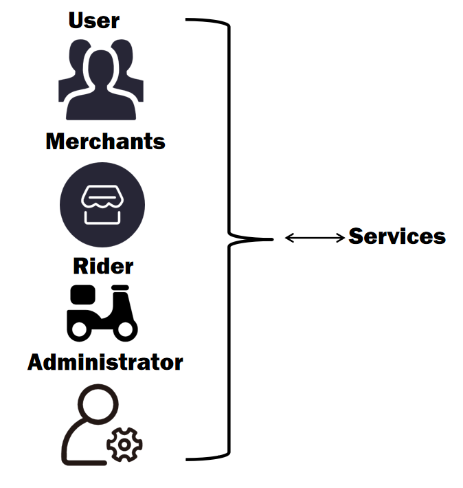

#### 1.3 Glossary of Terms

| **Term**                                    | **Definition**                                               |
| :------------------------------------------ | :----------------------------------------------------------- |
| **JikeDa System**                           | The online platform for food ordering and delivery.          |
| **User**                                    | Consumers who use the platform to order food.                |
| **Merchant**                                | Restaurant owners who manage their menus and orders through the platform. |
| **Rider**                                   | Delivery personnel who handle the transportation of food orders. |
| **Administrator**                           | System administrators who manage the overall operations and user data. |
| **Order**                                   | A request made by a user to purchase food from a merchant.   |
| **Coupon**                                  | Discount vouchers that users can apply to their orders.      |
| **Full Reduction Activity**                 | Promotional offers where discounts are applied based on the total order value. |
| **DTO (Data Transfer Object)**              | A design pattern used for transferring data between different layers of a system, encapsulating data and reducing data coupling. |
| **API (Application Programming Interface)** | A set of rules and protocols for building and interacting with software applications. |
| **UI (User Interface)**                     | The visual and interactive elements through which users interact with a system. |
| **VO (View Object)**                        | A data object used to encapsulate page data and pass it between the presentation layer and the application logic. |
| **BLL (Business Logic Layer)**              | The layer in the system architecture where business rules and logic are processed. |
| **Service Layer**                           | The intermediary layer that exposes the system’s functionalities to external clients while abstracting the complexity of the business processes. |
| **Presentation Layer**                      | The layer that manages the interface elements that engage with users. |
| **Data Access Layer**                       | The layer responsible for interacting with the database to retrieve and store data. |

### 2. Introduction

#### 2.1 Goals

The primary goals of this document are:

1. **Comprehensive Analysis**: To provide a detailed analysis of the JikeDa System's architectural design and functional components.
2. **Design Clarity**: To offer clear and concise diagrams and descriptions that illustrate the system's structure and interactions.
3. **Progress Tracking**: To document the progress of the system's development, including updates to the user interface and lessons learned.
4. **Future Planning**: To identify unresolved issues and areas for future development, ensuring the system's continuous improvement.

#### 2.2 Progress and Current Status

As of the latest update, the JikeDa System has made significant progress in the following areas:

1. **System Architecture**: The hierarchical architecture design has been finalized, with detailed diagrams and descriptions provided.
2. **User Interface**: Updated snapshots of the user interface have been included, reflecting recent design changes and improvements.
3. **Functional Components**: The activity organization system has been expanded to include detailed class and interaction diagrams for key subsystems.
4. **Use Case Model**: The updated use case model reflects recent enhancements and improvements to the system's functionalities.

#### 2.3 Changes in the System

The following changes have been made to the JikeDa System since the last update:

1. **User Ordering System**: Added a "Rate Order" feature and an "Order Notes" option for personalized order instructions.
2. **Rider System**: Introduced an "Optimal Route Planning" feature and a GPS punch-in function for location verification.
3. **Administrator System**: Added a "View Order Statistics" feature to provide key order metrics for performance monitoring.
4. **User Interface**: Updated the user interface to improve usability and responsiveness, particularly on mobile devices.
5. **Security Enhancements**: Implemented additional security measures, including enhanced authentication and role-based access control.

These changes reflect the ongoing efforts to enhance the system's functionality, usability, and security, ensuring it meets the evolving needs of its users and stakeholders.

### 3.Architecture Decisions

#### 3.1 System-Level Architecture Analysis and Design

The Jikeda system is a network-based platform dedicated to managing food delivery operations within university campuses. Its primary goal is to provide students, faculty, staff, and restaurant partners with a fast, efficient, and user-friendly experience while ensuring transaction security and system scalability. The system adopts a multi-layer architecture that supports various business functionalities, emphasizing user simplicity and robustness for developers.

To promote the Jikeda campus food delivery platform, the analysis has been conducted from multiple perspectives:

- **User Perspective**: Users prioritize rich functionality and a simple interface, including food ordering, order tracking, and seamless account management. Additionally, ensuring the security and confidentiality of personal information is paramount.
- **Developer Perspective**: From the developer's standpoint, it is crucial to extract common business mechanisms and enhance system performance and scalability. This involves optimizing existing features, ensuring code reusability, and adopting robust architectural practices to improve system reliability and maintainability.

##### 3.1.1 Detailed System Analysis

During the requirements phase, the design focus of the Jikeda system was on the interactions between various roles (such as users, merchants, delivery personnel, and administrators) and their interactions with the system. Preliminary system analysis was performed through use case modeling, identifying key use cases such as user registration, order creation, and delivery tracking.

In the early stages of architectural design, the emphasis was on decomposing the system into smaller functional components and establishing clear interaction definitions using robust diagrams. Each major system function, such as user food ordering, restaurant order acceptance, and delivery fulfillment by riders, was translated into specific subsystems that support the overall architecture.

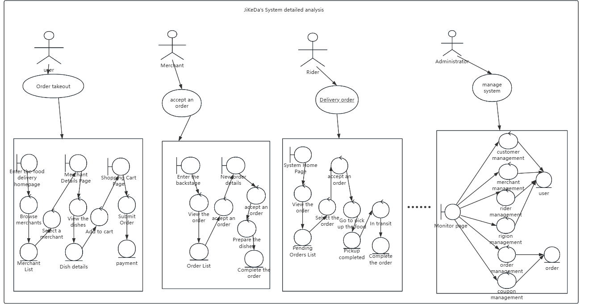

Our robustness diagram is divided into four systems: User System, Merchant System, Rider System, and Administrator System. Below, I will introduce these four systems.

###### 1. User System

This system primarily includes modules for user login, merchant browsing, shopping cart, payment, favorite merchants, and personal information management.

- **Login and Registration Module**: Users access the system via the login and registration interface to view their personal information.
- **Merchant List Module**: Users can browse the merchant list, view merchant details and product information, and add items to the shopping cart.
- **Shopping Cart Management Module**: Users can view and delete items in their shopping cart, with a total price displayed for payment.
- **Payment Module**: Users enter a payment password on the payment page to complete transactions.
- **Favorite Merchants Module**: Users can manage their favorite merchants and view the favorites list.
- **Address Management Module**: Users can manage their personal address information for future deliveries.

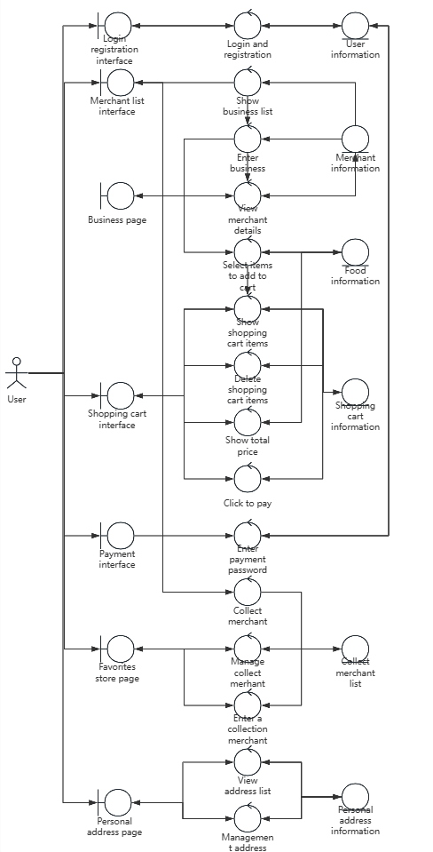

###### 2. Merchant System

This system provides merchants with functions for menu management, order processing, personal information, wallet, and activity management.

- **Login and Registration Module**: Merchants log in to view and manage their personal information.
- **Menu Management Module**: Merchants can add new dishes and manage their menu information.
- **Order Management Module**: Processes user orders and displays order details.
- **Personal Information Management Module**: Merchants can manage their personal profiles and view sales data.
- **Wallet Management Module**: Merchants manage funds through the wallet interface, including viewing sales revenue and promotional activity information.
- **Activity Management Module**: Merchants can set up promotional discounts and view related information.

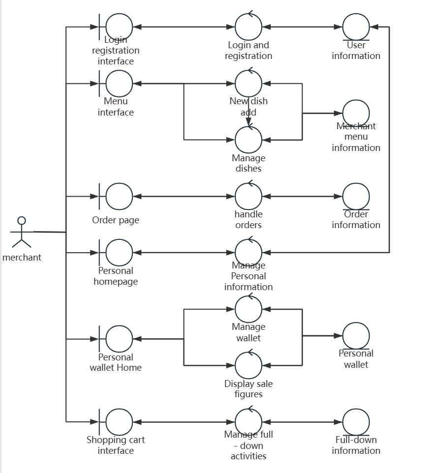

###### 3. Rider System

This system supports riders in managing orders, wallets, and personal information.

- **Login and Registration Module**: Riders log in to view their personal information.
- **Order Management Module**: Riders can accept orders and manage order statuses.
- **Wallet Management Module**: Riders can view their earnings and manage funds via the wallet interface.
- **Personal Information Management Module**: Riders can manage their personal profiles.

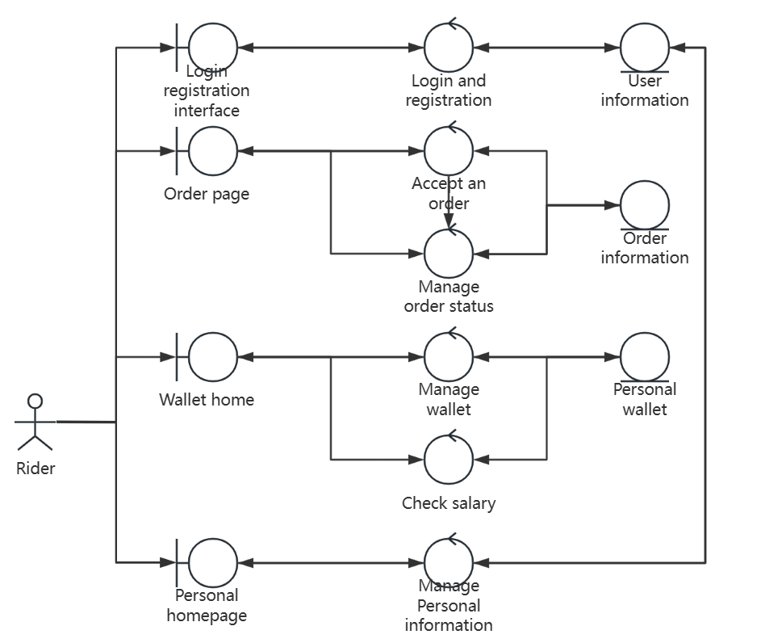

###### 4. Administrator System

This system provides administrators with functionalities for managing orders, merchants, riders, users, and reviews.

- **Login Module**: Administrators access the system via the login interface to manage their personal information.
- **Order Management Module**: Administrators can view all order details.
- **Merchant Management Module**: Manages merchant profiles on the platform.
- **Rider Management Module**: Administrators can view and manage rider information.
- **User Management Module**: Allows administrators to view and manage user profiles.
- **Area Management Module**: Administrators can manage different areas.
- **Comment Management Module**: Allows administrators to manage user reviews and related details.

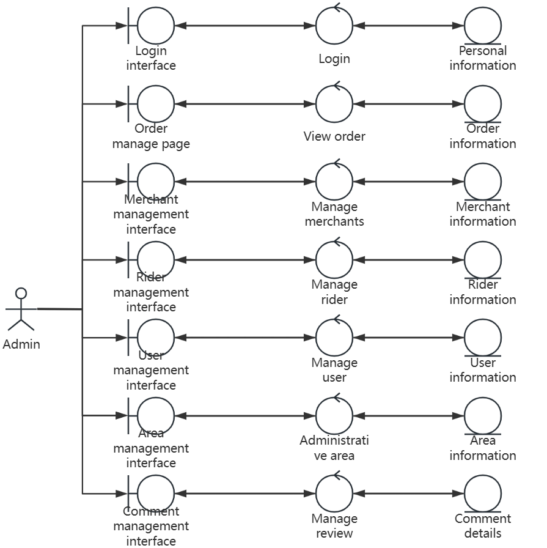

##### 3.1.2 Hierarchical Architecture Design 

Our system employs a traditional three-tier architectural design, which is detailed as follows:

By subdividing the conventional three-layer logical system architecture, we have completed the architectural analysis and design of the system. The overall system architecture can be represented by the figure below: 

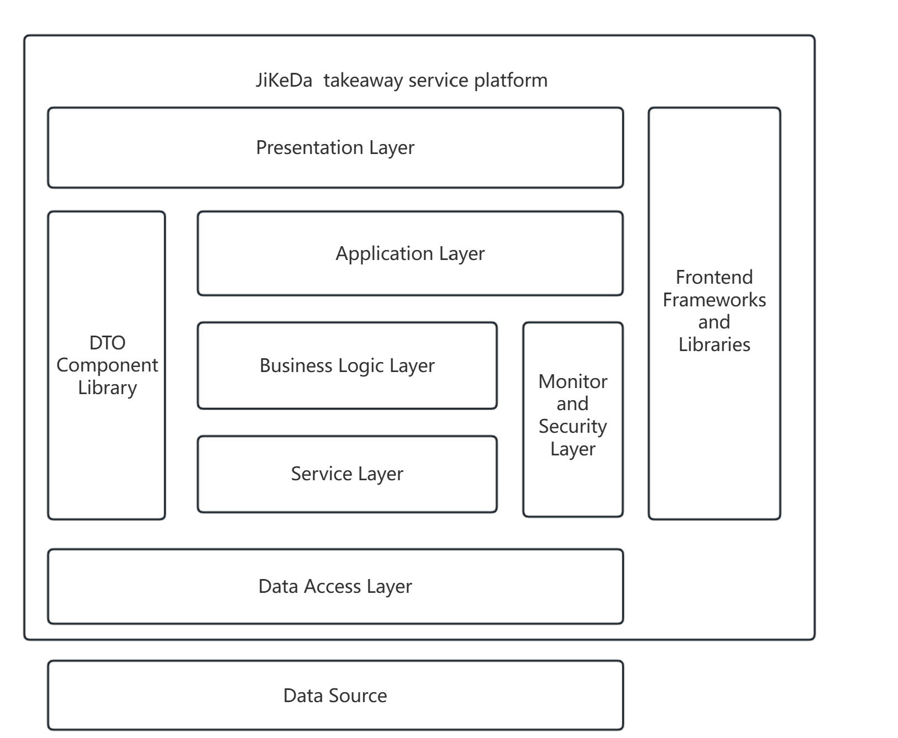

Taking into account the functional requirements of the system, we integrate the aforementioned architectural design into the JiKeDa (JiKeDa) system through the use of package diagrams and components.

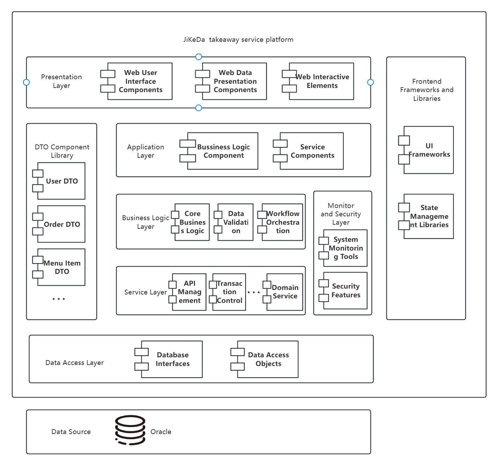

###### 1. Presentation Layer

The presentation layer of the JiKeDa takeaway service platform is designed to manage the interface elements that engage with users. This layer is structured to handle user interactions through its components and to encapsulate page data into view objects (VO), which serve as the bridge between the user interface and the application logic. The VOs can be directly passed to the application layer for further processing or can interact with external APIs to execute functionalities.

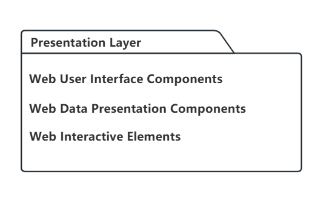

**Web User Interface Components** These components are responsible for rendering the UI elements that users interact with directly. They include navigation bars, search bars, and modal dialogs, ensuring a seamless user experience.

**Web Data Presentation Components** This category of components is tasked with displaying data to the user in a formatted and accessible manner. They include order lists, menu items, and rating systems, providing users with clear and useful information.

**Web Interactive Elements** Interactive elements such as buttons, forms, and sliders are part of this component set. They allow users to perform actions like placing orders, filling out forms, and customizing their preferences.

Each component in the presentation layer is crafted to not only provide a user-friendly interface but also to efficiently manage the flow of data and interactions within the system. The encapsulation of data and the direct transfer of VOs to the application layer or external interfaces streamline the process, enhancing the overall performance and user satisfaction of the JiKeDa platform.

###### 2. The Frontend Frameworks and Libraries layer

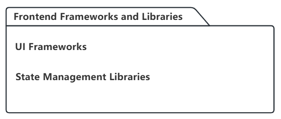

The Frontend Frameworks and Libraries layer of the JiKeDa takeaway service platform is instrumental in shaping the user interface and managing the state of the application. This layer is composed of two primary categories:

**UI Frameworks** These frameworks provide the necessary tools and structures to build a responsive and interactive user interface. They offer a wide range of pre-built components and utilities that simplify the development process and ensure a consistent look and feel across the platform.

- **React**: A JavaScript library for building user interfaces, known for its component-based architecture.
- **Vue.js**: A progressive framework that is versatile and performant, with a focus on ease of integration.

**State Management Libraries** These libraries are crucial for managing the state of the application in a predictable and efficient manner. They help in centralized state management, making it easier to track changes and debug the application.

- **Redux**: A predictable state container for JavaScript apps, enabling the development of large-scale applications with a single source of truth.
- **Vuex**: A state management pattern and library for Vue.js applications, providing a centralized store for all the components.

This layer acts as the bridge between the user's interactions and the application's core logic. It ensures that the user interface is not only visually appealing but also functional and responsive to user actions. By leveraging these frameworks and libraries, the JiKeDa platform can deliver a seamless and engaging user experience.

###### 3. The Application Layer 

The Application Layer in the JiKeDa takeaway service platform serves as the heart of the system, where the core functionality and business rules are implemented. This layer is pivotal for coordinating the flow of data between the presentation layer and the data access layer, ensuring that the business logic is encapsulated and separate from the user interface and data storage concerns.

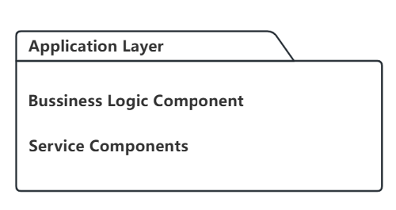

**Business Logic Component** This component is responsible for the implementation of the business rules and operations that are essential for the platform's functionality. It processes the data received from the presentation layer, performs necessary calculations, and makes decisions based on the business rules.

- **Order Management**: Handles the creation, modification, and tracking of orders.
- **User Account Management**: Manages user registrations, profile updates, and authentication.
- **Payment Processing**: Integrates with payment gateways to process transactions securely.

**Service Components** Service components are designed to provide specific services that support the business logic. They are the building blocks that facilitate the interaction between different parts of the application, ensuring that the business logic can be executed efficiently.

- **Authentication Service**: Verifies user credentials and manages session information.
- **Authorization Service**: Checks user permissions and ensures that users can only access appropriate resources.
- **Notification Service**: Sends alerts and updates to users regarding their orders or account activities.
- **Reporting Service**: Generates business intelligence reports for analysis and decision-making.

The Application Layer is crucial for maintaining the integrity and consistency of the data as it interacts with the Data Access Layer to store or retrieve information from the Data Source. It acts as a "middleman" that ensures the system's operations are carried out smoothly and in accordance with the defined business processes. By clearly defining the responsibilities of the Business Logic Component and Service Components, the JiKeDa platform can achieve a scalable, maintainable, and robust application architecture.

###### 4. Business Logic Layer

The **Business Logic Layer (BLL)** forms the core of the system, where all business rules and logic are processed. This layer is responsible for ensuring that all operations adhere to the business policies, workflows, and constraints.

- **Key Functions**:
  1. **Core Business Logic**: Encapsulates the main computations and workflows that define the business operations. For example, processing customer orders, calculating discounts, and determining delivery routes are all handled here.
  2. **Data Validation**: Ensures that all input data meets the required criteria before it is passed to lower layers or persisted in the database. Invalid data is flagged and appropriate error messages are generated.
  3. **Workflow Orchestration**: Integrates various submodules to execute end-to-end business processes.
- **Design Characteristics**:
  - Organized into modular components, such as **Order Processing**, **User Management**, **Merchant Management**, and **Rider Management**, each with clear boundaries.
  - Supports iterative development by isolating different business areas, allowing for independent updates and scaling.
- **Integration Points**:
  The BLL interacts directly with the **Service Layer** for input and output and with the **Data Access Layer** for persistence and data retrieval.

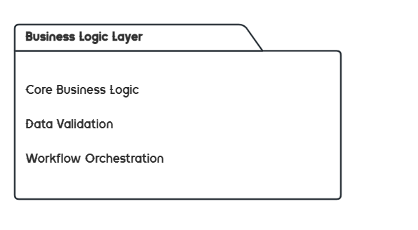

###### 5. Service Layer

The **Service Layer** acts as the intermediary between the user-facing layers (controllers, APIs) and the internal business logic. It exposes the system’s functionalities to external clients while abstracting the complexity of the business processes.

- **Key Functions**:
  1. **API Management**: Provides a unified interface for external applications to interact with the system. This includes RESTful APIs, RPC calls, or other communication protocols.
  2. **Transaction Control**: Ensures atomicity, consistency, isolation, and durability (ACID) of operations involving multiple business components.
  3. **Data Aggregation**: Collects results from different modules in the BLL and prepares a coherent response for external consumption.
  4. **Domain Services**: Divided into services corresponding to specific business domains, such as **User Services**, **Order Services**, **Merchant Services**, and **Rider Services**.
- **Design Characteristics**:
  - Implements security measures like authentication and role-based access control to protect sensitive operations.
  - Is scalable to support high levels of concurrency during peak usage.
- **Interaction with Other Layers**:
  - The Service Layer receives requests from the **Business Logic Layer**, invokes the corresponding BLL functions for processing, and returns the results to the controller or client applications.
  - Errors and exceptions are handled at this layer, ensuring that meaningful feedback is provided to the user.

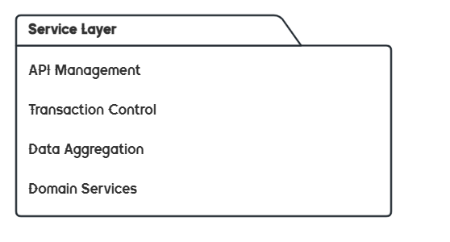

###### 6. DTO Component Library

**DTO (Data Transfer Object)** is a common design pattern used for transferring data between different layers of a system. The DTO Component Library is a specialized library designed for encapsulating, transmitting, managing, and operating data objects. It aims to simplify data transmission in complex systems, reduce data coupling, and improve code maintainability and scalability.

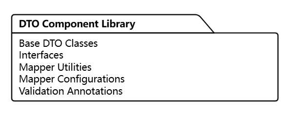

###### 7. Monitor and Security Layer

This module is dedicated to **monitoring** and **security protection**. Its primary objectives are to ensure the **stability**, **security**, and **traceability** of the system. In modern applications, especially those employing distributed systems and microservices architectures, this layer is responsible for real-time monitoring of system behavior, performance, and security vulnerabilities. It also actively prevents potential threats and attacks.

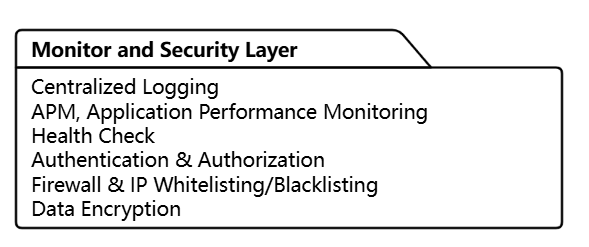

###### 8. Data Access Layer

The data access layer primarily handles interactions with the database, including tasks such as inserting, deleting, updating, and retrieving data from tables. It then provides the necessary data to the business logic layer.

This layer typically outlines the methods for establishing and managing database connections and operations. As the system's functionality expands, the data access layer may evolve to include a separation between interfaces and a general service layer, enhancing the reusability of certain services.

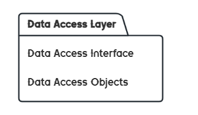

### 4.Activity Organization System

#### 4.1 User Ordering System

The User Ordering System is designed to provide a seamless and efficient online food ordering experience, encompassing the entire process from product selection to order completion. The core functionalities of this system revolve around the user, products, orders, and merchants. Users interact with the shopping cart to select items, form orders, and proceed with payments, while the merchant management module handles inventory updates based on completed orders.

**4.1.1 Class Diagram**

The User Ordering System leverages a collaborative set of classes to implement its functionalities. The `User` class handles basic user information and the order placement process. The `Cart` class manages product selection and calculates the total price. The `Item` class stores product details, while the `Order` class tracks order information and status. The `PayController` ensures secure payment processing, and the `Merchant` class maintains product availability. The class diagram visually represents the relationships between these components, illustrating the end-to-end logic from user interactions to order fulfillment.

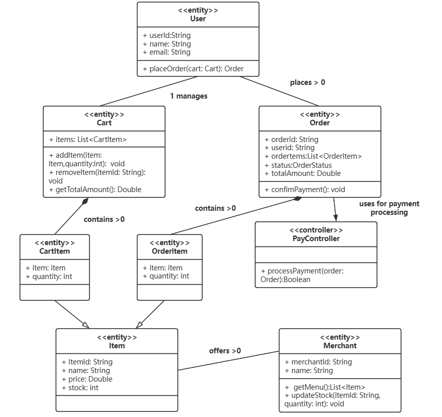

**4.1.2 Interaction Diagram**

The interaction diagram further clarifies the workflow of the system, depicting how users interact with various system components. From selecting items to confirming an order, the system sequentially invokes the cart, order, and payment modules, ensuring a logical and smooth flow of operations. This carefully crafted interaction design ensures a user-friendly ordering experience.

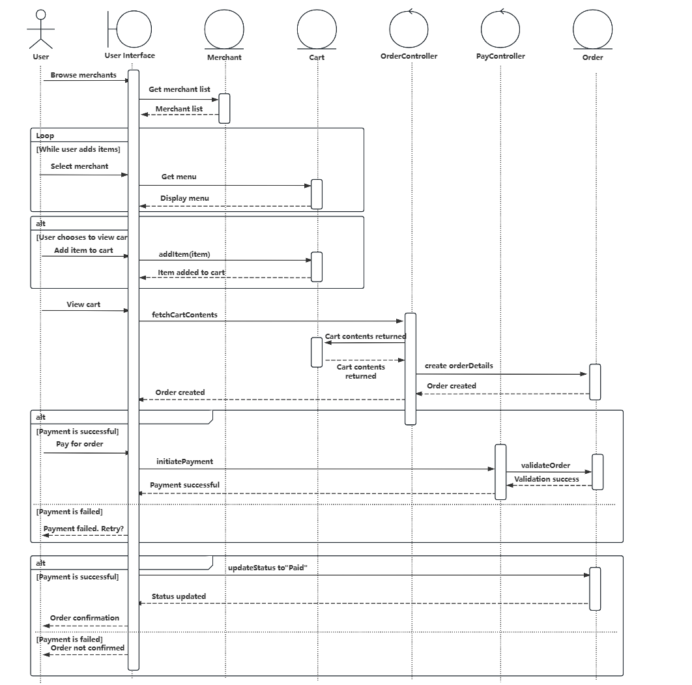

#### 4.2 User Information Management System

The User Information Management System is another key subsystem that focuses on personal information viewing, and updating. It ensures that users can conveniently manage their information while maintaining data security and privacy.

**4.2.1 Class Diagram**

The `User` class is responsible for displaying and updating user profile information, including attributes such as `userId`, `name`, `password`, `phone`, and `address`. The controller class manages these operations, including updating user profiles and handling data updates, ensuring that different functionalities are encapsulated within appropriate classes, thereby promoting system maintainability and scalability. This structure indicates that the system adopts a modular and organized approach to managing user profiles.

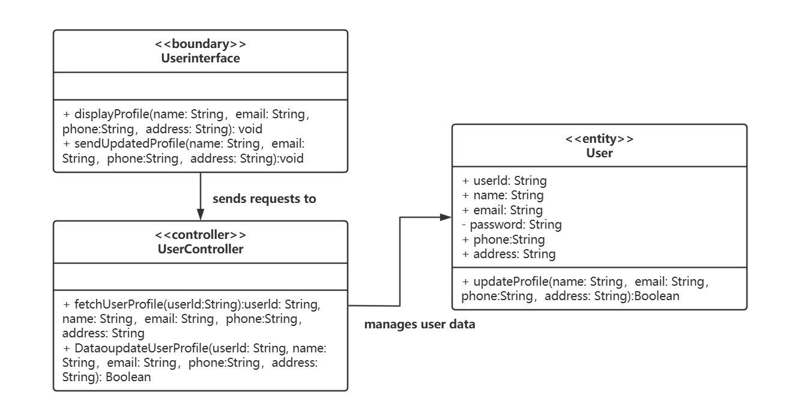

**4.2.2 Interaction Diagram**

From the perspective of the interaction diagram, the workflow for information management is clearly represented.  For information updates, the system collects input data via the user interface, validates it through the user controller, and ultimately stores it in the database.

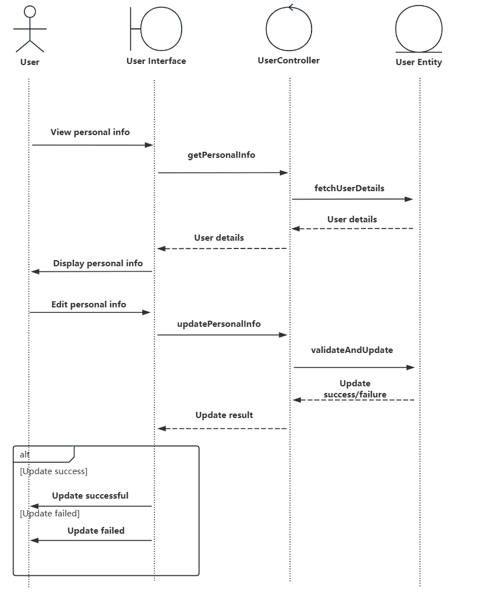

#### 4.3 Login & Register System

##### 4.3.1 Class Diagram

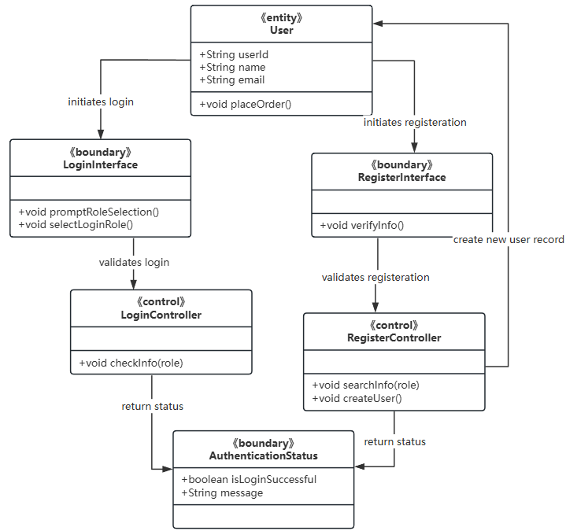

##### 4.3.2 Interaction Diagram

This sequence diagram illustrates the main interaction flow during the login and registration process. It includes the steps a visitor takes after clicking the login or register button, showing how the system validates information through the login and registration interfaces and the controller. The diagram also details role selection and handling of success or failure scenarios, ensuring users can complete login or registration securely. 

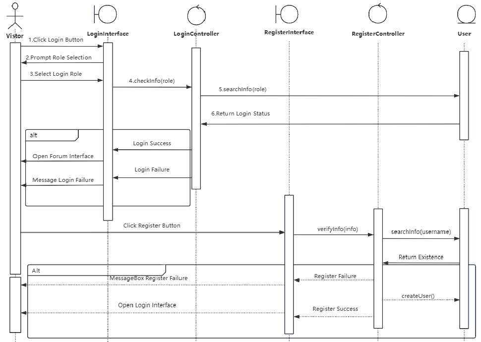

---

#### 4.4 Merchant Menu System

##### 4.4.1 Class Diagram

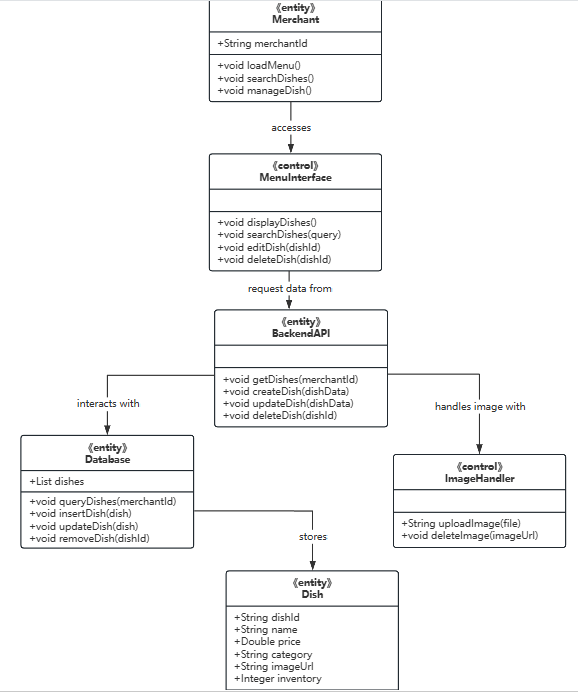

##### 4.4.2 Interaction Diagram

This sequence diagram describes the interaction process for merchants managing their menus. It covers operations such as loading the menu, searching for items, deleting items, uploading item images, editing items, and creating new items. Merchants interact with the **MenuInterface**, which communicates with the **BackendAPI**. The API further invokes the **Database** to perform corresponding data operations, such as querying, deleting, updating, and inserting. The entire flow demonstrates the round-trip communication from merchant requests to data operations completion, ensuring merchants can efficiently manage their menu information.

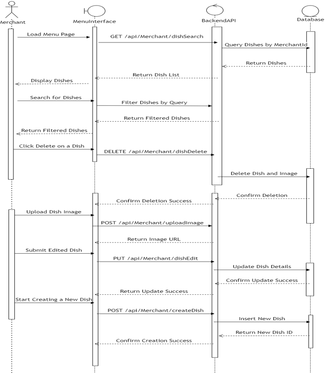 

#### 4.5 Order System

##### 4.5.1 Class Diagram

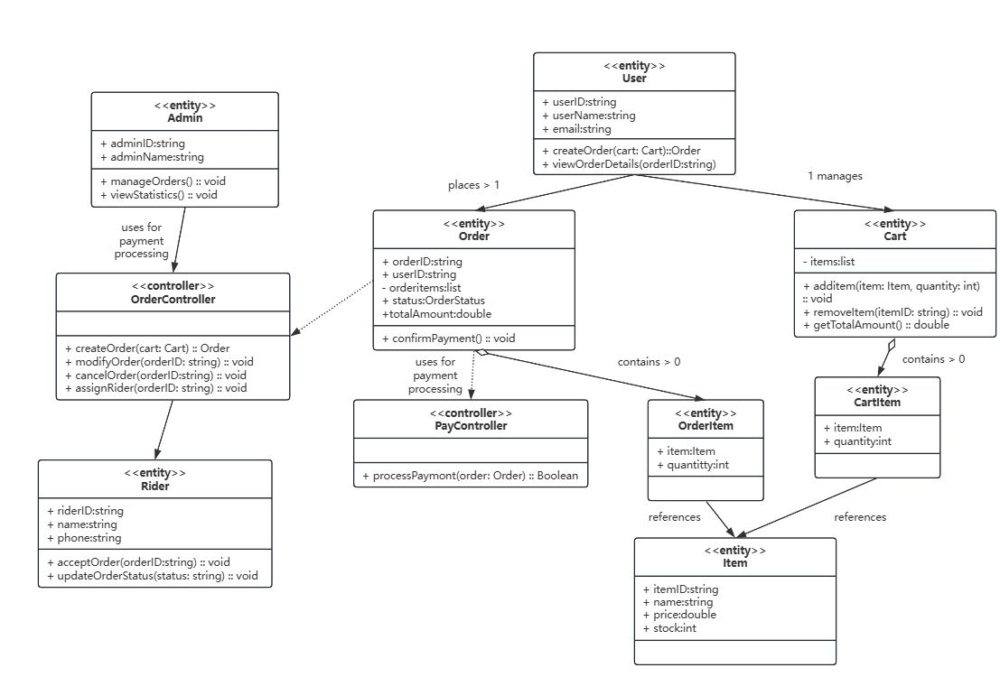

##### 4.5.2 Interaction Diagram

This sequence diagram illustrates the complete workflow of the order system, encompassing processes such as placing an order, querying order status, order acceptance by the delivery person, updating order status, and the administrator viewing order details. It provides a comprehensive depiction of the order system's operations.

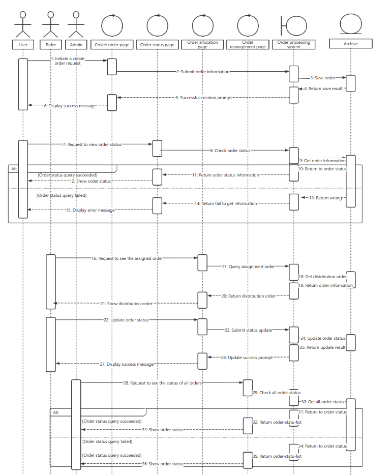

#### 4.6 Administrator System

The Administrator System within the JiKeDa takeaway service platform is a dedicated component of the Application Layer that provides a comprehensive interface for managing various aspects of the platform. This system is crucial for overseeing the operations, ensuring quality control, and managing the data that drives the service.

##### 4.6.1 Class Diagram

The Administrator Class Diagram for the JiKeDa takeaway service platform is designed to encapsulate the core functionalities available to administrators within the system. It comprises several service classes that interact with various entities such as Users, Merchants, Riders, Orders, Coupons, and Comments. Each service class is responsible for a specific aspect of the platform's management, ensuring a modular and maintainable architecture.

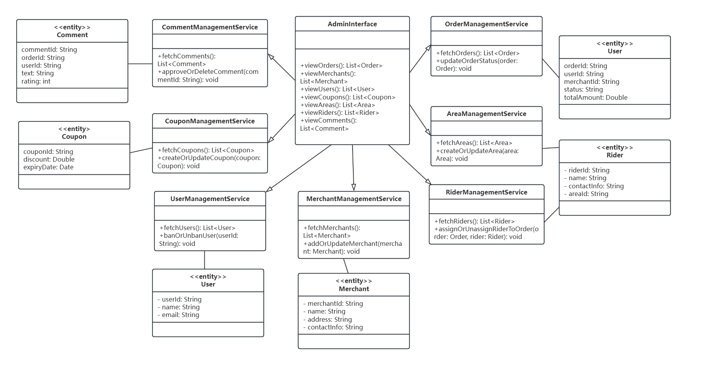

These services are all integrated through the `AdminInterface`, which serves as the central access point for administrators to execute their management tasks.

##### 4.6.2 Interaction Diagram

The Sequence Diagram for the administrator's interaction with the JiKeDa takeaway service platform outlines the flow of operations when an administrator performs key management tasks. It begins with the administrator logging into the system, represented by the 'Login' message.

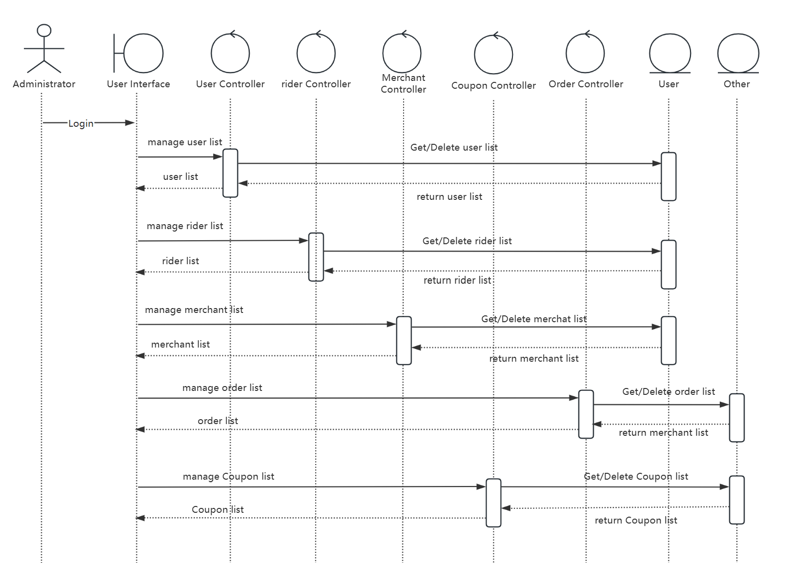

Each operation is a clear exchange between the administrator and the respective controllers, which act upon the service classes to perform data retrieval, updates, or deletions. The sequence of interactions is designed to provide a comprehensive view of how administrators manage the platform's core components, ensuring efficient and effective system oversight.

### 5. Updated Use Case Model

#### 5.1 Updated System: Order System

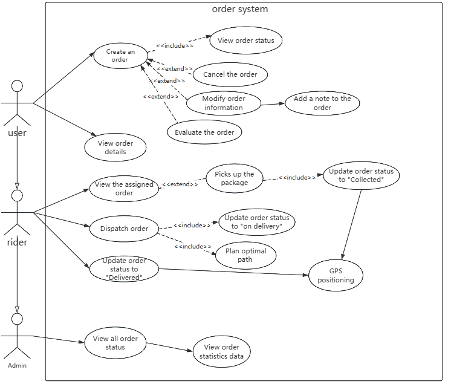

---

##### 5.1.1 User-Side Functionality Improvements

**Improved Area**: **"Create an Order" Use Case**  
- **Improvement Plan**: Add a "Rate Order" feature. After completing an order, users can rate the service quality and the delivery person's attitude.  
- **Description**: This functionality provides feedback on the delivery service, motivating delivery personnel to enhance service quality while offering valuable insights for administrators to improve user experience.

**Improved Area**: **"Modify Order Information" Use Case**  
- **Improvement Plan**: Introduce an "Order Notes" option, allowing users to add comments (e.g., "No spice," "Deliver quickly") when creating or modifying an order.  
- **Description**: This enables users to personalize their orders, leading to a higher satisfaction rate.

---

##### 5.1.2 Rider-Side Functionality Improvements

**Improved Area**: **"Dispatch Order" Use Case**  
- **Improvement Plan**: Add an "Optimal Route Planning" feature, allowing riders to view system-recommended delivery routes.  
- **Description**: By leveraging a map API for route planning, this feature can reduce delivery times, enhance rider efficiency, and improve user expectations regarding delivery times.

**Improved Area**: **"Update Order Status" Use Case**  
- **Improvement Plan**: Add a GPS punch-in function to the steps "Update order status to ‘on delivery’" and "Update order status to ‘Delivered’" for location verification.  
- **Description**: This ensures riders are at the correct locations at specific order stages, enhancing monitoring of the delivery process and reducing potential disputes.

---

##### 5.1.3 Administrator-Side Functionality Enhancements

**Improved Area**: **"View All Order Status" Use Case**  
- **Improvement Plan**: Add a "View Order Statistics" feature, including metrics like total orders, cancellation rates, average rider delivery times, etc.  
- **Description**: Providing key order statistics allows administrators to monitor system performance effectively, identify areas for improvement, and enhance the overall operational efficiency of the system.

### 6.Update Snapshots

#### 6.1 Modification of the Original Use Case Snapshots

##### 6.1.1 User: Registration page

The registration page faces three types of objects (Users, Merchants, Riders) to register.

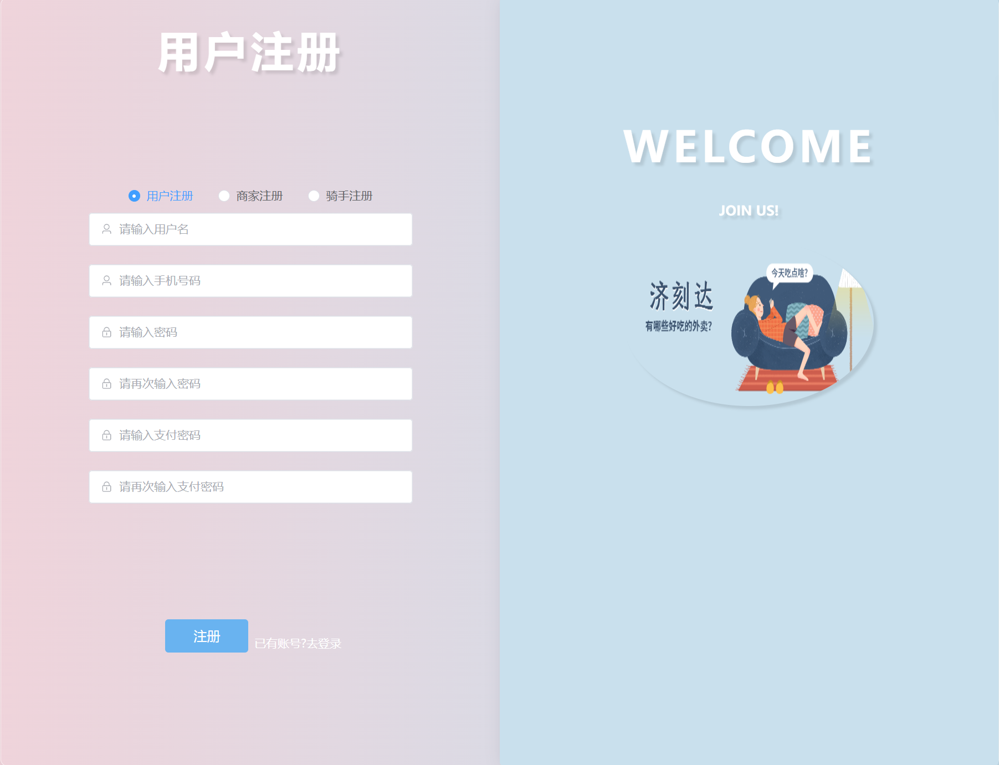

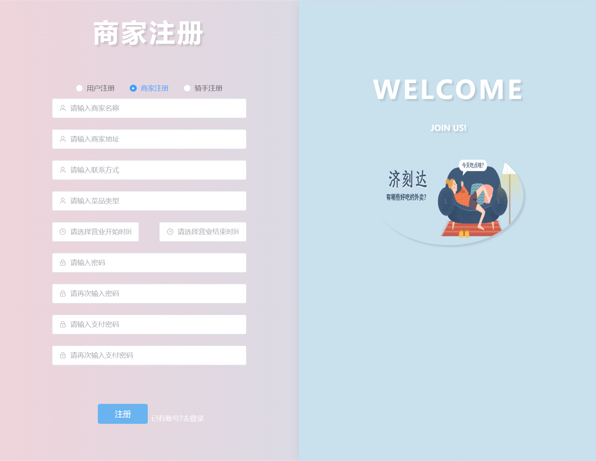

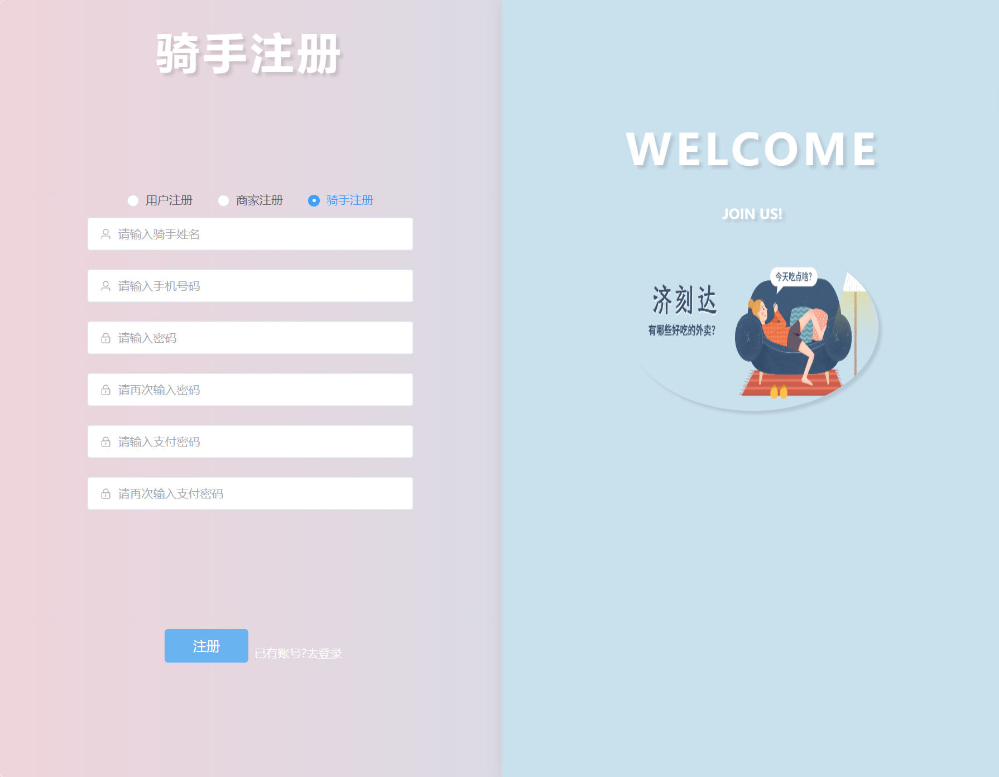

##### 6.1.2 User: Menu page

On this page, we can place orders, as well as promotions, and we can add, reduce, and delete items in the shopping cart area.

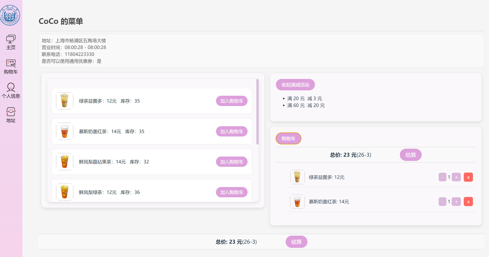

##### 6.1.3 User: Order page

On this page, confirm the delivery address, order information, choose whether you need tableware, or use coupons, and click Submit Order after confirmation.

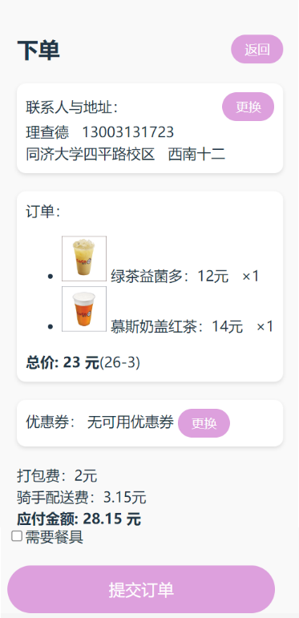

##### 6.1.4 User: My Orders page

On this page, we can view unpaid, pending, delivered, and completed orders. Unpaid orders are automatically cancelled after 15 minutes.

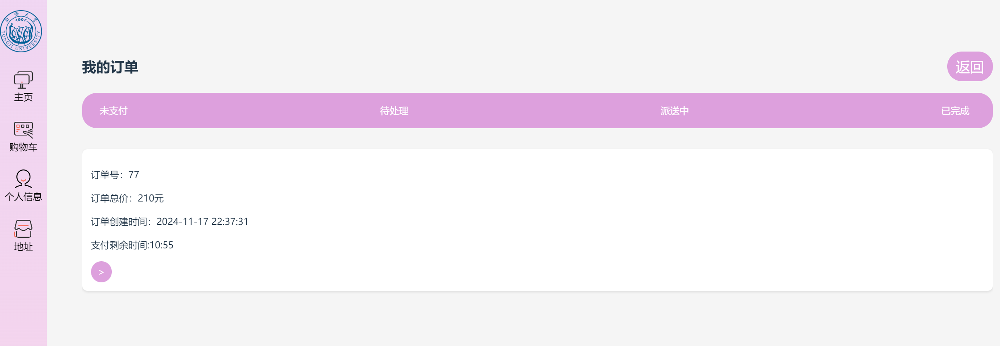

##### 6.1.5 User: Edit the address page

At this address, we can edit the shipping address, including the consignee, contact number.

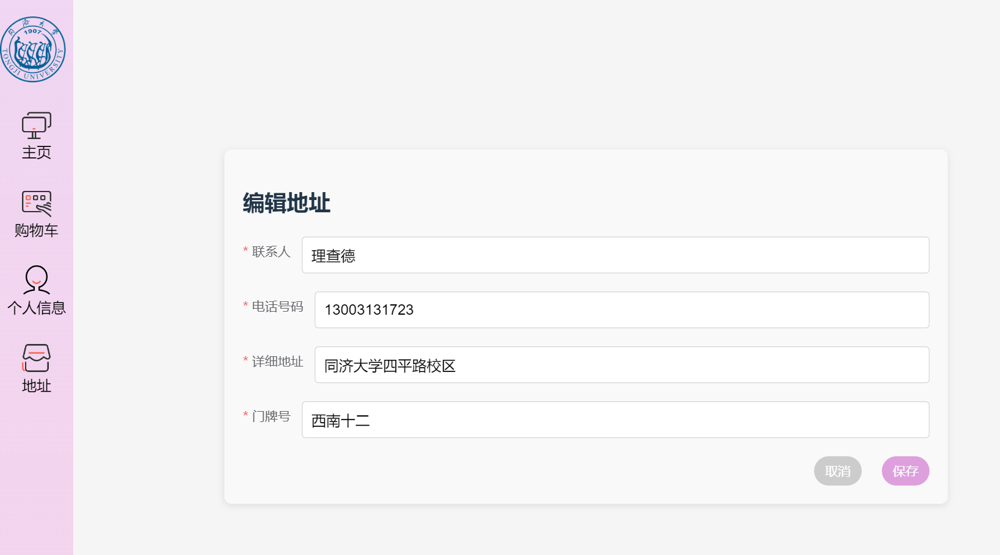

#### 6.2 New Use Case Snapshots

##### 6.2.1 Merchant: menu page

On this page, merchants can add food, describe food, and provide pictures.

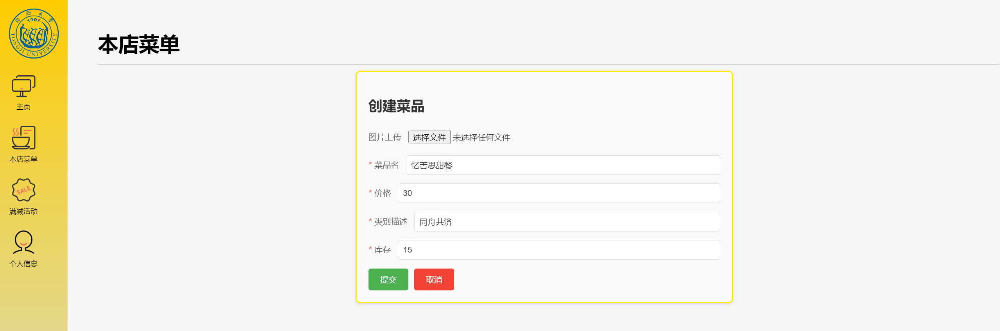

##### 6.2.2 Merchant: Full reduced activity page

On this page, merchants can set the full reduction campaign policy.

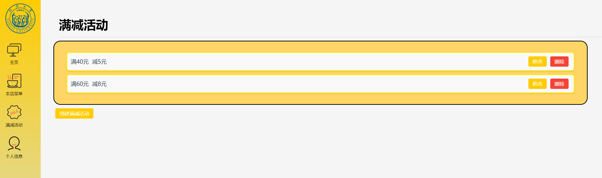

##### 6.2.3 Merchant: Edit information page

On this page, merchant can edit business information.

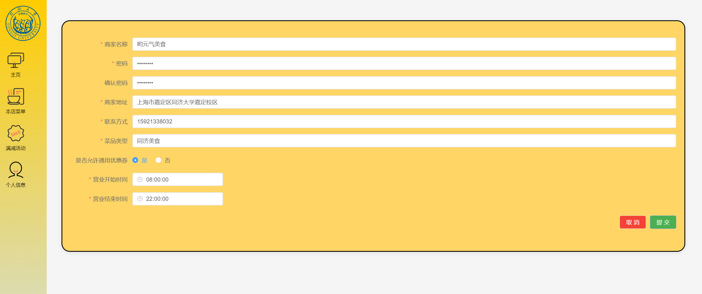

##### 6.2.4 Rider: Edit information page

On this page, rider can edit business information. In addition, rider can withdraw cash.

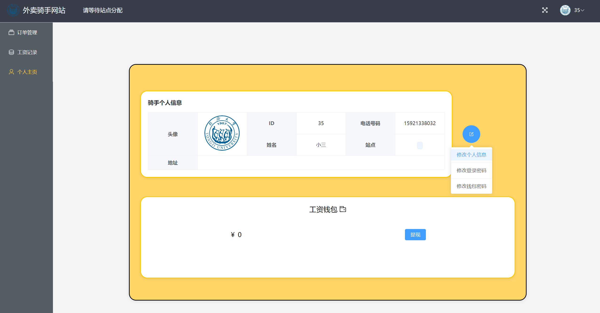

##### 6.2.5 Administrator: Merchant list page

On this page, administrators can view the list of merchant.

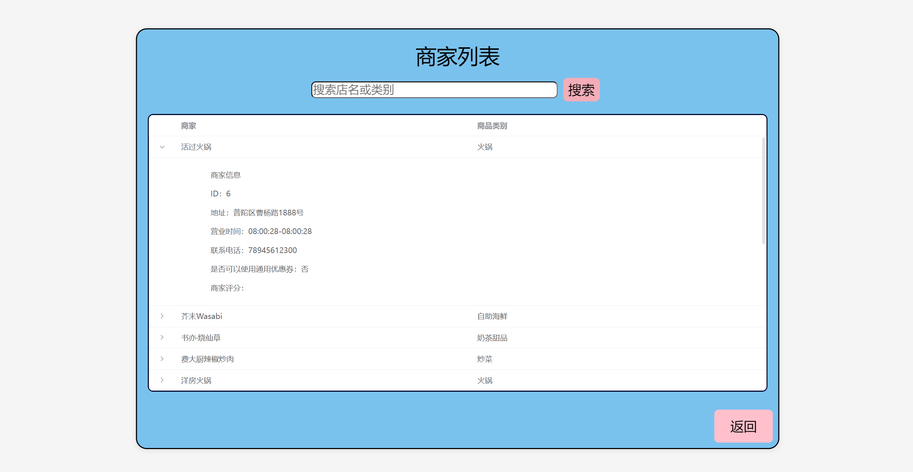

##### 6.2.6 Administrator: User list page

On this page, administrators can view user information.

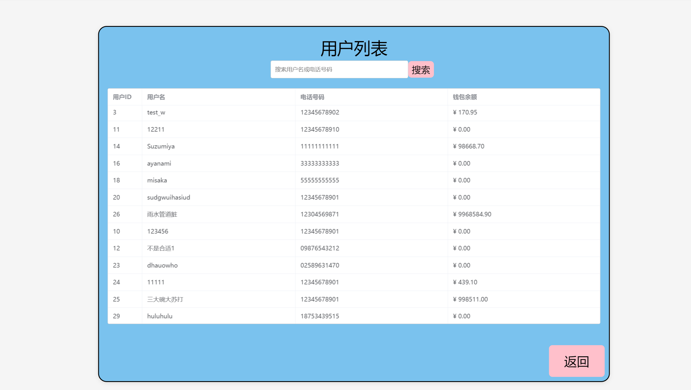

##### 6.2.7 Administrator: Coupon page

From this page, administrators can view coupons and cancel them.

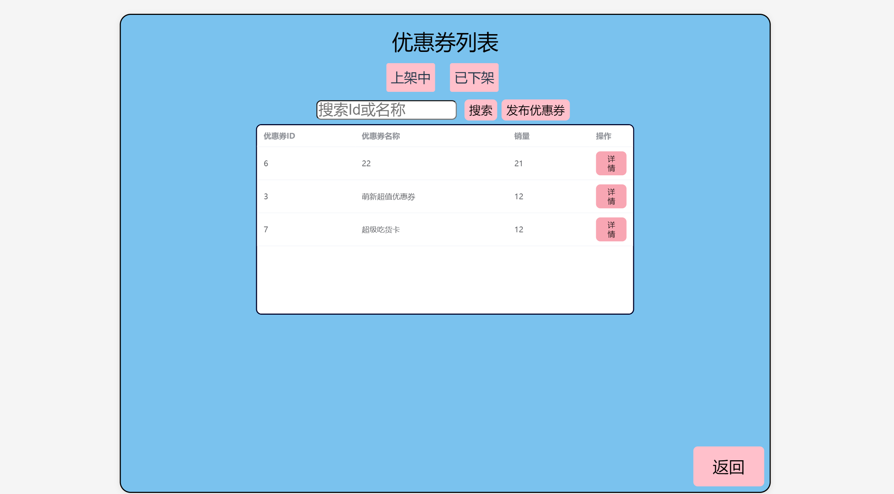

##### 6.2.8 Administrator: Area list page

From this page, administrators can view the site and edit and delete it.

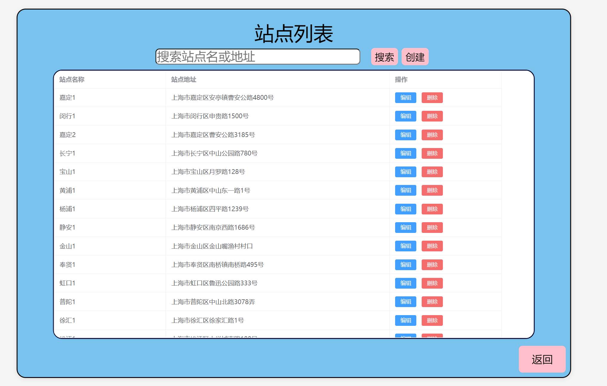

##### 6.2.9 Administrator: Rider list page

From this page, administrators can view riders and assign sites.

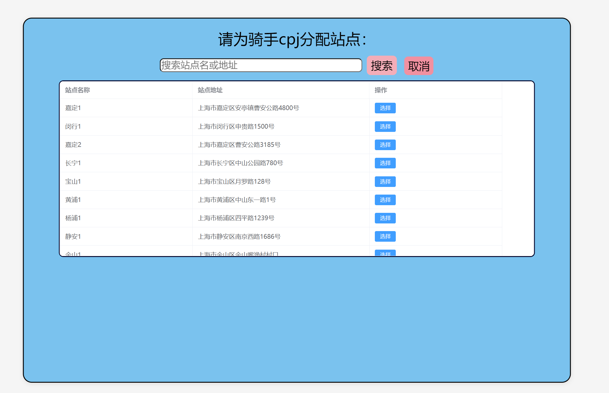

##### 6.2.10 Administrator: Comment management page

From this page, administrators can manage comments.

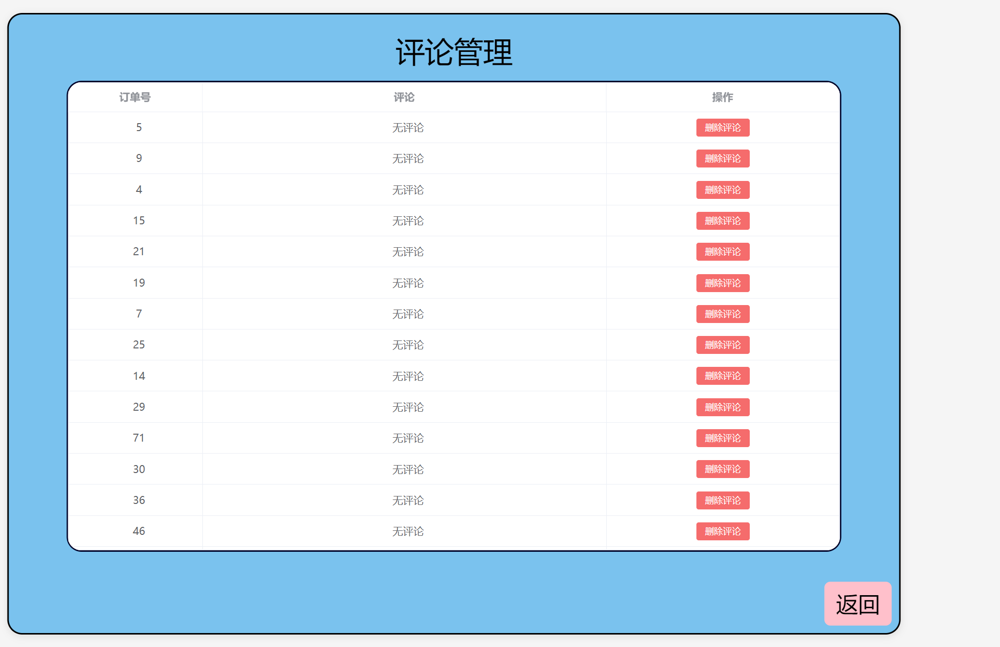

##### 6.2.11 Administrator: Order management page

From this page, administrators can manage orders.

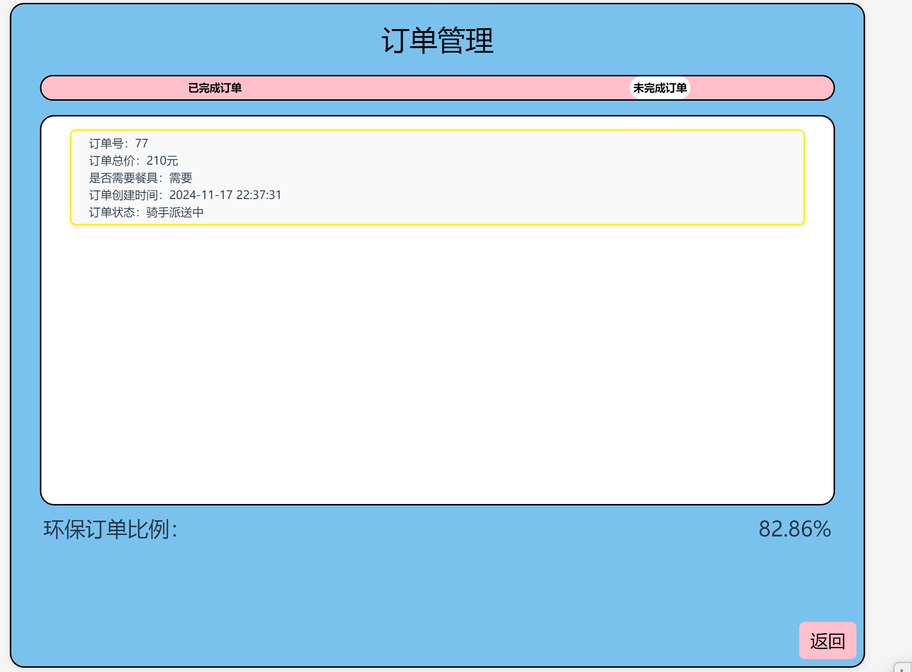

### 7. Unresolved Issues

#### 7.1. After-Sales Service Functionality

- **Problem Description**: Users may need a quick resolution for issues such as incorrect orders, delayed deliveries, or unsatisfactory food quality.
- **Feature Suggestion**: Add a "Request After-Sales Service" button to support refunds, compensation, and re-delivery. Users can select the issue type (e.g., "Delayed Delivery," "Incorrect Order") and upload photos as evidence.
- **Expected Outcome**: Enhances user trust in the platform and reduces dispute resolution time.

#### 7.2 Precise Location Sharing

- **Problem Description**: User-provided addresses may not be accurate, especially in large residential areas or commercial buildings, making it difficult for riders to find the exact location.
- **Feature Suggestion**: Include a "Share Real-Time Location" feature on the order page, allowing users to share their live location for rider navigation.
- **Expected Outcome**: Improves delivery efficiency and minimizes delays caused by inaccurate addresses.

#### 7.3 Diverse Payment Methods

- **Problem Description**: Some users prefer alternative payment methods not currently supported by the system.
- **Feature Suggestion**: Add support for payment options like Apple Pay, Google Pay, and Digital RMB.
- **Expected Outcome**: Increases order conversion rates and enhances the user payment experience.

#### 7.4 Personalized Recommendations

- **Problem Description**: Users may struggle to discover food items that match their preferences, particularly during their first use of the platform.
- **Feature Suggestion**: Use machine learning algorithms to generate personalized recommendations based on users' order history and ratings. Include a "You May Like" module.
- **Expected Outcome**: Boosts repeat purchase rates and increases user engagement.

### 8. References

1. **A. G. Taylor, *SQL for Dummies*. Wiley, 9th ed., 2018.**

   This book provides a comprehensive guide to SQL, including syntax, database creation, advanced queries, and performance optimization techniques. It formed the basis for designing database tables such as users, orders, and merchant lists in the Jikeda platform.

2. **C. R. Pereira, *Building APIs with Node.js*. Apress, 1st ed., 2016.**

   This book offers practical tutorials for creating scalable APIs using Node.js, covering topics like routing, HTTP request handling, database integration, and authentication. It was instrumental in building the backend API for the Jikeda platform, enabling functionalities like user authentication and order management.

3. **J. Duckett, *HTML & CSS: Design and Build Websites*. Wiley, 1st ed., 2011.**

   This visually rich book introduces foundational web development concepts, such as HTML structure, CSS styling, and responsive design. It was used to create intuitive and user-friendly interfaces for the Jikeda platform, enhancing overall user experience.

### 9. Contributions

This system analysis project has undergone multiple discussions. Throughout the process, all team members actively engaged in the discussions and worked diligently to complete their assigned tasks. The team maintained a harmonious collaboration, effectively communicating and addressing issues promptly. The division of labor within the group was equitable and well-defined, as detailed below:

- **Brief Introduction**:
  The brief introduction is written by Lejunjie Chen.
- **Architecture Decisions**:
  The architecture decisions are written by ZIyi Zhao.
- **Overall Robustness Diagram**:
  The overall robustness diagram is created by Siyuan Yu.
- **Architecture Part - DTO Component Library**:
  The DTO component library is analyzed and documented by Siyuan Yu.
- **Architecture Part - Monitor and Security Layer**:
  The monitor and security layer is analyzed and documented by Siyuan Yu.
- **Architecture Part - Business Logic Layer**:
  The business logic layer is analyzed and documented by Lejunjie Chen.
- **Architecture Part - Service Layer**:
  The service layer is analyzed and documented by Lejunjie Chen.
- **Architecture Part - Frontend Frameworks and Libraries Layer**:
  The frontend frameworks and libraries layer is analyzed and documented by Ziyi Zhao.
- **Architecture Part - Backend Frameworks and Libraries Layer**:
  The backend frameworks and libraries layer is analyzed and documented by Haoran Wang.
- **User Information Management System**:
  The user information management system is analyzed and documented by Lejunjie Chen.
- **User Ordering System**:
  The user ordering system is analyzed and documented by Lejunjie Chen.
- **Login & Register System**:
  The login & register system is analyzed and documented by Haoran Wang.
- **Merchant Menu System**:
  The merchant menu system is analyzed and documented by Haoran Wang.
- **Order System**:
  The order system is analyzed and documented by Siyuan Yu.
- **Administrator System**:
  The administrator system is analyzed and documented by ZIyi Zhao.
- **Updated Use Case Model**:
  The updated use case model is analyzed and documented by Haoran Wang.
- **Updated Snapshots **:
  The updated snapshots are provided by Lejunjie Chen.
- **Unresolved Issues**:
  The unresolved issues are identified and documented by Siyuan Yu.
- **References**:
  The references are compiled by Siyuan Yu.
- **Document Integration**:
  The document is integrated and beautified by Lejunjie Chen.

#### STUDENT NUMBER NAME SCORE WEIGHT

| Student_ID | Name          | Score Weight |
| ---------- | ------------- | ------------ |
| 2251528    | Haoran Wang   | 100%         |
| 2251656    | Siyuan Yu     | 100%         |
| 2250944    | Lejunjie Chen | 100%         |
| 2254272    | Ziyi Zhao     | 100%         |