# <center>Contents</center>

[TOC]

## 1.Introduction

### 1.1 Purpose

The purpose of this System Design Model Document (SDM) is to present a detailed design model for the JiKeDa Takeaway Service System. This document will cover the platform-independent architecture, related subsystems, and specific interfaces. Additionally, it will provide examples of system prototyping and mechanisms. The goal is to offer a comprehensive understanding of the system's design, focusing on its architecture, interfaces, and implementation strategies.

### 1.2 Project Scope

The JiKeDa Takeaway Service System is a web-based platform designed to simplify the process of ordering and delivering food and other goods. The system aims to provide a seamless user experience for users, merchants, riders, and administrators. Users can access the system via PC or mobile devices to browse menus, place orders, and track deliveries. Merchants can manage their menus, orders, and promotions, while riders handle delivery tasks. Administrators oversee the platform, manage user accounts, and monitor system performance.

Key features of the system include:

**User Management**: Users can place, track, and manage orders.

**Merchant Management**: Merchants can update menus, manage orders, and create promotions.

**Rider Management**: Riders can accept, deliver, and track orders.

**Administrative Control**: Administrators can manage users, monitor system performance, and resolve issues.

### 1.3 Glossary of Terms

| **Technology**                 | **Description**                                              |
| ------------------------------ | ------------------------------------------------------------ |
| **Microservices Architecture** | A design approach that decomposes a system into smaller, autonomous services, each responsible for specific business functionalities. |
| **OAuth 2.0**                  | An industry-standard protocol for authorization, used to secure inter-service communication and user authentication. |
| **Hibernate**                  | An ORM (Object-Relational Mapping) framework used for data persistence in relational databases. |
| **ELK Stack**                  | A collection of tools (Elasticsearch, Logstash, Kibana) used for centralized logging and monitoring. |
| **Vue.js**                     | A progressive JavaScript framework used for building user interfaces. |
| **Spring Boot**                | A Java-based framework used for building microservices and backend services. |
| **API Gateway**                | A service that acts as an entry point for external requests, routing them to the appropriate microservices. |

### 1.4 Progress on System Design

In the previous phase, we completed the analysis model for the JiKeDa Takeaway Service System, including user interface designs, architecture diagrams, and class diagrams. Based on this foundation, we have made significant progress in the system design, as outlined below:

**Architecture Refinement**: The system has been refined to adopt a microservices architecture, with clear separation of concerns and modularity. Each service is designed to be independently deployable and scalable.

**Interface Specification**: Detailed specifications for the system's interfaces have been developed, including REST APIs for user management, order processing, and payment services.

**Design Mechanisms**: Two key design mechanisms—Data Persistence and User Access Control—have been implemented using Hibernate and OAuth 2.0, respectively.

**Prototyping**: Initial prototypes for both the front-end and back-end have been developed, showcasing the system's user interface and core functionalities.

### 1.5 Description of Implementation Platforms and Frameworks

In the practical development of the JiKeDa Takeaway Service System, we adopt a microservices architecture to ensure flexibility, scalability, and high availability. Each microservice is independently deployable and loosely coupled, focusing on specific tasks. To achieve this, we leverage a series of proven technologies and frameworks, as outlined below:

**Front-End**:

- **Vue.js**: A progressive JavaScript framework for building responsive and interactive user interfaces.
- **Element-UI**: A UI component library for Vue.js, providing pre-built components for rapid development.
- **npm**: The package manager for JavaScript, used to manage dependencies and streamline development.
- **vue-cli**: A command-line tool for scaffolding Vue.js projects.

**Back-End**:

- **Spring Boot**: A Java-based framework for building microservices and backend services.
- **Spring Cloud**: Provides tools for building distributed systems, including service discovery (Nacos) and API Gateway.
- **Hibernate**: An ORM framework for data persistence in Oracle databases.
- **OAuth 2.0**: A standard protocol for secure authorization, used for user authentication and inter-service communication.
- **Redis:** An in-memory data store used for caching frequently accessed data.

**Database**:

- **Oracle**: A relational database used for persistent data storage.
- **Redis:** An in-memory data store used for caching frequently accessed data.

**Monitoring and Logging**:

- **ELK Stack**: Elasticsearch, Logstash, and Kibana are used for centralized logging and real-time monitoring.
- **Grafana**: Used for visualizing system metrics and performance data.

**Messaging**:

- **ActiveMQ**: A messaging broker used for asynchronous communication between services.
- **Kafka**: Used for high-throughput, real-time data streaming.

**Deployment**:

- **Docker**: Used for containerizing services for easy deployment and scaling.
- **Kubernetes**: An orchestration platform for managing containerized applications.

These platforms and frameworks collectively enable the JiKeDa Takeaway Service System to deliver a robust, scalable, and secure solution that meets the dynamic requirements of a modern takeaway platform.

### 1.6 Architectural Style

#### 1.6.1 Overview

The JiKeDa Takeaway Service System employs a Microservice Architecture, a design approach that decomposes the system into smaller, autonomous services, each responsible for specific business functionalities. This architectural style emphasizes modularity, scalability, and flexibility, making it ideal for a high-demand, complex service like a takeaway platform.

#### 1.6.2 Characteristics

**Modularity**:

- The system is broken into multiple independent microservices such as user management, order processing, and payment services.
- Each service is self-contained, focusing on a specific domain and functionality.

**Service-Oriented Design**:

- Services communicate using lightweight protocols such as REST and gRPC.
- Inter-service communication is secured using OAuth 2.0 and Sa-Token.

**Decoupled Development and Deployment**:

- Services are loosely coupled, allowing independent development, testing, and deployment.
- This enhances agility, enabling faster feature delivery and updates.

**Data Transformation**:

- Standardized data models (e.g., VO → DTO → DO → PO) ensure consistency across the system.
- Persistent objects are stored using Hibernate in Oracle databases, with Redis providing caching support.

**Scalability and Fault Tolerance**:

- Individual services can scale horizontally to meet increased demand.
- Failures in one service are isolated, ensuring overall system stability.

#### 1.6.3 Design Principles

**Distributed Deployment**:

Each service operates independently, deployed as a containerized application using Docker or Kubernetes.

**Service Registration and Discovery**:

Nacos is used for dynamic service discovery and load balancing.

**Logging and Monitoring**:

The ELK stack (Elasticsearch, Logstash, Kibana) provides centralized logging and monitoring, with Grafana used for real-time system metrics.

**Security and Authentication**:

User authentication is implemented via OAuth 2.0, with additional security provided by Spring Security.

#### 1.6.4 Key Advantages

1. **Scalability**:
   - Individual services can be scaled independently based on demand, optimizing resource utilization.
2. **Fault Isolation**:
   - Issues in one service (e.g., order processing) do not propagate to other services, allowing the system to degrade gracefully.
3. **Agility**:
   - The architecture supports rapid development cycles, enabling quick feature releases and system enhancements.
4. **Maintainability**:
   - Modular services simplify debugging, testing, and maintenance, improving developer productivity.

#### 1.6.5 Core Components

- Frontend:
  - Built with Vue.js for responsive and interactive user interfaces.
- Backend:
  - Powered by Spring Boot and Spring Cloud, enabling efficient service orchestration and API management.
- Caching:
  - Redis and Memcached reduce latency and improve performance for frequently accessed data.
- Messaging:
  - ActiveMQ facilitates asynchronous communication between services.

By adhering to the microservice architecture principles, the **JiKeDa Takeaway Service System** delivers a robust, scalable, and highly maintainable solution that supports the dynamic requirements of a modern takeaway platform.

## 2. Architecture Refinement

### 2.1 Platform-dependent Architecture

The **JiKeDa Takeaway Service System** is meticulously architected to thrive in the dynamic landscape of online food delivery. Its foundation lies in a microservices architecture, which is renowned for its ability to scale and evolve with the ever-changing demands of the market. This design philosophy allows for the system to be decomposed into a collection of smaller, independent services, each with its own set of responsibilities and capabilities.

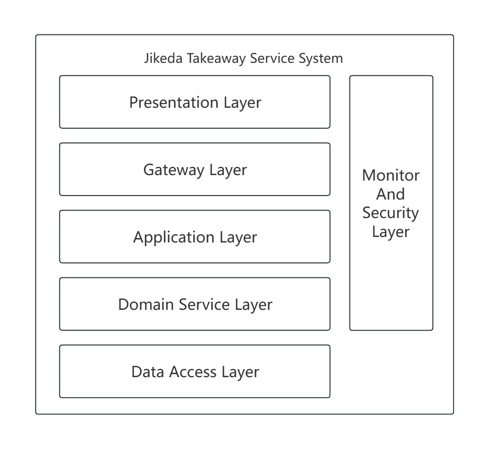

#### Technical Service Model View

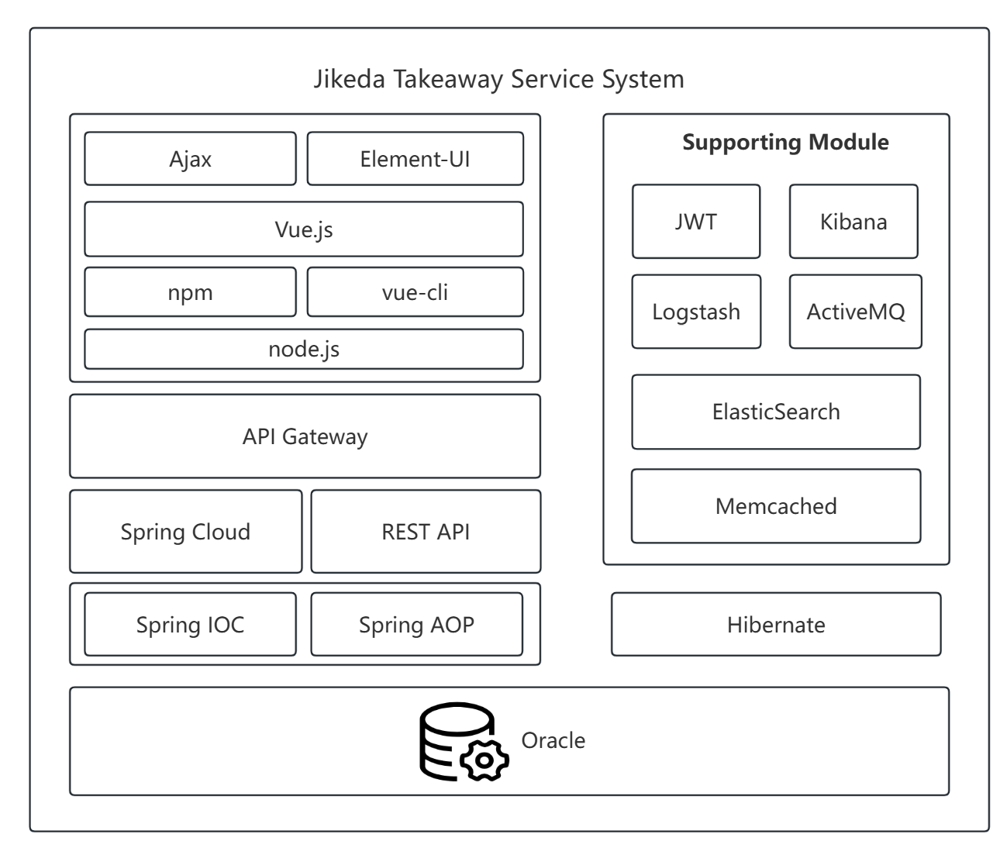

At the heart of the system's technical model are the following components:

**Frontend Technologies**: The user interface is brought to life with Vue.js, a progressive framework that ensures a responsive and engaging experience. Element-UI complements this by providing a rich set of UI components that adhere to modern design standards. Ajax is employed for seamless asynchronous server communication, allowing for a fluid user experience without the need for page reloads.

**Development Tools**: npm and vue-cli are instrumental in managing project dependencies and providing a structured environment for development, ensuring that the build process is both efficient and reliable.

**Backend Frameworks**: The backend is powered by Spring Boot and Spring Cloud, which together create a robust platform for developing and orchestrating microservices. These frameworks are chosen for their ability to handle complex business logic and to facilitate communication between services.

**API Gateway**: This component acts as the central hub for managing and routing incoming API requests, ensuring that they are directed to the appropriate microservices. It also plays a crucial role in enhancing security and efficiency by providing a single entry point.

**Data Access**: Data persistence is managed through Hibernate, which simplifies the interaction with Oracle databases. This object-relational mapping (ORM) tool is essential for converting database records into Java objects and vice versa, streamlining the data access layer.

#### Data Model View

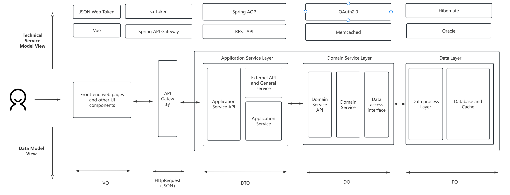

The data model within the system is meticulously crafted to ensure consistency and efficiency:

**VO (View Object)**: This represents the raw user input data captured from the frontend, serving as the initial point of data collection.

**DTO (Data Transfer Object)**: Standardizes the data formats for communication between services, ensuring that data is consistently structured as it moves throughout the system.

**DO (Domain Object)**: These objects encapsulate the business logic and rules within the domain, providing a layer of abstraction that keeps the core business logic separate from the technical implementation.

**PO (Persistent Object)**: These objects are designed to map directly to the database schema, ensuring that data storage and retrieval are optimized for performance and reliability.

#### Supporting Modules

The system's reliability and efficiency are further bolstered by a suite of supporting modules:

**Security**: The security of the system is paramount, with JWT providing a secure means of token-based authentication. OAuth 2.0 and Spring Security work in tandem to manage user authentication and access control, ensuring that only authorized users can interact with sensitive data.

**Monitoring and Logging**: The ELK Stack (Elasticsearch, Logstash, Kibana) is central to the system's monitoring and logging efforts. It provides a comprehensive view of the system's health and performance, allowing for real-time data visualization and search capabilities.

**Message Queuing**: ActiveMQ is integral to the system's ability to handle asynchronous communication between services. This ensures that the system can manage concurrent operations without delays, maintaining a high level of responsiveness.

#### Layered Logical Architecture

The layered logical architecture of the system is a testament to its design for flexibility and scalability:

**Presentation Layer**: This is the face of the system, handling all user interactions and serving as the bridge between the user and the backend services.

**Gateway Layer**: The API Gateway is the sentinel that routes incoming requests to the appropriate backend services, ensuring that the system's resources are utilized efficiently.

**Application Layer**: This layer is where the business logic resides, encapsulating the core functionalities of the system and exposing APIs that external clients can interact with.

**Domain Service Layer**: Here, the core business logic is implemented, managing processes like order management and payment processing, which are critical to the system's operation.

**Data Access Layer**: This layer manages the interaction with databases and caches, using Hibernate to facilitate efficient data retrieval and storage, ensuring that the system's data needs are met with optimal performance.

In summary, the JiKeDa Takeaway Service System is a testament to modern software architecture, designed to deliver a seamless and efficient service in the competitive world of online food delivery. Its microservices-based design, coupled with a robust set of supporting modules and a layered logical architecture, positions it to meet the challenges of scalability, maintainability, and performance head-on.

### 2.2 Subsystems and Interfaces

According to domain-driven design, in order to properly design the corresponding domain services, we chose to divide the business boundary involved in the system into four primary partial domains: Merchant, Platform, Rider, and Users. Each domain represents a distinct area of responsibility within the system, ensuring clear separation of concerns and modularity.

Based on the above domain design, in order to accommodate the moderate granularity of services in the system design process, we choose to further divide the microservices into the following systems based on functionality:

#### 2.2.1 Merchant Subsystem

The Merchant Subsystem is responsible for managing all operations related to merchants, including registration, account management, dish management, and order handling. Below are the key interfaces provided by this subsystem:

| ORDER NUM | REST API                                      | INTERFACE INTRODUCTION                                       |
| --------- | --------------------------------------------- | ------------------------------------------------------------ |
| 001       | POST /api/Merchant/register                   | Merchant registration interface, used to create a merchant account. |
| 002       | POST /api/Merchant/login                      | Merchant login interface, to obtain an authentication token. |
| 003       | GET /api/Merchant/merchantSearch              | Retrieve merchant information based on specified conditions. |
| 004       | PUT /api/Merchant/merchantEdit                | Update merchant information.                                 |
| 005       | PUT /api/Merchant/recharge                    | Merchant account recharge interface.                         |
| 006       | PUT /api/Merchant/withdraw                    | Merchant account withdrawal interface.                       |
| 007       | GET /api/Merchant/dishSearch                  | Query dish information published by the merchant.            |
| 008       | DELETE /api/Merchant/dishDelete               | Delete dish information.                                     |
| 009       | POST /api/Merchant/uploadImage                | Upload dish images or promotional images.                    |
| 010       | PUT /api/Merchant/dishEdit                    | Edit dish information.                                       |
| 011       | POST /api/Merchant/createDish                 | Create a new dish.                                           |
| 012       | GET /api/Merchant/GetStations                 | Retrieve all station information.                            |
| 013       | POST /api/Merchant/assignStation              | Assign a delivery station to the merchant.                   |
| 014       | PUT /api/Merchant/editMerchantStation         | Edit the merchant's delivery station information.            |
| 015       | POST /api/Merchant/specialOfferCreate         | Create a special promotional offer.                          |
| 016       | PUT /api/Merchant/specialOfferEdit            | Edit promotional offer information.                          |
| 017       | DELETE /api/Merchant/deleteSpecialOffer       | Delete a promotional offer.                                  |
| 018       | GET /api/Merchant/specialOfferGet             | Retrieve a single promotional offer's information.           |
| 019       | GET /api/Merchant/getDishInfo                 | Query detailed dish information.                             |
| 020       | GET /api/Merchant/multiSpecialOfferGet        | Retrieve multiple promotional offers' information.           |
| 021       | GET /api/Merchant/getOrdersToHandle           | Query the list of orders to be processed.                    |
| 022       | DELETE /api/Merchant/deletePaidOrder          | Delete a paid order record.                                  |
| 023       | GET /api/Merchant/getMerAddrByOrderId         | Retrieve the merchant's address based on the order ID.       |
| 024       | PUT /api/Merchant/deliverOrder                | Update the order status to "in delivery".                    |
| 025       | GET /api/Merchant/ordersByRegion              | Query order information by region.                           |
| 026       | GET /api/Merchant/getMerOrdersWithinThisMonth | Retrieve the merchant's order data for the current month.    |
| 027       | GET /api/Merchant/getMerOrdersWithinThisDay   | Retrieve the merchant's order data for the current day.      |
| 028       | GET /api/Merchant/getMerPrice                 | Query the merchant's total income.                           |
| 029       | GET /api/Merchant/getMerAvgRating             | Retrieve the merchant's average rating.                      |
| 030       | GET /api/Merchant/getFinishedMerOrders        | Query the merchant's completed order information.            |
| 031       | GET /api/Merchant/getMerRating                | Query the merchant's detailed rating data.                   |

#### 2.2.2 Platform Subsystem

The Platform Subsystem is responsible for managing platform-level operations, including station management, rider assignment, and sales analytics. Below are the key interfaces provided by this subsystem:

| ORDER NUM | REST API                                   | INTERFACE INTRODUCTION                                  |
| --------- | ------------------------------------------ | ------------------------------------------------------- |
| 032       | POST /api/Platform/login                   | Platform administrator login.                           |
| 033       | DELETE /api/Platform/merchantDelete        | Delete a merchant account.                              |
| 034       | POST /api/Platform/stationCreate           | Create a delivery station.                              |
| 035       | GET /api/Platform/stationSearch            | Search delivery stations based on specified conditions. |
| 036       | PUT /api/Platform/stationEdit              | Edit delivery station information.                      |
| 037       | DELETE /api/Platform/stationDelete         | Delete a delivery station.                              |
| 038       | GET /api/Platform/GetStationIds            | Retrieve all station IDs.                               |
| 039       | GET /api/Platform/SeparateRiders           | Query rider assignment status.                          |
| 040       | POST /api/Platform/riderStationAssign      | Assign a station to a rider.                            |
| 041       | DELETE /api/Platform/riderStationDelete    | Delete a rider's station assignment.                    |
| 042       | PUT /api/Platform/riderStationEdit         | Edit a rider's station information.                     |
| 043       | POST /api/Platform/couponCreate            | Create a coupon campaign.                               |
| 044       | GET /api/Platform/couponSearch             | Query coupon campaigns.                                 |
| 045       | PUT /api/Platform/couponEdit               | Edit coupon campaign information.                       |
| 046       | GET /api/Platform/GetCouponIds             | Retrieve all coupon IDs.                                |
| 047       | GET /api/Platform/GetMerchantStation       | Query the merchant's delivery station information.      |
| 048       | GET /api/Platform/GetStationRiders         | Query the list of riders under a delivery station.      |
| 049       | GET /api/Platform/getEcoOrder              | Retrieve ecological order data.                         |
| 050       | GET /api/Platform/getMerAddrByOrderId      | Query the merchant's address corresponding to an order. |
| 051       | GET /api/Platform/GetSalesByRegion         | Statistically analyze sales data by region.             |
| 052       | GET /api/Platform/GetQuantityByRegion      | Statistically analyze order quantity by region.         |
| 053       | GET /api/Platform/getFinishedOrders        | Query the list of completed orders.                     |
| 054       | GET /api/Platform/getUnfinishedOrders      | Query the list of unfinished orders.                    |
| 055       | GET /api/Platform/getFinishedOrdersComment | Retrieve user reviews of completed orders.              |
| 056       | PUT /api/Platform/deleteOrdersComment      | Delete user reviews.                                    |
| 057       | DELETE /api/Platform/deleteFinishedOrder   | Delete a completed order record.                        |

#### 2.2.3 Rider Subsystem

The Rider Subsystem is responsible for managing all operations related to riders, including registration, account management, and order handling. Below are the key interfaces provided by this subsystem:

| ORDER NUM | REST API                                               | INTERFACE INTRODUCTION                                       |
| --------- | ------------------------------------------------------ | ------------------------------------------------------------ |
| 058       | POST /api/Rider/register                               | Rider registration.                                          |
| 059       | POST /api/Rider/login                                  | Rider login.                                                 |
| 060       | GET /api/Rider/riderSearch                             | Search rider information.                                    |
| 061       | PUT /api/Rider/riderEdit                               | Edit rider account information.                              |
| 062       | PUT /api/Rider/recharge                                | Rider account recharge.                                      |
| 063       | GET /api/Rider/StIdSearch                              | Query the station information where the rider is located.    |
| 064       | GET /api/Rider/getReceivedOrders                       | Retrieve orders received by the rider.                       |
| 065       | GET /api/Rider/getDeliveredOrdersCountandAverageRating | Query the number of orders completed by the rider and the average rating. |
| 066       | GET /api/Rider/getPaidOrders                           | Retrieve paid orders of the rider.                           |
| 067       | PUT /api/Rider/receiveOrder                            | Rider receives a new order.                                  |
| 068       | GET /api/Rider/getRiderPrice                           | Query the rider's income.                                    |
| 069       | GET /api/Rider/getRiderInOrder                         | Retrieve the rider information assigned to an order.         |
| 070       | GET /api/Rider/getOrdersWithinThisMonth                | Query the rider's order data for the current month.          |
| 071       | PUT /api/Rider/withdraw                                | Rider account withdrawal.                                    |
| 072       | GET /api/Rider/getFinishedOrders                       | Query the rider's completed orders.                          |

#### 2.2.4 Users Subsystem

The Users Subsystem is responsible for managing all operations related to users, including registration, account management, shopping cart, and order handling. Below are the key interfaces provided by this subsystem:

| ORDER NUM | REST API                                 | INTERFACE INTRODUCTION                                 |
| --------- | ---------------------------------------- | ------------------------------------------------------ |
| 073       | POST /api/Users/register                 | User registration interface.                           |
| 074       | POST /api/Users/login                    | User login interface.                                  |
| 075       | GET /api/Users/userSearch                | Search user information.                               |
| 076       | GET /api/Users/getAllUsers               | Query all user information.                            |
| 077       | PUT /api/Users/userEdit                  | Edit user information.                                 |
| 078       | DELETE /api/Users/deleteUser             | Delete a user account.                                 |
| 079       | PUT /api/Users/recharge                  | User account recharge.                                 |
| 080       | PUT /api/Users/withdraw                  | User account withdrawal.                               |
| 081       | GET /api/Users/GetMerchantIds            | Retrieve a list of merchant IDs.                       |
| 082       | GET /api/Users/merchantsSearch           | Search merchant information.                           |
| 083       | GET /api/Users/merchantsAll              | Retrieve all merchant information.                     |
| 084       | POST /api/Users/CreateFM                 | Create a favorites list.                               |
| 085       | GET /api/Users/getFM                     | Retrieve favorites list information.                   |
| 086       | DELETE /api/Users/deleteFM               | Delete a favorites list.                               |
| 087       | POST /api/Users/addToShoppingCart        | Add a dish to the shopping cart.                       |
| 088       | PUT /api/Users/decrementDishInCart       | Decrease the quantity of a dish in the shopping cart.  |
| 089       | DELETE /api/Users/removeFromShoppingCart | Remove a dish from the shopping cart.                  |
| 090       | GET /api/Users/getShoppingCartItems      | Retrieve all items in the shopping cart.               |
| 091       | GET /api/Users/getShoppingCartinMerchant | Query the shopping cart items for a specific merchant. |
| 092       | DELETE /api/Users/deleteShoppingCart     | Clear the shopping cart.                               |
| 093       | POST /api/Users/submitAddress            | Submit a user address.                                 |
| 094       | DELETE /api/Users/deleteAddress          | Delete a user address.                                 |
| 095       | PUT /api/Users/editAddress               | Edit user address information.                         |
| 096       | GET /api/Users/getAddress                | Retrieve a list of user addresses.                     |
| 097       | GET /api/Users/getAddByAddId             | Retrieve address information based on the address ID.  |
| 098       | GET /api/Users/couponList                | Query the coupon list.                                 |
| 099       | POST /api/Users/createCpPurchase         | Create a coupon purchase record.                       |
| 100       | GET /api/Users/getUserCoupons            | Query the coupons owned by the user.                   |
| 101       | GET /api/Users/getCouponInfo             | Retrieve detailed coupon information.                  |
| 102       | GET /api/Users/getAllCP                  | Retrieve all coupon information.                       |
| 103       | GET /api/Users/GetDefaultAddress         | Retrieve the default address.                          |
| 104       | POST /api/Users/createDefaultAddress     | Set the default address.                               |
| 105       | DELETE /api/Users/deleteDefaultAddress   | Delete the default address.                            |
| 106       | GET /api/Users/GetUserAddress            | Query user addresses.                                  |
| 107       | POST /api/Users/CreateOrder              | Create a new order.                                    |
| 108       | POST /api/Users/PurchaseOrder            | Submit an order purchase record.                       |
| 109       | GET /api/Users/getOrders                 | Query the user's order list.                           |
| 110       | GET /api/Users/getOrderCoupon            | Query the coupon associated with an order.             |
| 111       | GET /api/Users/getOrderDishes            | Query the dishes within an order.                      |
| 112       | DELETE /api/Users/deleteOrder            | Delete an order record.                                |
| 113       | PUT /api/Users/updateOrderComment        | Update the order comment.                              |

### 2.3 Example

#### 2.3.1 External System Calls Add Dish API

To facilitate integration with other systems, the takeout delivery platform provides multiple external interfaces. Taking the merchant management subsystem as an example, this section demonstrates how external systems call these interfaces to complete specific business logic.

##### Specific API Design:

| **DISH NUM** | **REST API**                    | **Interface**                                           | **Argument**          | **Return Value**          | **Interface Introduction**                                   |
| ------------ | ------------------------------- | ------------------------------------------------------- | --------------------- | ------------------------- | ------------------------------------------------------------ |
| 001          | `POST /api/Merchant/createDish` | `addDish(DishDBDto dishInfo): Result<boolean>`          | `dishInfo: DishDBDto` | `Result<boolean>`         | Receives dish information submitted by the frontend, processes the new dish business logic, and returns whether the operation was successful. |
| 002          | `GET /api/Merchant/dishSearch`  | `getDishes(String merchantId): Result<List<DishDBDto>>` | `merchantId: String`  | `Result<List<DishDBDto>>` | Retrieves all dish information for a specific merchant based on the merchant ID. |
| 003          | `PUT /merchant/dishEdit`        | `updateDish(DishDBDto dishInfo): Result<boolean>`       | `dishInfo: DishDBDto` | `Result<boolean>`         | Receives updated dish information and processes the dish update business logic. |

##### External System Integration Example

**Calling Add Dish API:**
After authorization and authentication, external systems can send HTTP requests containing dish information. For example, to add a new dish, the access URL might be:

```
http://localhost:5079/api/Merchant/createDish
```

**Parameter Passing:**
Data parameters are passed in JSON format within the body of the POST request, such as:

```json
{
    "merchantId":12345,
    "dishName":"宫保鸡丁",
    "dishPrice":23,
    "dishCategory":"川菜",
    "imageUrl":"https://example.com/images/kung-pao-chicken.jpg",
    "dishInventory":50,
    "dishId":67890,
}
```

**Response Format:**
The system will return a JSON-formatted result indicating the success of the operation, for example:

```json
{
    "status": 0,
    "message": "SUCCESS",
    "data": true
}
```

##### Data Transfer Objects (DTOs)

To ensure data security and encapsulation during parameter passing or returning values, DTOs are used to wrap the data. The involved DTOs include but are not limited to:

**DishDBDto**
Contains basic dish information such as name, price, description, and category.


**OrderCreate**
A data structure for order creation.

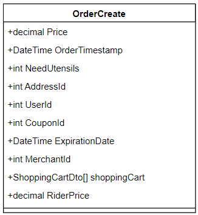

#### 2.3.2 External API Documentation: Merchant Management Subsystem

To facilitate integration with other systems, the university takeout delivery platform provides a series of external APIs that support merchant information querying, station assignment, distance calculation, and more. Below is the external API documentation for the Merchant Management Subsystem, detailing the functions, example code, and how we integrate with Gaode (Amap) API for geolocation and distance calculation.

##### 1 Get All Station Information API

**Function**：

This API retrieves basic information about all the delivery stations and uses the Gaode (Amap) API to get the latitude and longitude of each station to ensure accurate location data.

**API Design**：

```javascript
export const getAllStationInfos = async () => {
    try {
        // Get basic information for all stations
        const response = await axios.get(`${BASE_URL}/Merchant/GetStations`);
        const stationsInfo = response.data.data;
        const stationsWithCoordinates = [];

        // Iterate through all stations and call Gaode API to get latitude and longitude
        for (const station of stationsInfo) {
            const address = encodeURIComponent(station.stationAddress);  // URL encode the station address
            const geoResponse = await axios.get(`https://restapi.amap.com/v3/geocode/geo?address=${address}&output=JSON&key=YOUR_API_KEY`);
            
            // Extract latitude and longitude from Gaode API response
            const location = geoResponse.data.geocodes && geoResponse.data.geocodes.length > 0
                ? geoResponse.data.geocodes[0].location.split(',')
                : [null, null];  // Return null if location is not found

            // Push station ID and coordinates to result array
            stationsWithCoordinates.push({
                StationId: station.stationId,
                Longitude: location[0],  // Longitude
                Latitude: location[1]    // Latitude
            });
        }
        return stationsWithCoordinates;  // Return all stations' IDs and coordinates
    } catch (error) {
        throw error;  // Error handling
    }
};
```

**Parameters**:

No input parameters

**Sample Response**:

```json
[
    {
        "StationId": 1,
        "Longitude": "116.397128",
        "Latitude": "39.916527"
    },
    {
        "StationId": 2,
        "Longitude": "117.209557",
        "Latitude": "39.142797"
    }
]
```

**Function Explanation**:

This API returns all delivery stations' IDs and their corresponding coordinates (latitude and longitude). We utilize Gaode (Amap) API to retrieve the coordinates based on the station's address. The address is URL-encoded and passed to Gaode's API, which returns the geographic coordinates.

##### 2 Assign Nearest Station to Merchant API

**Function**: 

This API calculates the distance between a merchant's address and all delivery stations using the Gaode API and assigns the nearest station to the merchant.

**API Design**:

```javascript
export const assignStationToMerchant = async (address) => {
    try {
        // Get all stations' coordinates
        const stationsWithCoordinates = await getAllStationInfos();
        
        // URL encode the merchant's address and call Gaode API to get its latitude and longitude
        const encodedAddress = encodeURIComponent(address);
        const geoResponse = await axios.get(`https://restapi.amap.com/v3/geocode/geo?address=${encodedAddress}&output=JSON&key=YOUR_API_KEY`);
        
        const targetLocation = geoResponse.data.geocodes && geoResponse.data.geocodes.length > 0
            ? geoResponse.data.geocodes[0].location.split(',')
            : [null, null];  // Return null if location is not found

        if (targetLocation[0] === null) return null;  // Return null if the target address's coordinates are not found

        const targetLongitude = parseFloat(targetLocation[0]);
        const targetLatitude = parseFloat(targetLocation[1]);
        let nearestStationId = null;
        let minDistance = Infinity;

        // Calculate the distance between the merchant's address and each station, and find the nearest station
        for (const station of stationsWithCoordinates) {
            const stationLongitude = parseFloat(station.Longitude);
            const stationLatitude = parseFloat(station.Latitude);
            const distance = haversineDistance(targetLatitude, targetLongitude, stationLatitude, stationLongitude);  // Use Haversine formula for distance calculation

            if (distance < minDistance) {
                minDistance = distance;
                nearestStationId = station.StationId;
            }
        }
        return nearestStationId;  // Return the ID of the nearest station
    } catch (error) {
        throw error;  // Error handling
    }
};
```

**Parameters**:

`address`: The merchant's address to calculate the distance from.

**Sample Response**:

```json
{
    "nearestStationId": 1
}
```

**Function Explanation**:

This API receives a merchant's address and uses the Gaode API to get the merchant's coordinates. It then calculates the distance between the merchant and all available delivery stations, returning the ID of the station that is geographically closest to the merchant. The distance is calculated using the Haversine formula, which considers the Earth's curvature for an accurate result (distance in kilometers).

##### 3 Calculate Distance Between Two Addresses API

**Function**: This API calculates the straight-line distance between two addresses (in kilometers). Gaode API is used to retrieve the latitude and longitude for both addresses, and the Haversine formula is used to calculate the distance.

**API Design**:

```javascript
export const getDistanceBetweenAddresses = async (address1, address2) => {
    try {
        const encodedAddress1 = encodeURIComponent(address1);
        const encodedAddress2 = encodeURIComponent(address2);

        const geoResponse1 = await axios.get(`https://restapi.amap.com/v3/geocode/geo?address=${encodedAddress1}&output=JSON&key=YOUR_API_KEY`);
        const geoResponse2 = await axios.get(`https://restapi.amap.com/v3/geocode/geo?address=${encodedAddress2}&output=JSON&key=YOUR_API_KEY`);

        const location1 = geoResponse1.data.geocodes && geoResponse1.data.geocodes.length > 0
            ? geoResponse1.data.geocodes[0].location.split(',')
            : [null, null];

        const location2 = geoResponse2.data.geocodes && geoResponse2.data.geocodes.length > 0
            ? geoResponse2.data.geocodes[0].location.split(',')
            : [null, null];

        if (location1[0] === null || location2[0] === null) return null;

        const lat1 = parseFloat(location1[1]);
        const lon1 = parseFloat(location1[0]);
        const lat2 = parseFloat(location2[1]);
        const lon2 = parseFloat(location2[0]);

        const distanceInKm = haversineDistance(lat1, lon1, lat2, lon2);
        return distanceInKm.toFixed(1);  // Return distance with one decimal point
    } catch (error) {
        throw error;  // Error handling
    }
};
```

**Parameters**:

`address1`: The first address.

`address2`: The second address.

**Sample Response**:

```json
{
    "distance": 27
}
```

**Function Explanation**:

This API calculates the straight-line distance between two addresses by first using the Gaode API to retrieve the geographic coordinates of each address. Then, the Haversine formula is applied to calculate the distance between the two points, returning the result in kilometers.

##### 4 Edit Merchant's Delivery Station API

**Function**: 

This API allows external systems to modify the delivery station information for a merchant.

**API Design**:

```javascript
export const EditMerchantStation = async (data) => {
    try {
        const response = await axios.put(`${BASE_URL}/Merchant/editMerchantStation`, data);
        return response.data;
    } catch (error) {
        throw error;
    }
};
```

**Parameters**:

`data`: An object containing the merchant ID and the new station information.

**Sample Response**:

```json
{
    "success": true,
    "message": "Merchant station updated successfully"
}
```

## 3 Mechanism Analysis

Mechanism analysis is a critical aspect of system design, ensuring the functionality, performance optimization, and security of the system. This section analyzes the system mechanisms from serveral perspectives.

Two design mechanisms of Jikeda system are as follows:

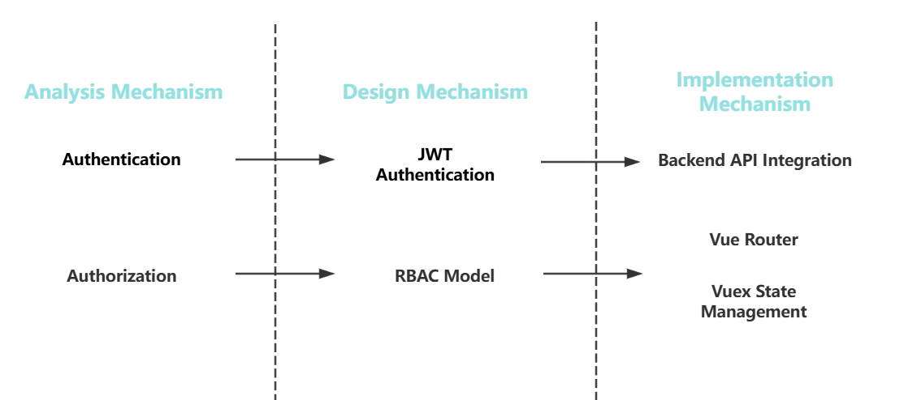

The authentication and authorization mechanisms are the core components of the system, ensuring secure access for users, merchants, riders, and administrators. By leveraging Vue Router's route guards, Vuex state management, and backend API integration, the system implements strict access control and identity verification. Below is a detailed analysis of these mechanisms.

### 3.1 Example: Authentication Mechanism

#### 3.1.1 Token-Based Authentication

The system employs JSON Web Token (JWT) as the core mechanism for identity authentication. After a successful login, the backend generates a token containing user identity information, which the client includes in the HTTP header for subsequent requests.

**Token Expiration Management**: Tokens have a short expiration time (e.g., 1 hour) and are extended through a refresh token mechanism to enhance security.

**Stateless Authentication**: The stateless nature of JWT allows for easy system scaling and reduces the server's burden of storing session information.

#### 3.1.2 Login Process

1. **User Submits Login Form**: The user inputs their user ID and password, selecting their role (user, merchant, rider, or administrator).
2. **Form Validation**: Both the client (Vue.js) and the server (backend API) validate the input data.
3. **API Call**: The system calls the corresponding login API (e.g., `/api/Users/login`, `/api/Merchant/login`, etc.) for identity verification.
4. **Token Generation and Storage**: Upon successful login, the backend generates a JWT token and stores it in Vuex state management.


#### 3.1.3 API List

| **API**               | **HTTP Method** | **Description**                                              |
| --------------------- | --------------- | ------------------------------------------------------------ |
| `/api/Users/login`    | POST            | Authenticates a user and returns a token for subsequent requests. |
| `/api/Merchant/login` | POST            | Authenticates a merchant and returns a token for subsequent requests. |
| `/api/Rider/login`    | POST            | Authenticates a rider and returns a token for subsequent requests. |
| `/api/Platform/login` | POST            | Authenticates an administrator and returns a token for subsequent requests. |

### 3.2. Example:Authorization Mechanism


#### 3.2.1 Role-Based Access Control (RBAC)

The system adopts the RBAC (Role-Based Access Control) model, assigning different permissions based on user roles. Each role can only access routes and functionalities that match its permissions.

**User Roles**:

**User**: Can access user-related pages (e.g., personal center, order management, shopping cart, etc.).

**Merchant**: Can access merchant-related pages (e.g., dish management, special offer management, personal center, etc.).

**Rider**: Can access rider-related pages (e.g., order assignment, personal information, wage management, etc.).

**Administrator**: Can access platform management-related pages (e.g., merchant management, rider management, order management, statistics analysis, etc.).

#### 3.2.2 Route Guards

The system implements access control through Vue Router's route guards. Before each route transition, the system checks the `meta.requiresAuth` property of the target route and determines whether to allow access based on the current user's authentication status.

**Route Guard Logic**:

```javascript
router.beforeEach((to, from, next) => {
    const isAuthenticated = store.state.user || store.state.merchant || store.state.rider || store.state.admin;
    const requiresAuth = to.meta.requiresAuth;

    if (requiresAuth && !isAuthenticated) {
        next({ path: '/login' }); // Redirect to the login page if not logged in
    } else {
        next(); // Allow access
    }
});
```

**Route Configuration Example**:

```javascript
{
    path: "/user-home",
    component: UserHome,
    meta: { requiresAuth: true }, // Requires authentication
    children: [
        { path: 'personal', component: UserPersonal },
        { path: 'cart', component: ShoppingCart },
    ],
}
```

#### 3.2.3 Dynamic Route Addition

The system supports dynamic route addition, primarily for administrator role permissions management. Administrators can dynamically generate menus based on permissions and map them to routes.

**Dynamic Route Addition Method**:

```javascript
export function addRoutes(menus) {
    let hasNewRoute = false;

    const findAndAddRoutesByMenus = (arr) => {
        arr.forEach(e => {
            let item = dynamicRouters.find(o => o.path == e.frontpath);
            if (item && !router.hasRoute(item.path)) {
                router.addRoute("admin", item);
                hasNewRoute = true;
                if (item.children && item.children.length > 0) {
                    item.children.forEach(c => {
                        router.addRoute("admin", c);
                    });
                }
            }
            if (e.child && e.child.length > 0) {
                findAndAddRoutesByMenus(e.child);
            }
        });
    };

    findAndAddRoutesByMenus(menus);
    return hasNewRoute;
}
```

## 4. Use Case Realization

### 4.1 Merchant update menu

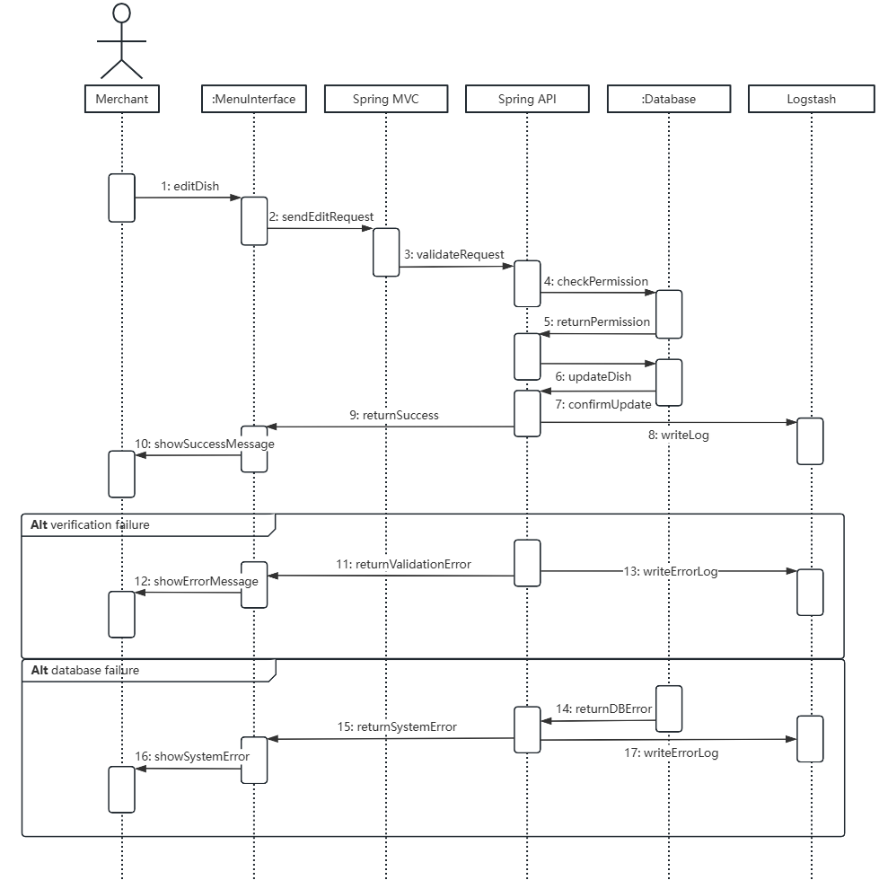

System Architecture Overview:
The system employs a layered architecture comprising:

- Merchant Interface (Frontend)
- Menu Interface
- Spring MVC Controller Layer
- Spring API Service Layer
- Database Layer
- Logstash for logging

Workflow Analysis:

1. Main Success Flow:
   - Merchant initiates dish editing (editDish)
   - Request passes through MenuInterface to Spring MVC
   - Spring MVC validates the request
   - Spring API performs permission checking
   - Upon permission confirmation, database update proceeds
   - Database confirms the update
   - Operation is logged in Logstash
   - Success message returns to merchant

2. Validation Failure Scenario:
   - Spring API detects validation issues
   - Validation error is returned
   - Error message displays to user
   - Error logging occurs in Logstash

3. Database Failure Scenario:
   - Database operation fails
   - System error is returned
   - System error message shows to user
   - Error is logged in Logstash

Key System Features:

1. Comprehensive Error Handling
   - Separate flows for validation and database failures
   - Detailed error logging
   - User-friendly error messages

2. Security Implementation
   - Permission validation before updates
   - Structured authentication flow
   - Secure data access control

3. Robust Architecture
   - Clear separation of concerns
   - Standardized communication flow
   - Centralized logging mechanism

4. Transaction Management
   - Sequential operation flow
   - Consistent state management
   - Proper error recovery

Improvement Suggestions:

1. Cache Implementation
   - Add caching layer for frequently accessed data
   - Implement cache invalidation strategy

2. Enhanced Error Handling
   - More granular error types
   - Retry mechanisms for transient failures

3. Performance Optimization
   - Batch processing capabilities
   - Asynchronous logging

4. Security Enhancements
   - Input validation at each layer
   - Rate limiting implementation
   - Session management

This design demonstrates a well-structured approach suitable for restaurant management systems, with clear separation of concerns and robust error handling capabilities. The integration of Logstash ensures comprehensive activity tracking and system monitoring.

Corresponding subsystems and interfaces, together with their communication method, are represented at the below class diagram and the communication diagram:

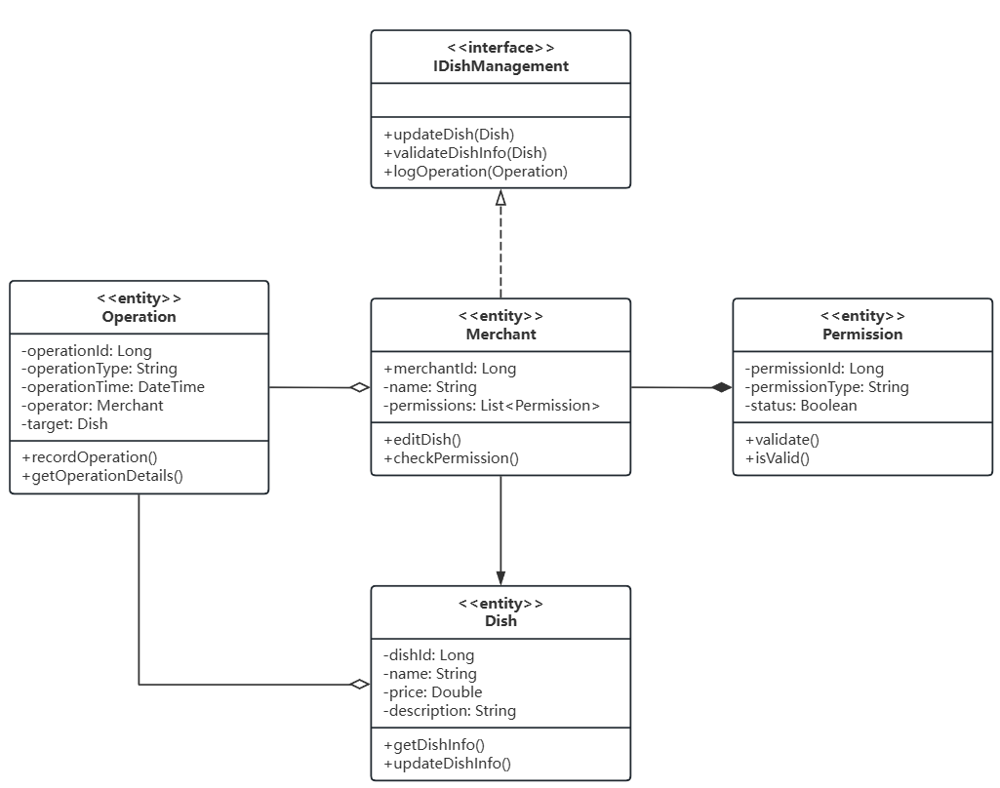

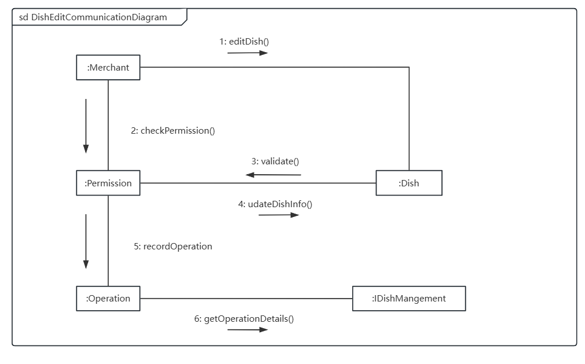

### 4.2 User Payment

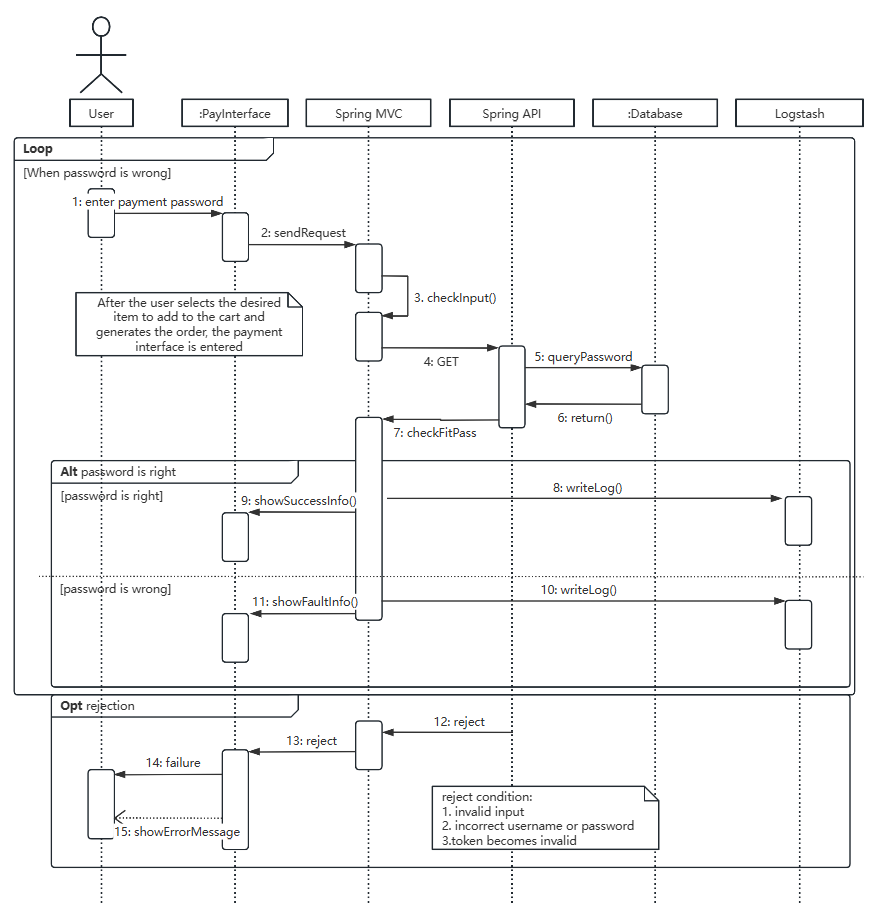

Payment is a critical use case for users who have successfully logged into the system. The process of payment verification is demonstrated in the above sequence diagram.

According to our system design, we use Spring MVC to handle the payment requests, and Spring API for processing payment information and communicating with the database that stores payment credentials. The system employs a secure payment interface to handle sensitive payment data.

After the user selects desired items and generates an order, they must enter their payment password through the payment interface. The information is first validated at the interface level for input correctness, rejecting any illegal format inputs (such as empty or malformed passwords). Once validated, the payment request is sent to Spring MVC for processing.

Spring MVC forwards the request through the checkInput() method, which triggers a GET request to the database via Spring API. The database then executes queryPassword to verify the payment credentials. The result is returned through the return() method, after which checkFitPass() validates whether the password matches the stored credentials.

The system handles two main scenarios:

1. If the password is correct, showSuccessInfo() is called to inform the user of successful verification, and the action is recorded via writeLog().
2. If the password is incorrect, showFaultInfo() notifies the user of the failure, and the event is logged through writeLog().

The system includes rejection handling for various error conditions:

1. Invalid input
2. Incorrect password
3. Token invalidity

When any of these conditions occur, the reject() method is called, leading to a failure state and displaying an error message to the user through showErrorMessage(). The system allows users to retry password entry through a loop mechanism when authentication fails.

All actions are logged in the Logstash system for security auditing and monitoring purposes.

Corresponding subsystems and interfaces, together with their communication method, are represented at the below class diagram and the communication diagram:

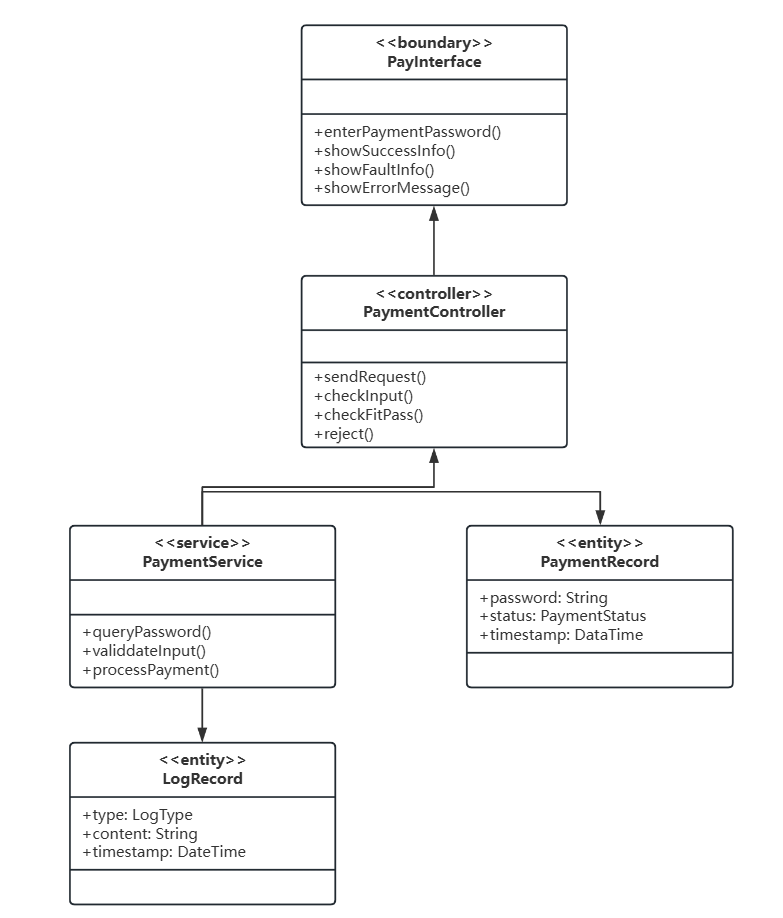

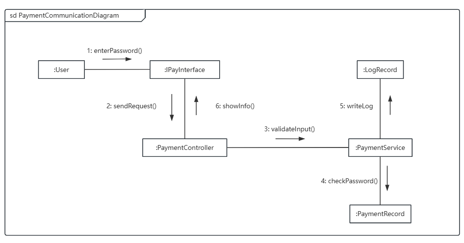

## 5. Progress on Prototyping

### 5.1 Front-end Prototyping

We use VUE.js framework to develop the front-end and Element-UI is used for the UI mode. At the same time, tools such as npm and vue-cli streamline development, while Element-UI and Ajax facilitate rapid UI component integration and server communication.

Taking the order system for example, the front-end code is just as follows.

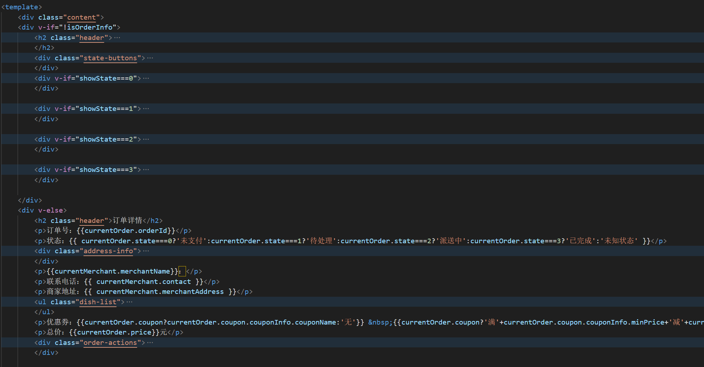

And we use npm run dev to start the front-end. After it is compiled, we can view the page at http://localhost:5234.

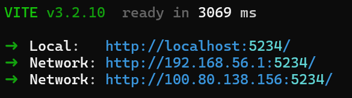

By entering the above website, we can simply see our Ji Ke Da Takeaway system.


### 5.2 Back-end Prototyping

For the backend services of Ji Ke Da Takeaway system, we implement Spring Boot as our main framework with Spring API Gateway for routing and OAuth 2.0 for authentication. This provides a secure and modular approach to service development.

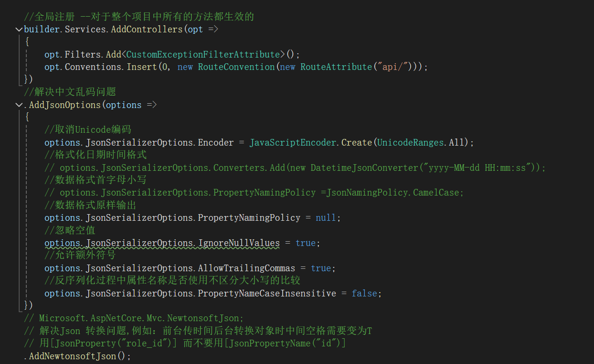

To handle data persistence, we create entity classes using Hibernate annotations, and implement repository interfaces for database operations. Redis is configured for caching frequently accessed data.

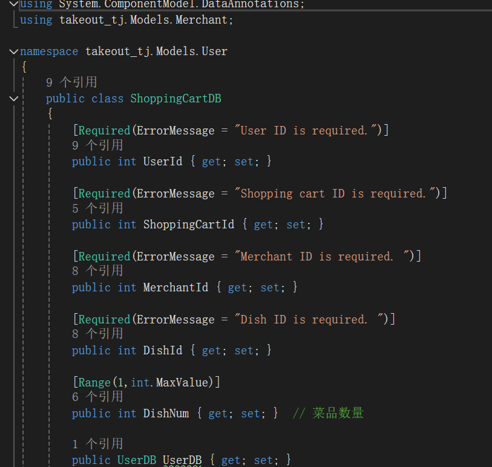

The ELK stack integration helps us monitor application performance and analyze logs in real-time. We configure our application to send logs to Logstash for processing.

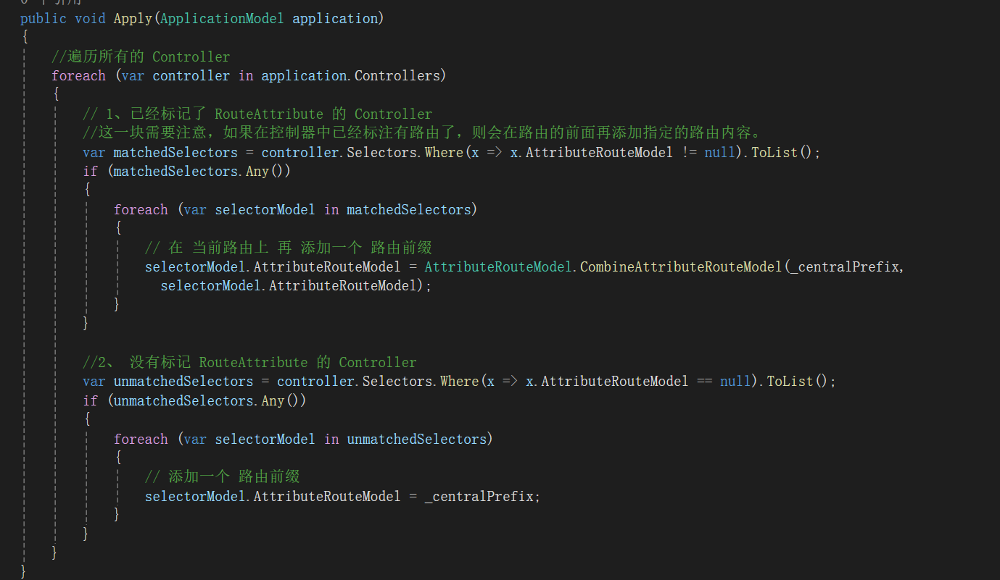

## 6. Open issues in our design model

There is a summarized table which covers the key issues and improvement suggestions in our system design.

| **Module**                  | **Issue Description**                                        | **Improvement Suggestions**                                  |
| --------------------------- | ------------------------------------------------------------ | ------------------------------------------------------------ |
| **Architecture Design**     | Complex communication between microservices may lead to performance bottlenecks. | Introduce an API Gateway (e.g., Spring Cloud Gateway) and message queues (e.g., Kafka or ActiveMQ) to optimize inter-service communication. |
|                             | Object conversion between VO, DTO, DO, and PO in the data model may impact performance. | Use automation tools (e.g., MapStruct) to simplify object conversion, reduce manual coding, and improve performance. |
| **Subsystems and APIs**     | Large number of APIs may lead to inconsistency and maintainability issues. | Use Swagger or OpenAPI to automatically generate API documentation and enforce consistent naming conventions and error handling mechanisms. |
|                             | Ensuring data security and consistency during external system API calls. | Implement OAuth 2.0 or JWT for authentication and use HTTPS to encrypt data transmission. |
| **Mechanism Analysis**      | Short expiration time of JWT may affect user experience.     | Use a Refresh Token mechanism to allow users to obtain a new JWT without re-logging in after token expiration. |
|                             | Dynamic route addition may complicate permission management. | Perform strict permission checks during dynamic route addition and log all route changes for auditing purposes. |
| **Use Case Implementation** | Ensuring data consistency and transactional integrity during menu updates. | Use database transactions (Transaction) to ensure atomicity of menu update operations and roll back on failure. |
|                             | Handling concurrent requests to avoid duplicate payments or payment failures. | Use distributed locks (e.g., Redis distributed locks) to ensure only one user can pay for the same order at a time. |
| **Prototyping**             | Responsive layout issues on different devices for the frontend. | Use responsive design frameworks (e.g., Bootstrap) to ensure consistent display across devices. |
|                             | Ensuring performance and scalability of backend services.    | Use performance testing tools (e.g., JMeter) to stress-test backend services and optimize performance based on results. |

## 7. Contributions

This system analysis project has been discussed three times. Throughout the process, all team members actively participated in the discussions and worked diligently to complete their assigned tasks. The team collaborated harmoniously, communicated effectively, and resolved issues in a timely manner. The workload was evenly distributed, and the responsibilities were clearly defined as follows:

**Introduction**  

The introduction is written by Lejunjie Chen.

**Architecture Refinement**

The architecture refinement is written by Ziyi Zhao, and subsystem and interfaces are written by Lejunjie Chen and Haoran Wang.

**Design Mechanism**

The design mechanism is written by all members.

**Use Case Realization**

The use case realization is written by all members.

**Progress on Prototyping**

The progress on prototyping is written by Siyuan Yu.

**Open issues in our design model**

The open issues in our design model is written by all members.

**Document Integration**

The document integration is written by Lejunjie Chen.

| Student_ID | Name          | Score Weight |
| ---------- | ------------- | ------------ |
| 2251528    | Haoran Wang   | 100%         |
| 2251656    | Siyuan Yu     | 100%         |
| 2250944    | Lejunjie Chen | 100%         |
| 2254272    | Ziyi Zhao     | 100%         |