<h2 align="center">Contents</h2>`

[TOC]

## 1. Brief Description

From this section, you will have an overview of almost everything involved in this document, including a brief description of the system, the purpose of this document, and some other miscellaneous details.

### 1.1 Purpose

The purpose of this project is to design and implement the "Ji Ke Da System," an efficient takeaway service platform aimed at providing users with convenient ordering and delivery services. Currently, most takeaway platforms are managed manually, which cannot achieve real-time updates of order data and efficient promotion of services. Therefore, it is essential to integrate community information with modern technology.

The Ji Ke Da System aims to simplify the takeaway management process and ensure real-time data updates. This document will provide a detailed description of the functionalities of the Ji Ke Da System, covering essential use case modeling and snapshots of the system's user interface. Additionally, intended features and technical dependencies will be included.

### 1.2 Project Scope

The Ji Ke Da System is a web-based takeaway management platform designed to streamline the ordering and delivery processes for users. Users can access the system via PCs or mobile devices through a website. Key scenarios include browsing restaurant menus, placing orders, tracking deliveries, and managing user accounts.

Both registered users and guests can browse information about restaurants and ongoing promotions. Registered users can place orders, leave reviews, and participate in loyalty programs. Merchants can manage their menus and track sales performance through an intuitive dashboard. Riders can efficiently accept delivery requests and manage their delivery routes.

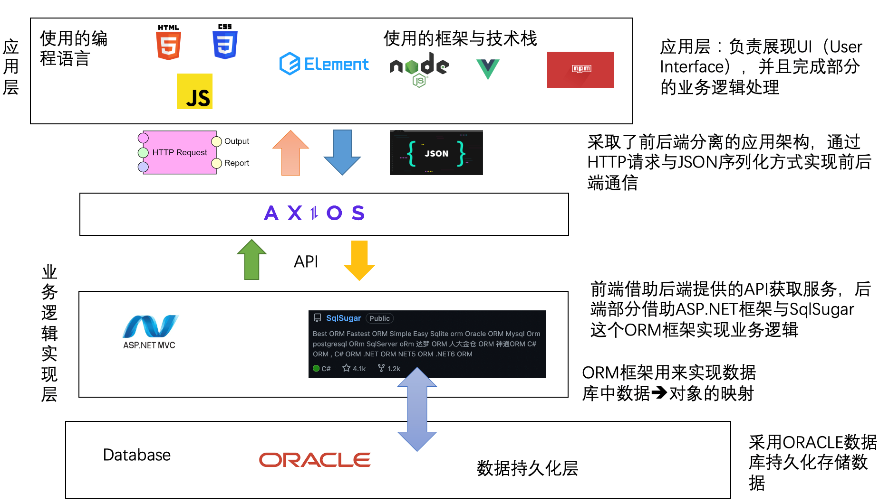

### 1.3 Glossary of Terms

| **Term**           | **Definition**                                               |
| ------------------ | ------------------------------------------------------------ |
| Ji Ke Da           | The name of our system, symbolizing a seamless connection between users and services. |
| User               | A consumer who uses the platform to place orders.            |
| Merchant           | A business that provides food services through the platform. |
| Rider              | A person responsible for delivering orders to customers.     |
| Order              | A purchase request made by a user through the platform.      |
| Coupon             | A discount voucher that users can apply when placing orders. |
| Real-time Tracking | The ability for users to see live updates on their order status. |

### 1.4 Target Readers and Suggestions

This document is intended for all stakeholders involved in this system, including developers, testers, project managers, and end-users. Readers who want a general overview of the product may focus on Section 1 (Introduction). For more detailed information regarding features, functions, or dependencies, Section 2 (Overall Description) is recommended.

Use case modeling is described specifically in Section 3 (Specific Requirements), where readers can also glimpse the interface of the system. Finally, Section 4 (Other Supplementary Specifications) includes additional information about the system.

## 2. Introduction

### 2.1 Product Perspective

The Ji Ke Da System is a web application comprising both client-side and server-side components. The server manages a centralized database that processes requests from various users based on their roles within the system. Different roles will have access to different data sets, which will be elaborated upon in the use case section.

### 2.2 Product Features

The Ji Ke Da System offers several key features:

- **User-Friendly Interface**: The system has a simple yet appealing UI designed for ease of use.
- **Real-Time Order Tracking**: Users can monitor their order status at any time.
- **Multiple Payment Options**: The system supports various payment methods including credit cards and popular mobile payment solutions.
- **Coupon Management**: Users can apply coupons for discounts during checkout.
- **Data Analytics Dashboard**: Merchants have access to analytics tools to track sales performance and customer feedback.

### 2.3 Actors

There are several types of users interacting with the system:

- **Visitor**: Can browse information provided by the system but cannot place orders.
- **User**: Includes both club members and non-club members; they can participate in activities, search for clubs, join clubs, or create new ones.
- **Merchant**: Manages their restaurant's menu and handles customer orders.
- **Rider**: Accepts delivery requests from users and manages their delivery tasks.
- **Administrator**: Oversees overall platform operations including user management, merchant verification, and data analysis.

### 2.4 Assumptions and Dependencies

The following are assumptions and dependencies for this system:

- The platform assumes that users will have stable internet access to interact with the application effectively.
- The activities depend on merchants organizing events or promotions.
- If users cannot participate in an activity due to capacity limits or other reasons, the system will send notifications to inform them.

## 3.Specific Requirement

### 3.1 Agile development and requirement analysis

#### Persona

The JiKeDa Campus Food Delivery System is designed to offer a tailored solution for university students and staff, focusing on their unique needs within a campus environment. During the exploration of the system's features, we analyzed and categorized different types of users based on their lifestyles, preferences, and campus routines. This led to the development of detailed user personas, highlighting their key challenges and motivations.

By understanding these personas, JiKeDa aims to create a user-centric system that not only simplifies food ordering and delivery but also enhances the overall dining experience by providing efficient, reliable, and personalized services. The goal is to accommodate busy university schedules, dietary preferences , and the desire for convenience, while offering features such as real-time tracking and tailored promotions.

#### Empathy map

According to different user portraits, we draw an **empathy map** from the perspective of users. Through their thinking, speaking, hearing, doing and feeling in daily life, we can improve our system functions.

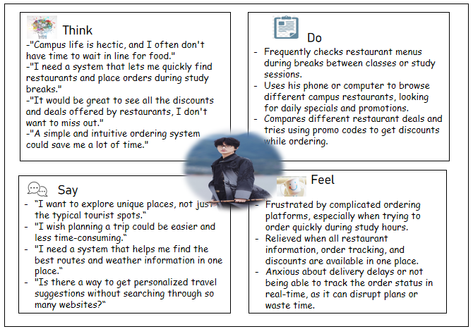

#### User story

By summarizing and analyzing different personas and empathy maps, we have learned a lot about the expectations and needs of many virous users for oursystem, and displayed the user needs through **user stories**.

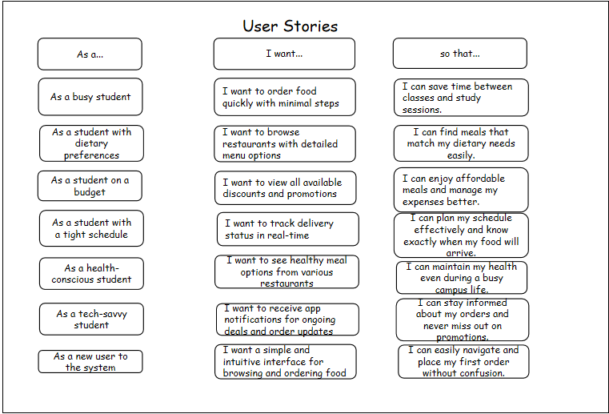

#### User journey map

According to different users' different requirements for the system, the user stories are classified according to the users, and then each user story is tracked to build the steps of users' interaction with the system when they complete the requirements and the changes of their mentality , and draw the **user journeymap** to help us design the system functions.

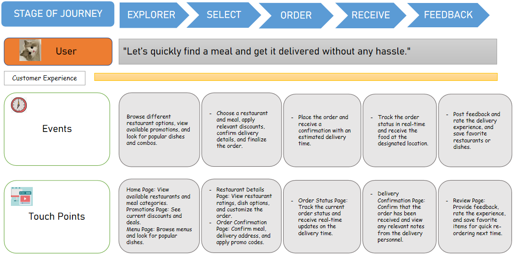

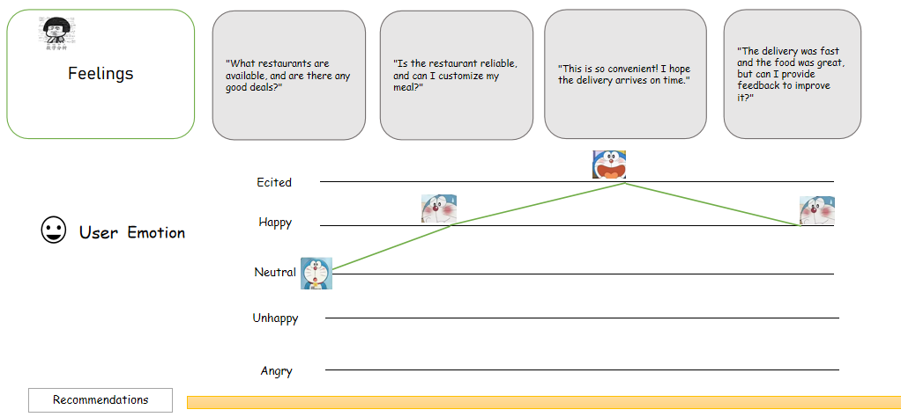

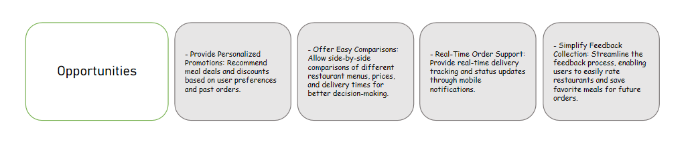

#### User story map

On this basis, we get the most urgent needs of users for the system and the good ideas that can be improved, and then draw the user story map according to the urgency of the task. The **user story map** can help us build the use case model and the team tasks, develop the feasible distribute version in the shortest time according to the agile development idea, and then update the system according to the user needs.

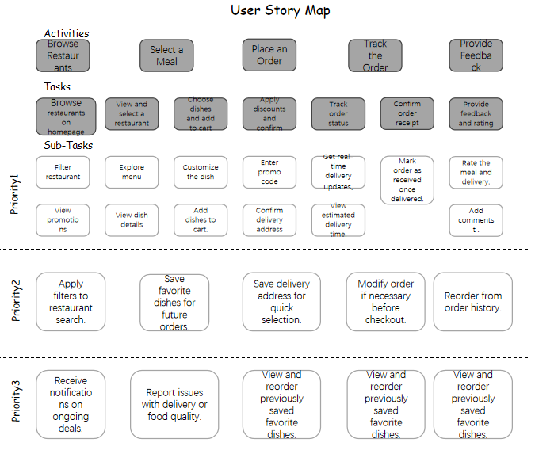

### 3.2 Use Cases Modeling

#### 3.2.1. User system

##### Use Case Diagram

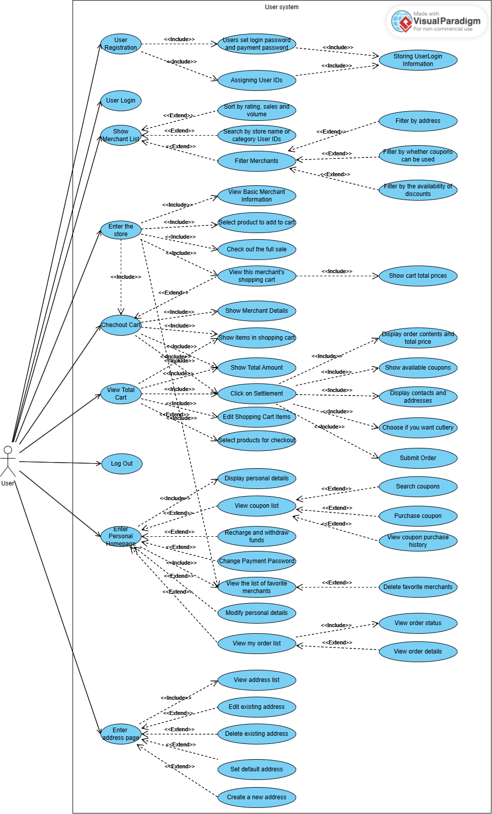

##### Detailed Specification for Use Case

###### Use Case: User Registration

| **Use Case Name**        | User Registration                                            |
| ------------------------ | ------------------------------------------------------------ |
| **ID**                   | UC01                                                         |
| **Use Case Description** | Users register new accounts in the system through this function. |
| **Major Players**        | Users                                                        |
| **Precondition**         | The user has not registered an account.                      |
| **Post-Conditions**      | The system successfully assigns a unique user ID to the user and saves the login information. |
| **Basic Event Flow**     | 1. The user selects the "Register" function.   2. The system prompts the user to set the login password and payment password.   3. The user enters the required information.   4. The system assigns a unique user ID to the user and saves the login information.   5. After the registration is completed, the user can use the login function to access the system. |

###### Use Case: User login

| **Use Case Name**        | User Login                                                   |
| ------------------------ | ------------------------------------------------------------ |
| **ID**                   | UC02                                                         |
| **Use Case Description** | Registered users log in to the system by entering their username and password. |
| **Major Players**        | Users                                                        |
| **Prerequisites**        | The user has completed registration and has valid login information. |
| **Post-Conditions**      | The user successfully logs into the system.                  |
| **Basic Event Flow**     | 1. The user selects the "Login" function.   2. The user enters their username and password.   3. The system verifies the user's login information.   4. After successful login, the user enters the system main page. |

###### Use Case: Show merchant list

| **Use Case Name**        | Display merchant list                                        |
| ------------------------ | ------------------------------------------------------------ |
| **ID**                   | UC03                                                         |
| **Use Case Description** | Users can view the list of merchants in the system and filter merchants by different conditions. |
| **Major Players**        | Users                                                        |
| **Precondition**         | The user has logged in to the system.                        |
| **Post-Conditions**      | The system displays a list of merchants that meet the criteria based on the filter conditions. |
| **Basic Event Flow**     | 1. The user enters the "Display Merchant List" page.   2. The system displays all merchants by default.   3. Users can select filter conditions (such as by rating, sales volume, store name, address, etc.).   4. The system updates the merchant list based on the filtering conditions.   5. Users can click to enter a business details page. |

###### Use Case: Enter the store

| **Use Case Name**        | Enter Store                                                  |
| ------------------------ | ------------------------------------------------------------ |
| **ID**                   | UC04                                                         |
| **Use Case Description** | The user selects a merchant to enter its store, view product details, and can add products to the shopping cart. |
| **Major Players**        | Users                                                        |
| **Precondition**         | The user has logged in and selected a merchant.              |
| **Post-Conditions**      | Users can view merchant products and add products to the shopping cart. |
| **Basic event flow**     | 1. The user selects a merchant in the merchant list.   2. The system displays the merchant's basic information and product list.   3. Users view product details.   4. The user selects a product and adds it to the shopping cart. |

###### Use Case: View Cart

| **Use Case Name**        | View Cart                                                    |
| ------------------------ | ------------------------------------------------------------ |
| **ID**                   | UC05                                                         |
| **Use Case Description** | Users can view the items added to the shopping cart, modify the quantity of items or remove items, and submit settlement. |
| **Major Players**        | Users                                                        |
| **Precondition**         | The user has logged in and has products added to the shopping cart. |
| **Post-Conditions**      | The user confirms the items in the shopping cart and submits settlement. |
| **Basic event flow**     | 1. The user enters the shopping cart page.   2. The system displays the list of products that the user has added to the shopping cart and the total price of the products.   3. Users can edit product quantity or remove products.   4. The user confirms the product list and selects "Checkout".   5. The system enters the order settlement page, displaying the total amount, available coupons and other information. |

###### Use Case: Checkout Cart

| **Use Case Name**        | Checkout Cart                                                |
| ------------------------ | ------------------------------------------------------------ |
| **ID**                   | UC06                                                         |
| **Use Case Description** | The user views the total amount of all items in the shopping cart and completes checkout. |
| **Major Players**        | Users                                                        |
| **Precondition**         | The user has added the product to the shopping cart.         |
| **Post-Conditions**      | The system completes the order and confirms the purchase.    |
| **Basic Event Flow**     | 1. The user clicks the "Settlement" button.   2. The system displays the total amount of items in the shopping cart and available coupons.   3. The user confirms the total amount and selects "Submit Order".   4. The system completes the order and prompts for payment information. |

###### Use Case: View profile

| **Use case name**        | View personal homepage                                       |
| ------------------------ | ------------------------------------------------------------ |
| **ID**                   | UC07                                                         |
| **Use Case Description** | Users can view personal information, order status, favorite merchants, personal coupons and other information on their personal homepage. |
| **Major Players**        | Users                                                        |
| **Precondition**         | The user has logged in to the system.                        |
| **Post-condition**       | The system displays information related to the personal homepage. |
| **Basic event flow**     | 1. The user enters the personal homepage.   2. The system displays the user's personal information, order status, favorite merchants, etc.   3. Users can view and edit personal information. |

###### Use Case: View order list

| **Use Case Name**        | View Order List                                              |
| ------------------------ | ------------------------------------------------------------ |
| **ID**                   | UC08                                                         |
| **Use Case Description** | Users can view individual historical orders and their details. |
| **Major Players**        | Users                                                        |
| **Precondition**         | The user has logged in and has historical orders.            |
| **Post-condition**       | The system displays the user's historical order list.        |
| **Basic Event Flow**     | 1. The user selects "View Order List".   2. The system displays the user's historical orders.   3. Users can select an order to view detailed information. |

###### Use Case: View address list

| **Use Case Name**        | View Address List                                            |
| ------------------------ | ------------------------------------------------------------ |
| **ID**                   | UC09                                                         |
| **Use Case Description** | User can view, edit and delete shipping addresses.           |
| **Major Players**        | Users                                                        |
| **Prerequisite**         | The user has logged in and has a saved delivery address.     |
| **Post-condition**       | The system updates the user's address information.           |
| **Basic event flow**     | 1. The user enters the address management page.   2. The system displays the list of delivery addresses saved by the user.   3. Users can choose to edit, delete or add new addresses. |

###### Use Case: Change payment password

| **Use case name**        | Modify payment password                                      |
| ------------------------ | ------------------------------------------------------------ |
| **ID**                   | UC10                                                         |
| **Use Case Description** | Users can modify the payment password to ensure payment security. |
| **Major Players**        | Users                                                        |
| **Prerequisite**         | The user has logged in and has a valid payment password.     |
| **Post-Conditions**      | The system successfully updated the payment password.        |
| **Basic Event Flow**     | 1. The user enters the personal homepage and selects "Change Payment Password".   2. The system prompts the user to enter the old password and new password.   3. The user enters and confirms the new password.   4. The system verifies and updates the payment password. |

###### Use Case: Deposit and Withdrawal

| **Use Case Name**        | Deposit and Withdrawal                                       |
| ------------------------ | ------------------------------------------------------------ |
| **ID**                   | UC11                                                         |
| **Use Case Description** | Users can recharge or withdraw cash from their account.      |
| **Major Players**        | Users                                                        |
| **Prerequisites**        | The user has logged in and has an account balance.           |
| **Post-Conditions**      | The system processes the deposit or withdrawal request.      |
| **Basic event flow**     | 1. The user selects the recharge or withdrawal function.   2. The system prompts you to enter the amount and payment information.   3. The user confirms the operation.   4. The system processes the transaction and updates the account balance. |

#### 3.2.2 Merchant System

**Use Case Diagram**

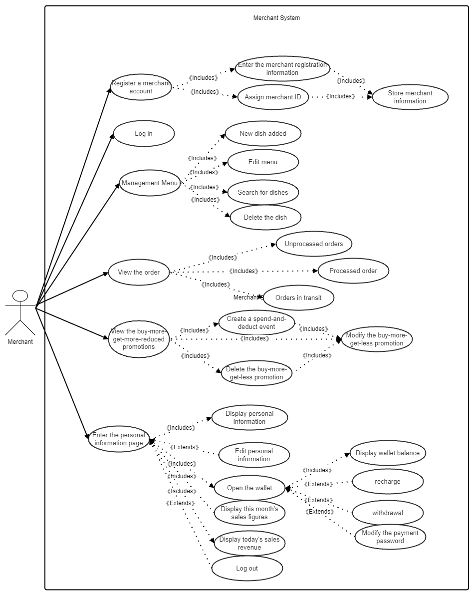

**Detailed Specification for Use Case**

###### Use Case Name: Merchant Login

| **Use Case Name**          | Merchant Login                                               |
| :------------------------- | ------------------------------------------------------------ |
| **ID**                     | UC12                                                         |
| **Use Case Description**   | Merchants log in to the merchant management system by entering their account number and password. |
| **Major Players**          | Merchants                                                    |
| **Prerequisite**           | The merchant has registered in the system and has a login account. |
| **Post-Conditions**        | The merchant successfully logs into the system and can access various management functions in the system. |
| **Basic event flow**       | 1. The merchant opens the login page of the merchant management system.  2. The merchant enters the account number and password.     3. The system verifies the login information.     4. After successfully logging into the system, the merchant enters the management page. |
| **Alternative Event Flow** | 1. If the account number entered by the merchant does not exist, the system displays an error message "The account number does not exist, please re-enter".     2. If the password entered by the merchant is incorrect, the system will prompt "Password is incorrect, please re-enter".     3. If the merchant enters an incorrect password 5 times in a row, the system will temporarily lock the account for 3 minutes.     4. If the merchant forgets the password, the merchant can select "Forgot Password" and the system will send a verification code to the merchant's registered email or mobile phone number for password reset. |

------

###### Use Case Name: Management menu

| **Use Case Name**          | Administration Menu                                          |
| -------------------------- | ------------------------------------------------------------ |
| **ID**                     | UC13                                                         |
| **Use Case Description**   | Merchants can add, edit, delete dishes, and view the details of existing dishes through the management menu. |
| **Major Players**          | Merchants                                                    |
| **Prerequisite**           | The merchant has logged into the system and has the right to manage the menu. |
| **Post-Conditions**        | The system updates the menu, adds, modifies or deletes dishes, and displays the currently valid menu. |
| **Basic event flow**       | 1. The merchant selects the "Management Menu" function.     2. The system displays the list of existing dishes.     3. The merchant can perform the following operations:  -Add new dishes: The merchant enters the dish name, price, description and picture, and the system saves the new dish information.     - Edit existing dishes: The merchant selects the dish to be edited, modifies the price or description, and the system saves the modifications.     - Delete a dish: The merchant selects the dish to be deleted, and the system prompts to confirm the deletion. After the merchant confirms, the system deletes the dish. |
| **Alternative Event Flow** | 1. If the merchant does not fill in the required fields when adding or editing a dish, the system will prompt "Please fill in all required fields".     2. If the merchant cancels the operation when deleting a dish, the system will not make any changes and return to the menu page. |

###### Use Case Name: View the "Buy More, Reduce More" Promotion

| **Use Case Name**        | View the "Buy More, Reduce More" Promotion                   |
| ------------------------ | ------------------------------------------------------------ |
| **ID**                   | UC14                                                         |
| **Use Case Description** | Merchants or administrators can view all "Buy More, Reduce More" promotions in the current system. |
| **Main Participants**    | Merchants, Administrators                                    |
| **Prerequisite**         | The merchant or administrator has logged into the system and has the permission to view promotions. |
| **Post-Conditions**      | The system returns the detailed information of all "Buy More, Reduce More" promotions. |
| **Basic Event Flow**     | 1. The merchant or administrator selects the "View Promotions" function.     2. The system displays a list of currently valid "Buy More, Reduce More" promotions.     3. Merchants or administrators can choose to view detailed information or perform operations (create, modify or delete) on promotions. |

###### Use Case Name: Create a "Buy More, Reduce More" Promotion

| **Use Case Name**        | Create a "Buy More, Reduce More" Promotion                   |
| ------------------------ | ------------------------------------------------------------ |
| **ID**                   | UC15                                                         |
| **Use Case Description** | Merchants or administrators can create new "Buy More, Reduce More" promotions in the system. |
| **Main Participants**    | Merchants, Administrators                                    |
| **Prerequisite**         | The merchant or administrator has logged into the system and has the permission to create promotions. |
| **Post-Condition**       | The system saves the new "Buy More, Reduce More" promotion and adds it to the promotions list. |
| **Basic Event Flow**     | 1. The merchant or administrator selects the "Create Promotion" function.     2. The merchant or administrator fills in the detailed information of the promotion (such as discount rules, start time, end time).     3. The merchant or administrator submits the information, and the system saves and creates a new promotion. |

###### Use Case Name: Modify the "Buy More, Reduce More" Promotion

| **Use Case Name**        | Modify the "Buy More, Reduce More" Promotion                 |
| ------------------------ | ------------------------------------------------------------ |
| **ID**                   | UC16                                                         |
| **Use Case Description** | Merchants or administrators can modify existing "Buy More, Reduce More" promotions. |
| **Main Participants**    | Merchants, Administrators                                    |
| **Prerequisites**        | The merchant or administrator has logged into the system and has the authority to modify promotions. |
| **Post-Conditions**      | The system updates the details of the promotion and saves the modifications. |
| **Basic Event Flow**     | 1. The merchant or administrator selects the promotion to be modified.     2. The system displays the detailed information of the current promotion.     3. The merchant or administrator modifies the parameters of the promotion, such as discount amount, time, etc.   4. The merchant or administrator submits the modification, and the system saves the updated promotion. |

###### Use Case Name: Delete "Buy More, Reduce More" Promotion

| **Use Case Name**        | Delete "Buy More, Reduce More" Promotion                     |
| ------------------------ | ------------------------------------------------------------ |
| **ID**                   | UC17                                                         |
| **Use Case Description** | Merchants or administrators can delete existing "Buy More, Reduce More" promotions. |
| **Main Participants**    | Merchants, Administrators                                    |
| **Prerequisite**         | The merchant or administrator has logged into the system and has the authority to delete promotions. |
| **Post-condition**       | The system deletes the specified promotion and removes it from the list. |
| **Basic Event Flow**     | 1. The merchant or administrator selects the promotion to be deleted.     2. The system prompts to confirm the deletion operation.     3. The merchant or administrator confirms the deletion, and the system deletes the promotion. |

###### Use case name: Enter personal information page

| **Use case name**        | Enter personal information page                              |
| ------------------------ | ------------------------------------------------------------ |
| **ID**                   | UC18                                                         |
| **Use Case Description** | Merchants or administrators can enter the personal information page, view and modify personal information, or access wallet and sales data. |
| **Main Participants**    | Merchants, Administrators                                    |
| **Prerequisite**         | The merchant or administrator has logged into the system and has permission to access personal information. |
| **Post-Conditions**      | The system displays the personal information page, and merchants can view or modify the information, as well as access wallet and sales data. |
| **Basic event flow**     | 1. The merchant or administrator selects the "Personal Information" function.    2. The system displays the current personal information.    3. Merchants or administrators can choose to edit personal information or access wallet functions. |

###### Use Case Name: View personal information

| **Use Case Name**        | View personal information                                    |
| ------------------------ | ------------------------------------------------------------ |
| **ID**                   | UC19                                                         |
| **Use Case Description** | Merchants or administrators can view current personal information, including name, contact information, etc. |
| **Main Participants**    | Merchants, Administrators                                    |
| **Precondition**         | The merchant or administrator has entered the personal information page. |
| **Post-condition**       | The system returns the details of personal information.      |
| **Basic Event Flow**     | 1. The merchant or administrator selects "View Personal Information".   2. The system displays the details of the current personal information. |

###### Use Case Name: Edit personal information

| **Use Case Name**        | Edit personal information                                    |
| ------------------------ | ------------------------------------------------------------ |
| **ID**                   | UC20                                                         |
| **Use Case Description** | Merchants or administrators can modify personal information, including updating contact information, changing names, etc. |
| **Main Participants**    | Merchants, Administrators                                    |
| **Precondition**         | The merchant or administrator has entered the personal information page. |
| **Post-condition**       | The system saves the updated personal information.           |
| **Basic Event Flow**     | 1. The merchant or administrator selects the "Edit Personal Information" function.    2. The merchant modifies the information.    3. The merchant submits the updated information, and the system saves and updates the data. |

###### Use Case Name: View wallet balance

| **Use Case Name**        | View wallet balance                                          |
| ------------------------ | ------------------------------------------------------------ |
| **ID**                   | UC21                                                         |
| **Use Case Description** | Merchants or administrators can view the current wallet balance. |
| **Main Participants**    | Merchants, Administrators                                    |
| **Prerequisites**        | The merchant or administrator has logged into the system and entered the wallet page. |
| **Post-condition**       | The system displays the balance information of the current wallet. |
| **Basic Event Flow**     | 1. The merchant or administrator selects the "View Wallet Balance" function.    2. The system displays the current balance. |

###### Use Case Name: Recharge

| **Use Case Name**        | Recharge                                                     |
| ------------------------ | ------------------------------------------------------------ |
| **ID**                   | UC22                                                         |
| **Use Case Description** | Merchants or administrators can recharge wallet accounts.    |
| **Main Participants**    | Merchants, Administrators                                    |
| **Prerequisites**        | The merchant or administrator has entered the wallet page and selected the "Recharge" function. |
| **Post-Conditions**      | The system updates the wallet balance and displays the total amount after recharging. |
| **Basic Event Flow**     | 1. The merchant or administrator selects the "Recharge" function.    2. The merchant enters the recharge amount and confirms it.    3. The system processes the recharge and updates the balance. |

###### Use Case Name: Withdrawal

| **Use Case Name**        | Withdrawal                                                   |
| ------------------------ | ------------------------------------------------------------ |
| **ID**                   | UC23                                                         |
| **Use Case Description** | Merchants or administrators can withdraw cash from the wallet account. |
| **Main Participants**    | Merchants, Administrators                                    |
| **Prerequisites**        | The merchant or administrator has entered the wallet page and selected the "Withdrawal" function. |
| **Post-Conditions**      | The system processes the withdrawal request and updates the wallet balance. |
| **Basic event flow**     | 1. The merchant or administrator selects the "Withdrawal" function.    2. The merchant enters the withdrawal amount and confirms.    3. The system processes the withdrawal and updates the balance. |

###### Use Case Name: Change payment password

| **Use case name**        | Modify payment password                                      |
| ------------------------ | ------------------------------------------------------------ |
| **ID**                   | UC24                                                         |
| **Use Case Description** | Merchants or administrators can modify the payment password of the wallet. |
| **Main Participants**    | Merchants, Administrators                                    |
| **Prerequisites**        | The merchant or administrator has entered the wallet page and selected the "Change Payment Password" function. |
| **Post-Conditions**      | The system updates the payment password to ensure that the new password is used for the next payment. |
| **Basic Event Flow**     | 1. The merchant or administrator selects the "Change Payment Password" function.    2. The merchant enters the current password and new password.    3. The system verifies and saves the new password. |

#### 3.2.3 Rider System

##### Use Case Diagram

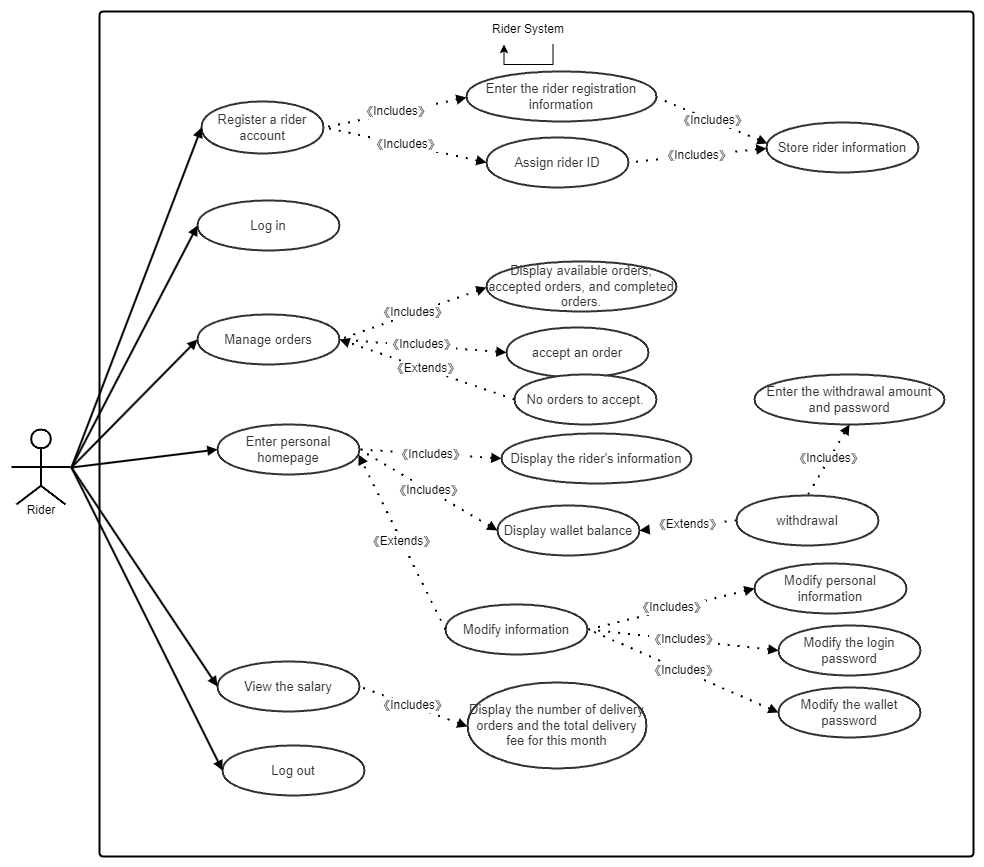

##### Detailed Specification for Use Case

###### Use Case Name: Register rider account

| **Use Case Name**        | Register a rider account                                     |
| ------------------------ | ------------------------------------------------------------ |
| **ID**                   | UC25                                                         |
| **Use Case Description** | Riders can register a new account through the system, and the system assigns a rider ID and stores rider information. |
| **Key Players**          | Riders                                                       |
| **Prerequisite**         | The rider has not registered an account in the system.       |
| **Post-Conditions**      | The system assigns a unique rider ID and stores the rider's registration information. |
| **Basic event flow**     | 1. The rider enters the registration page.   2. The rider fills in the registration information (such as name, contact information, etc.).   3. The system generates and assigns a rider ID.   4. The system stores the rider’s registration information. |

------

###### Use Case Name: Rider login

| **Use Case Name**        | Rider Login                                                  |
| ------------------------ | ------------------------------------------------------------ |
| **ID**                   | UC26                                                         |
| **Use Case Description** | The rider logs in to the rider system by entering the account ID and password. |
| **Key Players**          | Riders                                                       |
| **Prerequisite**         | The rider has registered in the system and has a login account. |
| **Post-Conditions**      | The rider successfully logs into the system and can access the management functions in the system. |
| **Basic event flow**     | 1. The rider clicks the "Login" button.   2. The rider enters the account ID and password.   3. The system verifies the login information.   4. The rider successfully logs in and enters the main page. |

------

###### Use Case Name: Manage orders

| **Use Case Name**        | Manage Orders                                                |
| ------------------------ | ------------------------------------------------------------ |
| **ID**                   | UC27                                                         |
| **Use Case Description** | Riders can view pending orders, received orders and completed orders, choose to receive orders or view order status. |
| **Key Players**          | Riders                                                       |
| **Prerequisites**        | The rider has logged into the system and has permission to view and manage orders. |
| **Post-Conditions**      | The rider successfully receives the order or views the order details, and the order status is updated. |
| **Basic event flow**     | 1. The rider selects the "Manage Order" function.   2. The system displays pending orders, received orders and completed orders.   3. The rider chooses to accept the order or view the order details.   4. The system updates the order status. |

------

###### Use Case Name: View wallet balance and withdraw cash

| **Use Case Name**        | View wallet balance and withdraw money                       |
| ------------------------ | ------------------------------------------------------------ |
| **ID**                   | UC28                                                         |
| **Use Case Description** | Riders can check the wallet balance and perform withdrawal operations. |
| **Key Players**          | Riders                                                       |
| **Prerequisites**        | The rider has logged into the system and has the amount of cash available for withdrawal in his wallet. |
| **Post-Conditions**      | The system displays the wallet balance, processes the withdrawal request, and updates the balance. |
| **Basic Event Flow**     | 1. The rider selects the "View Wallet Balance" function.   2. The system displays the current wallet balance.   3. The rider selects the "Withdrawal" function and enters the withdrawal amount and password.   4. The system processes the withdrawal request and updates the wallet balance. |

------

###### Use Case Name: View salary

| **Use Case Name**        | View Salary                                                  |
| ------------------------ | ------------------------------------------------------------ |
| **ID**                   | UC29                                                         |
| **Use Case Description** | Riders can view the number of orders and total delivery revenue this month. |
| **Key Players**          | Riders                                                       |
| **Prerequisites**        | The rider has logged into the system and completed a certain number of orders. |
| **Post-Conditions**      | The system displays the rider's order quantity and total income. |
| **Basic event flow**     | 1. The rider selects the "View Salary" function.   2. The system displays the rider’s order quantity and total income this month. |

------

###### Use Case Name: Modify personal information

| **Use case name**        | Modify personal information                                  |
| ------------------------ | ------------------------------------------------------------ |
| **ID**                   | UC30                                                         |
| **Use Case Description** | Riders can modify personal information such as contact details or passwords. |
| **Key Players**          | Riders                                                       |
| **Prerequisite**         | The rider has logged into the system and entered the personal homepage. |
| **Post-condition**       | The system saves the updated personal information.           |
| **Basic Event Flow**     | 1. The rider enters the personal homepage and selects the "Modify Personal Information" function.   2. The rider modifies personal information and submits it.   3. The system saves and updates the information. |

------

###### Use Case Name: Change login password

| **Use case name**        | Modify login password                                        |
| ------------------------ | ------------------------------------------------------------ |
| **ID**                   | UC31                                                         |
| **Use Case Description** | Riders can modify the system login password.                 |
| **Key Players**          | Riders                                                       |
| **Prerequisite**         | The rider has logged into the system and has the permission to change the password. |
| **Post-Conditions**      | The system saves the new password and it will take effect the next time you log in. |
| **Basic Event Flow**     | 1. The rider selects the "Change Password" function.   2. The rider enters the old password and the new password.   3. The system verifies and saves the new password. |

------

###### Use Case Name: Change wallet password

| **Use case name**        | Modify wallet password                                       |
| ------------------------ | ------------------------------------------------------------ |
| **ID**                   | UC32                                                         |
| **Use Case Description** | Riders can modify the wallet payment password.               |
| **Key Players**          | Riders                                                       |
| **Prerequisites**        | The rider has logged into the system and has a wallet account. |
| **Post-Conditions**      | The system saves the new wallet payment password.            |
| **Basic Event Flow**     | 1. The rider selects the "Change Wallet Password" function.   2. The rider enters the old password and the new password.   3. The system verifies and saves the new password. |

#### 3.2.4 Administrator System

##### Use Case Diagram

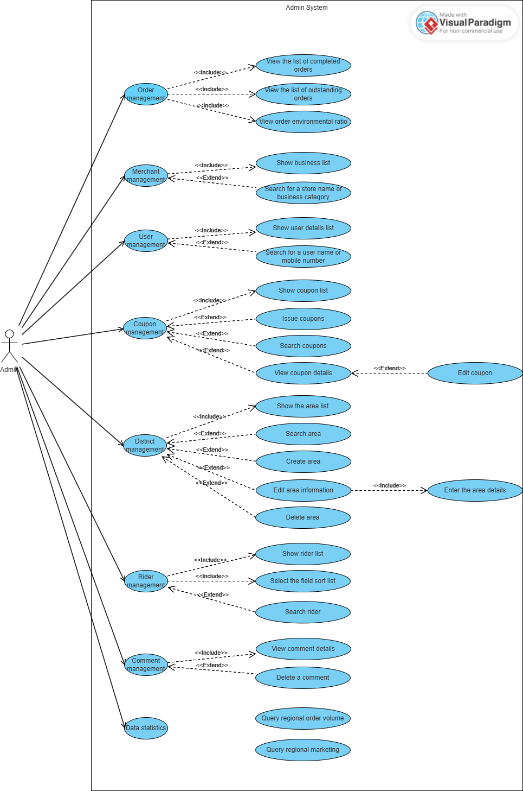

##### Detailed Specification for Use Case

###### Use Case: View the list of completed orders

| **Use Case Name**        | View the list of completed orders                            |
| ------------------------ | ------------------------------------------------------------ |
| **ID**                   | UC33                                                         |
| **Use Case Description** | The administrator uses this function to view all completed orders in the system. |
| **Key Players**          | Administrators                                               |
| **Prerequisite**         | The administrator has successfully logged in to the system.  |
| **Post-condition**       | The system returns a list of all completed orders.           |
| **Basic Event Flow**     | 1. The administrator selects the "View Completed Orders" function.  2. The system displays all completed orders. |

###### Use Case: View the list of outstanding orders

| **Use Case Name**        | View the list of outstanding orders                          |
| ------------------------ | ------------------------------------------------------------ |
| **ID**                   | UC34                                                         |
| **Use Case Description** | The administrator can view all outstanding orders in the system through this function. |
| **Key Players**          | Administrators                                               |
| **Prerequisite**         | The administrator has successfully logged in to the system.  |
| **Post-Condition**       | The system returns a list of all uncompleted orders.         |
| **Basic Event Flow**     | 1. The administrator selects the "View Uncompleted Orders" function.  2. The system displays all outstanding orders. |

###### Use Case: View order environment ratio

| **Use Case Name**        | View Order Environment Ratio                                 |
| ------------------------ | ------------------------------------------------------------ |
| **ID**                   | UC35                                                         |
| **Use Case Description** | The administrator can view the environment ratio of the order through this function. |
| **Key Players**          | Administrators                                               |
| **Prerequisite**         | The administrator has successfully logged in to the system.  |
| **Post-condition**       | The system returns the environmental ratio analysis data of the order. |
| **Basic Event Flow**     | 1. The administrator selects the "View Order Environment Ratio" function.  2. The system displays environmental ratio data. |

###### Use Case: Show merchant list

| **Use Case Name**        | Display merchant list                                        |
| ------------------------ | ------------------------------------------------------------ |
| **ID**                   | UC36                                                         |
| **Use Case Description** | The administrator can view the basic information list of all merchants through this function. |
| **Key Players**          | Administrators                                               |
| **Prerequisite**         | The administrator has successfully logged in to the system.  |
| **Post-condition**       | The system returns a list of all merchants.                  |
| **Basic event flow**     | 1. The administrator selects the "Show merchant list" function.  2. The system displays a list of all merchants. |

###### Use Case: Search for merchants

| **Use Case Name**        | Search for Merchant                                          |
| ------------------------ | ------------------------------------------------------------ |
| **ID**                   | UC37                                                         |
| **Use Case Description** | This feature allows administrators to search merchants by store name or category. |
| **Key Players**          | Administrators                                               |
| **Prerequisite**         | The administrator has successfully logged into the system and has business information. |
| **Post-Conditions**      | The system returns a list of merchants that meet the conditions. |
| **Basic Event Flow**     | 1. The administrator selects the "Search for Merchant" function.  2. The system prompts you to enter the store name or category.  3. The administrator enters relevant information and submits.  4. The system displays a list of merchants that meet the conditions. |

###### Use Case: Display user details list

| **Use Case Name**        | Display user details list                                    |
| ------------------------ | ------------------------------------------------------------ |
| **ID**                   | UC38                                                         |
| **Use Case Description** | Administrators can use this function to view a detailed list of all users in the system. |
| **Key Players**          | Administrators                                               |
| **Prerequisite**         | The administrator has successfully logged in to the system.  |
| **Post-condition**       | The system returns a list of detailed information for all users. |
| **Basic event flow**     | 1. The administrator selects the "Show user details list" function.  2. The system displays the user's detailed information. |

###### Use Case: Search user

| **Use Case Name**        | Search for Users                                             |
| ------------------------ | ------------------------------------------------------------ |
| **ID**                   | UC39                                                         |
| **Use Case Description** | Administrators can use this function to search for users by user name or mobile phone number. |
| **Key Players**          | Administrators                                               |
| **Precondition**         | The administrator has successfully logged into the system and there is user data in the system. |
| **Post-condition**       | The system returns user information that meets the conditions. |
| **Basic Event Flow**     | 1. The administrator selects the "Search User" function.  2. The system prompts you to enter your username or mobile phone number.  3. The administrator enters relevant information and submits.  4. The system displays user information that meets the conditions. |

###### Use Case: Display coupon list

| **Use Case Name**        | Display Coupon List                                          |
| ------------------------ | ------------------------------------------------------------ |
| **ID**                   | UC40                                                         |
| **Use Case Description** | The administrator can view the list of all coupons in the system through this function. |
| **Key Players**          | Administrators                                               |
| **Prerequisite**         | The administrator has successfully logged in to the system.  |
| **Post-condition**       | The system returns the coupon list.                          |
| **Basic Event Flow**     | 1. The administrator selects the "Show Coupon List" function.  2. The system displays the coupon list. |

###### Use Case: Post Coupon

| **Use Case Name**        | Publish Coupon                                               |
| ------------------------ | ------------------------------------------------------------ |
| **ID**                   | UC41                                                         |
| **Use Case Description** | Administrator publishes new coupons through this feature.    |
| **Key Players**          | Administrators                                               |
| **Prerequisite**         | The administrator has successfully logged in to the system.  |
| **Post-condition**       | The system saves and publishes the coupon.                   |
| **Basic Event Flow**     | 1. The administrator selects the "Publish Coupon" function.  2. The system prompts you to enter coupon information.  3. The administrator enters the coupon information and submits it.  4. The system saves and publishes the coupon. |

###### Use Case: Search for coupons

| **Use Case Name**        | Search Coupons                                               |
| ------------------------ | ------------------------------------------------------------ |
| **ID**                   | UC42                                                         |
| **Use Case Description** | This feature allows administrators to search for coupons by criteria. |
| **Key Players**          | Administrators                                               |
| **Prerequisite**         | The administrator has successfully logged into the system, and there is already coupon information in the system. |
| **Post-Conditions**      | The system returns a list of coupons that meet the conditions. |
| **Basic Event Flow**     | 1. The administrator selects the "Search Coupon" function.  2. The system prompts you to enter search criteria.  3. The administrator enters the conditions and submits.  4. The system returns a list of eligible coupons. |

###### Use Case: View coupon details

| **Use Case Name**        | View Coupon Details                                          |
| ------------------------ | ------------------------------------------------------------ |
| **ID**                   | UC43                                                         |
| **Use Case Description** | The administrator uses this function to view the detailed information of a certain coupon. |
| **Key Players**          | Administrators                                               |
| **Prerequisite**         | The administrator has successfully logged into the system, and coupon information exists in the system. |
| **Post-condition**       | The system displays the coupon details.                      |
| **Basic Event Flow**     | 1. The administrator selects the "View Coupon Details" function.  2. The system displays the coupon details. |

###### Use Case: Edit Coupon

| **Use Case Name**        | Edit Coupon                                                  |
| ------------------------ | ------------------------------------------------------------ |
| **ID**                   | UC44                                                         |
| **Use Case Description** | Administrator edits the coupon details through this feature. |
| **Key Players**          | Administrators                                               |
| **Prerequisite**         | The administrator has successfully logged into the system, and coupon information exists in the system. |
| **Post-Conditions**      | The system saves and updates the coupon information.         |
| **Basic Event Flow**     | 1. The administrator selects the "Edit Coupon" function.  2. The system prompts you to enter the information to be edited.  3. The administrator enters the modification content and submits it.  4. The system saves and updates the coupon information. |

###### Use Case: Display area list

| **Use case name**        | Display area list                                            |
| ------------------------ | ------------------------------------------------------------ |
| **ID**                   | UC45                                                         |
| **Use Case Description** | Administrators can view a list of all areas through this feature. |
| **Key Players**          | Administrators                                               |
| **Prerequisite**         | The administrator has successfully logged in to the system.  |
| **Postcondition**        | The system returns a list of all regions.                    |
| **Basic Event Flow**     | 1. The administrator selects the "Show Area List" function.  2. The system displays a list of all areas. |

###### Use Case: Search area

| **Use Case Name**        | Search Area                                                  |
| ------------------------ | ------------------------------------------------------------ |
| **ID**                   | UC46                                                         |
| **Use Case Description** | Administrators can use this feature to search areas by criteria. |
| **Key Players**          | Administrators                                               |
| **Prerequisites**        | The administrator has successfully logged in to the system, and the region information already exists in the system. |
| **Post-condition**       | The system returns a list of areas that meet the conditions. |
| **Basic Event Flow**     | 1. The administrator selects the "Search Area" function.  2. The system prompts you to enter search criteria.  3. The administrator enters the conditions and submits.  4. The system returns a list of regions that meet the conditions. |

###### Use Case: Create area

| **Use Case Name**        | Create Region                                                |
| ------------------------ | ------------------------------------------------------------ |
| **ID**                   | UC47                                                         |
| **Use Case Description** | Administrator creates new zones through this feature.        |
| **Key Players**          | Administrators                                               |
| **Prerequisite**         | The administrator has successfully logged into the system and has the permission to create areas. |
| **Post-Conditions**      | The system saves and creates a new region.                   |
| **Basic Event Flow**     | 1. The administrator selects the "Create Zone" function.  2. The system prompts you to enter regional information.  3. The administrator enters relevant information and submits.  4. The system saves and creates a new area. |

###### Use Case: Edit area information

| **Use case name**        | Edit area information                                        |
| ------------------------ | ------------------------------------------------------------ |
| **ID**                   | UC48                                                         |
| **Use Case Description** | Administrators can edit the details of a zone through this feature. |
| **Key Players**          | Administrators                                               |
| **Prerequisite**         | The administrator has successfully logged in to the system, and the system already has regional information. |
| **Post-Conditions**      | The system saves and updates regional information.           |
| **Basic Event Flow**     | 1. The administrator selects the "Edit Area Information" function.  2. The system prompts you to enter the editing content.  3. The administrator enters the modification content and submits it.  4. The system saves and updates regional information. |

###### Use Case: Delete area

| **Use Case Name**        | Delete Region                                                |
| ------------------------ | ------------------------------------------------------------ |
| **ID**                   | UC49                                                         |
| **Use Case Description** | The administrator deletes a certain area through this function. |
| **Key Players**          | Administrators                                               |
| **Prerequisite**         | The administrator has successfully logged in to the system, and the area information to be deleted exists in the system. |
| **Post-condition**       | The system deletes the specified area.                       |
| **Basic Event Flow**     | 1. The administrator selects the "Delete Area" function.  2. The system prompts to confirm the deletion operation.  3. After the administrator confirms, the system deletes the specified area. |

###### Use Case: Display rider list

| **Use Case Name**        | Display Rider List                                           |
| ------------------------ | ------------------------------------------------------------ |
| **ID**                   | UC50                                                         |
| **Use Case Description** | Administrator can view the list of all riders through this feature. |
| **Key Players**          | Administrators                                               |
| **Prerequisite**         | The administrator has successfully logged in to the system.  |
| **Post-Conditions**      | The system returns a list of all riders.                     |
| **Basic Event Flow**     | 1. The administrator selects the "Show Rider List" function.  2. The system displays a list of all riders. |

###### Use Case: Search for riders

| **Use Case Name**        | Search Rider                                                 |
| ------------------------ | ------------------------------------------------------------ |
| **ID**                   | UC51                                                         |
| **Use Case Description** | Administrators can search for riders by conditions through this feature. |
| **Key Players**          | Administrators                                               |
| **Prerequisite**         | The administrator has successfully logged into the system, and rider information exists in the system. |
| **Post-Conditions**      | The system returns rider information that meets the conditions. |
| **Basic Event Flow**     | 1. The administrator selects the "Search Rider" function.  2. The system prompts you to enter search criteria.  3. The administrator enters the conditions and submits.  4. The system returns information about qualified riders. |

###### Use Case: View comment details

| **Use Case Name**        | View comment details                                         |
| ------------------------ | ------------------------------------------------------------ |
| **ID**                   | UC52                                                         |
| **Use Case Description** | The administrator uses this function to view the review details of the order or merchant. |
| **Key Players**          | Administrators                                               |
| **Prerequisite**         | The administrator has successfully logged in to the system, and comment information exists in the system. |
| **Post-Conditions**      | The system displays the details of the comment.              |
| **Basic Event Flow**     | 1. The administrator selects the "View Comment Details" function.  2. The system displays the comment details. |

###### Use Case: Delete comment

| **Use Case Name**        | Delete Comment                                               |
| ------------------------ | ------------------------------------------------------------ |
| **ID**                   | UC53                                                         |
| **Use Case Description** | Administrators can delete non-compliant comments through this feature. |
| **Key Players**          | Administrators                                               |
| **Prerequisite**         | The administrator has successfully logged into the system, and there are comments to be deleted in the system. |
| **Post-Condition**       | The system deletes the specified comment.                    |
| **Basic Event Flow**     | 1. The administrator selects the "Delete Comment" function.  2. The system prompts to confirm the deletion operation.  3. After the administrator confirms, the system deletes the specified comment. |

###### Use Case: Query regional order volume

| **Use case name**        | Query regional order volume                                  |
| ------------------------ | ------------------------------------------------------------ |
| **ID**                   | UC54                                                         |
| **Use Case Description** | The administrator uses this function to query the order volume of a certain area. |
| **Key Players**          | Administrators                                               |
| **Prerequisite**         | The administrator has successfully logged in to the system.  |
| **Post-condition**       | The system returns the order volume in the specified area.   |
| **Basic event flow**     | 1. The administrator selects the "Query regional order volume" function.  2. The system prompts you to select a region.  3. The administrator selects the area and submits it.  4. The system returns the order volume in this area. |

###### Use Case: Query regional marketing

| **Use case name**        | Query regional marketing                                     |
| ------------------------ | ------------------------------------------------------------ |
| **ID**                   | UC55                                                         |
| **Use Case Description** | The administrator uses this function to query the marketing status of a certain area. |
| **Key Players**          | Administrators                                               |
| **Prerequisite**         | The administrator has successfully logged in to the system.  |
| **Post-Conditions**      | The system returns marketing data for the specified area.    |
| **Basic Event Flow**     | 1. The administrator selects the "Query Regional Marketing" function.  2. The system prompts you to select a region.  3. The administrator selects the area and submits it.  4. The system returns the marketing data of this area. |

### 3.2.5 Order System

**Use Case Diagram**

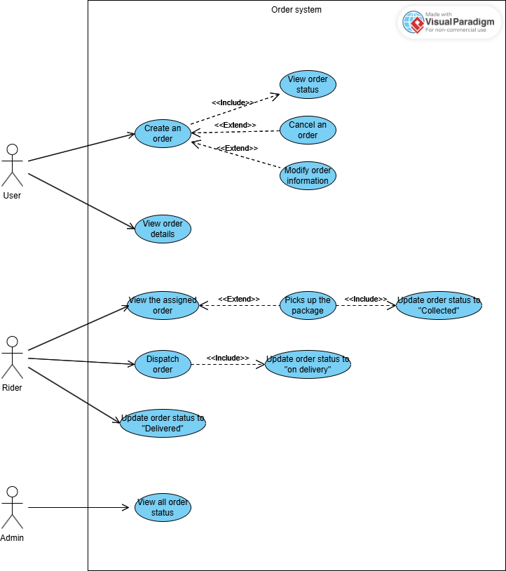

**Detailed Specification for Use Case**

###### Use Case: Create order

| **Use Case Name**        | Create Order                                                 |
| ------------------------ | ------------------------------------------------------------ |
| **ID**                   | UC56                                                         |
| **Use Case Description** | Users can create new orders by entering sender and recipient information, package information, etc. |
| **Major Players**        | Users                                                        |
| **Prerequisites**        | The user has logged into the system and is ready to fill in the order information. |
| **Post-Conditions**      | The system successfully creates the order and returns the order number for the user to view. |
| **Basic Event Flow**     | 1. The user selects the "Create Order" function.   2. The system prompts the user to fill in the sender and recipient information.   3. The user fills in the information and submits it.   4. The system creates the order and returns the order details. |

###### Use Case: Check order status

| **Use case name**        | View order status                                            |
| ------------------------ | ------------------------------------------------------------ |
| **ID**                   | UC57                                                         |
| **Use Case Description** | Users can check the status of their orders, including created, pending pickup, and delivery status. |
| **Major Players**        | Users                                                        |
| **Precondition**         | The user has created an order and has a valid order number.  |
| **Post-Condition**       | The system displays the current status of the order.         |
| **Basic Event Flow**     | 1. The user selects the "View Order Status" function.   2. The system returns the latest status of the order. |

###### Use Case: Cancel order

| **Use Case Name**        | Cancel Order                                                 |
| ------------------------ | ------------------------------------------------------------ |
| **ID**                   | UC58                                                         |
| **Use Case Description** | The user can cancel the order before it has been picked up.  |
| **Major Players**        | Users                                                        |
| **Preconditions**        | The user has created an order, but the order has not yet been picked up by the rider. |
| **Post-condition**       | The system marks the order as "cancelled" and notifies the relevant parties. |
| **Basic Event Flow**     | 1. The user selects the "Cancel Order" function.   2. The system prompts to confirm the cancellation operation.   3. After the user confirms, the system marks the order as "Cancelled". |

###### Use Case: Modify order information

| **Use case name**        | Modify order information                                     |
| ------------------------ | ------------------------------------------------------------ |
| **ID**                   | UC59 ​​                                                        |
| **Use Case Description** | Users can modify the recipient address or other information of the order, but only when the order has not been picked up. |
| **Major Players**        | Users                                                        |
| **Precondition**         | The user has created an order and the order has not yet been picked up. |
| **Post-Conditions**      | The system updates the order information and saves it.       |
| **Basic Event Flow**     | 1. The user selects the "Modify Order Information" function.   2. The system allows users to modify editable items such as recipient information.   3. The user submits modifications, and the system saves and updates the order. |

###### Use Case: View order details

| **Use case name**        | View order details                                           |
| ------------------------ | ------------------------------------------------------------ |
| **ID**                   | UC60                                                         |
| **Use Case Description** | Users can view the details of the order, including sender, recipient information, package information, etc. |
| **Major Players**        | Users                                                        |
| **Precondition**         | The user has created an order and has a valid order number.  |
| **Post-Conditions**      | The system returns the order details.                        |
| **Basic Event Flow**     | 1. The user selects the "View Order Details" function.   2. The system returns the order details. |

###### Use Case: View assigned orders

| **Use Case Name**        | View assigned orders                                         |
| ------------------------ | ------------------------------------------------------------ |
| **ID**                   | UC61                                                         |
| **Use Case Description** | Riders can view the order information assigned to themselves. |
| **Key Players**          | Riders                                                       |
| **Prerequisites**        | The rider has logged into the system and has an assigned order. |
| **Post-Conditions**      | The system displays a list of orders assigned to the rider.  |
| **Basic Event Flow**     | 1. Rider logs in and selects "View Assigned Orders".   2. The system displays the list of orders assigned to the rider. |

###### Use Case: Pickup

| **Use Case Name**        | Pickup                                                       |
| ------------------------ | ------------------------------------------------------------ |
| **ID**                   | UC62                                                         |
| **Use Case Description** | The rider goes to pick up the package based on the order information and updates the order status to "Picked Up". |
| **Key Players**          | Riders                                                       |
| **Prerequisites**        | The rider has been assigned the order and headed to the pickup address. |
| **Post-Conditions**      | The system updates the order status to "Picked".             |
| **Basic Event Flow**     | 1. The rider selects the "Pickup" function.   2. The rider goes to pick up the package and updates the order status.   3. The system updates the order status to "Picked". |

###### Use Case: Shipping order

| **Use Case Name**        | Delivery Order                                               |
| ------------------------ | ------------------------------------------------------------ |
| **ID**                   | UC63                                                         |
| **Use Case Description** | The rider delivers the order to the recipient and updates the order status to "Delivering". |
| **Key Players**          | Riders                                                       |
| **Preconditions**        | The rider has picked up the item and is delivering the order. |
| **Post-Conditions**      | The system updates the order status to "Delivering".         |
| **Basic Event Flow**     | 1. The rider selects the "Delivery Order" function.   2. The rider updates the order status to "Delivering". |

###### Use Case: Update order status to "Delivered"

| **Use Case Name**        | Update order status to "Delivered"                           |
| ------------------------ | ------------------------------------------------------------ |
| **ID**                   | UC64                                                         |
| **Use Case Description** | After the rider completes the delivery of the order, the order status is updated to "Delivered". |
| **Key Players**          | Riders                                                       |
| **Preconditions**        | The rider has successfully delivered the package to the recipient. |
| **Post-condition**       | The system updates the order status to "Delivered".          |
| **Basic event flow**     | 1. The rider selects the "Update order status to delivered" function.   2. The rider confirms that the order has been delivered and submitted.   3. The system updates the order status to "Delivered". |

###### Use Case: View all order statuses

| **Use Case Name**        | View all order statuses                                      |
| ------------------------ | ------------------------------------------------------------ |
| **ID**                   | UC65                                                         |
| **Use Case Description** | The administrator can view the status of all orders in the system, including creation, pickup, delivery, etc. |
| **Key Players**          | Administrators                                               |
| **Prerequisites**        | The administrator has logged into the system and has permission to view orders. |
| **Post-Condition**       | The system returns the status of all orders.                 |
| **Basic Event Flow**     | 1. The administrator selects the "View All Order Status" function.   2. The system returns the status information of all orders. |

### 3.3 Activity Diagrams

#### 3.3.1. User login

The user initiates the registration process in the system, and the admin stores user information upon confirmation. After successful registration, the user can log in using the credentials set during registration. Users may cancel the process during registration as well.

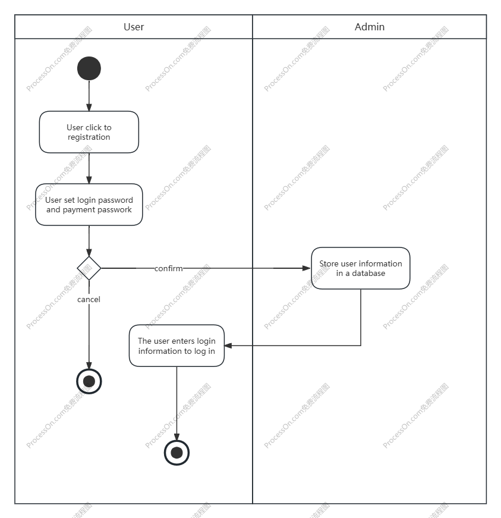

#### 3.3.2. Order Process

The entire order process starts when the user enters the homepage. The user can find the desired merchant through search or filtering, and enter the merchant page to select products and add them to the shopping cart. Users can checkout after exiting the merchant page or directly on the shopping cart page, and can modify the order information during this process. After confirming the order, the user submits the order and completes payment. The system will create an order after the user settles, and select the appropriate rider to receive the order based on the delivery area. After the rider receives the order, the system updates the order status to "Delivering" and the rider starts delivering the order. After the order is successfully delivered, the system will update the order status to "Delivered" and complete the entire order process.

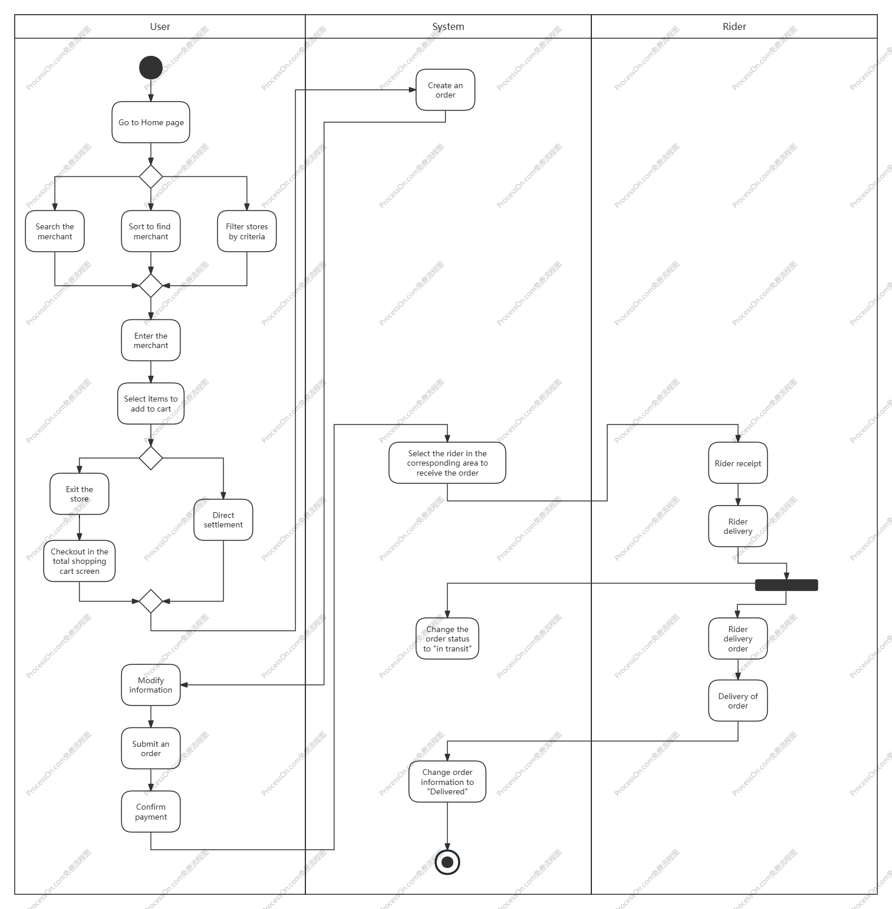

#### 3.3.3. Buy Coupon

First, after users enter the coupon page, they can choose three different paths: view existing coupons, view coupon purchase history, or click to purchase new coupons. When viewing history or purchasing coupons, users can find the coupon they want by searching for the coupon name or filtering the coupon list. After finding a suitable coupon, the user can view the coupon details and complete the purchase of the coupon.

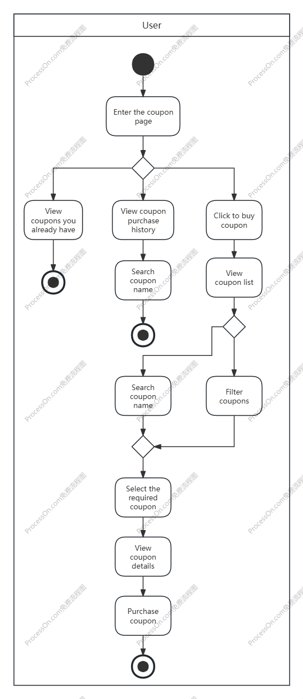

#### 3.3.4. Modify personal information

Users first enter the personal profile page, and then can choose to perform three operations: edit personal information, perform recharge or withdrawal operations, or change the payment password. If you choose to edit personal information, the user needs to enter the modified information and submit it; if you choose to recharge or withdraw cash, the user needs to enter the amount and complete the corresponding operations; if you choose to change the payment password, the user needs to enter a new payment password and confirm the change.

#### 3.3.5. Modify address information

Users first enter the address page and can choose three operations: add a new address, modify an existing address, or set a default address. If the user chooses to add a new address, they need to enter the new address information and confirm; if the user chooses to modify the existing address, they need to enter the modified address information and confirm; if the user chooses to set the default address, they need to click the asterisk next to the address bar. Mark this address as the default address.

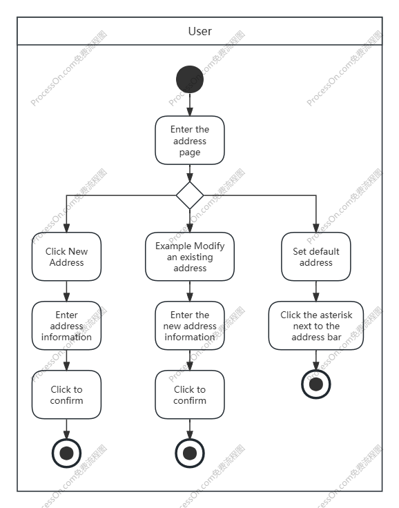

#### 3.3.6. Merchant login

Merchants first enter the registration page and can choose to fill in necessary registration information, such as merchant name, business hours, product type, address, login password and wallet password. If the merchant chooses to continue, complete information must be filled in and submitted; if the merchant chooses to cancel, the registration process will end. After submission, the system stores the merchant's information in the database and generates a unique login ID to return to the merchant. The merchant can then use this ID to log in to the merchant terminal, complete the registration process and continue to use other functions in the system.

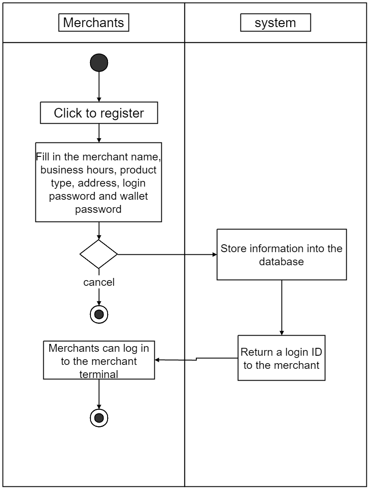

#### 3.3.7.Management Menu

Merchants first log in to the system and enter the menu page, and then can choose three operations: add new dishes, modify existing dishes, or delete dishes. If the merchant chooses to add a new dish, the new dish information needs to be entered and submitted; if the merchant chooses to modify an existing dish, the modified dish information needs to be entered and confirmed; if the merchant chooses to delete a dish, the system will delete the dish from the menu. After the operation is completed, the merchant can continue to manage other dishes or exit the system.

#### 3.3.8.Manage full discount activities

Merchants first log in to the system and enter the full discount page, and then can choose three operations: add a full discount activity, modify an existing full discount activity, or delete a full discount activity. If the merchant chooses to add a new one, he or she needs to enter the new discount information and submit it; if the merchant chooses to modify an existing activity, he or she needs to enter the modified activity information and confirm; if the merchant chooses to delete it, the activity system will remove the activity from the full discount activity. delete. After the operation is completed, the merchant can continue to manage other full discount activities or exit the system.

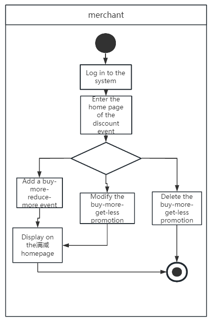

#### 3.3.9. Rider login

Riders first click the registration button and fill in the required registration information, including name, login password and payment password. At the decision point, the rider can choose to cancel the registration process, at which point the process ends; if they choose to continue, the system will store the registration information in the database. Once completed, a unique login ID will be generated and returned to the rider. The rider can then use this ID to log in to the rider system, complete registration and perform further operations.

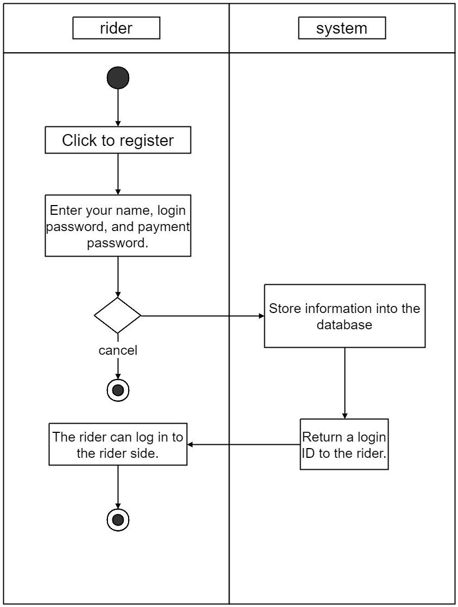

### 4. Supplementary Specifications

#### 4.1 Objectives

The objective of the Jikeda system is to provide an efficient food delivery platform for consumers, merchants, and couriers. Users can quickly browse and place orders, merchants can manage orders, and couriers can complete deliveries efficiently.

#### 4.2 Performance

The system should exhibit high performance to ensure fast response times. Specific requirements include page load times under 2 seconds, query response times within 1 second, and the ability to remain stable under high concurrency scenarios (such as during peak order times).

#### 4.3 Reliability

The system must ensure stable operation under high load conditions, with accurate data transmission and automatic recovery from failure situations. All data operations should ensure idempotency, and the recovery time from system failures should not exceed 1 hour.

#### 4.4 Security

The system must protect user privacy and transaction data, using encryption to secure payment information. Access control should be based on user identity and permissions, ensuring that different users (such as merchants, couriers, and administrators) can only access data relevant to their roles.

#### 4.5 Maintainability

The system follows a modular design to facilitate future feature expansion and maintenance. Each module includes a dedicated logging system to record operations and errors, allowing for quick troubleshooting and resolution.

#### 4.6 Usability

The user interface should be simple and intuitive, allowing users to quickly familiarize themselves without training. All documentation and APIs need to have detailed explanations to help developers understand the system’s structure and functionalities.

#### 4.7 Design Constraints

The system must be compatible with common operating systems and devices, including both web and mobile platforms. Development must use existing database systems and API interfaces, and the project should comply with data security and privacy regulations throughout the development process.

### 5. Mockup UI

#### 5.1 Login Page

Users log in on this interface, and no account can be registered first.

#### 5.2 Home Page

Displays various merchants. Users can filter or directly search for specific merchants.

#### 5.3 Merchant Details Page

Displays details about the business, including address, phone number, menu, hours, and offers. Users can add items to their cart and check out.

#### 5.4 Shopping Cart Page

Users can view selected items, manage quantities, and proceed to checkout.

#### 5.5 Personal Center Page

Users can manage personal information and view order history and favorite merchants.

#### 5.6 My Address Page

Users can create new addresses and set them as the default addresses.

### 6.TOWS Matrix for Jikeda System

This complete TOWS matrix helps the Jikeda system navigate its internal strengths and weaknesses while identifying external opportunities and threats, guiding strategic planning for future growth and risk mitigation.

### 7.References

1.Y. Yu, "Design and Implementation of Online Food Ordering System Based on Springcloud," Guangzhou Vocational and Technical University of Science and Technology, Guangzhou, Guangdong, China, 2022.

2.Customer’s Satisfaction: On the Food Delivery Apps. Journal of Digitainability Realism & Mastery (DREAM), 1(06), pp. 20-27, 2022. DOI: 10.56982/dream.v1i06.54.

3.ReportLinker, "Online Food Delivery Services Global Market Report 2023," 24 Feb. 2023. [Online Food Delivery Services Global Market Report 2023](https://www.globenewswire.com/en/news-release/2023/02/24/2615477/0/en/Online-Food-Delivery-Services-Global-Market-Report-2023.html)

4.G. Booch, J. Rumbaugh, and I. Jacobson, The Unified Modeling Language User Guide, 2nd ed. Addison-Wesley, 2005.

### 8.Contributions

This document was collaboratively developed by a team, with each member contributing their expertise to ensure a comprehensive and accurate representation of the Ji Ke Da System. Below is a detailed summary of the contributions made by each team member:

#### Haoran Wang

- **Contributions:**
  - Led agile development processes and conducted thorough requirement analysis.
  - Developed Use Cases Modeling.
  - Created Activity Diagrams.
  - Designed the document cover.

#### Siyuan Yu

- **Contributions:**
  - Assisted in the development of Use Cases Modeling.
  - Contributed to the creation of Activity Diagrams.

#### Lejunjie Chen

- **Contributions:**
  - Prepared Supplementary Specifications.
  - Compiled References and designed Mockup UI.
  - Developed the TOWS Matrix for the Ji Ke Da System.
  - Assisted in the overall document compilation and organization.

#### Ziyi Zhao

- **Contributions:**
  - Wrote the Brief Description.
  - Developed the Introduction section.
  - Assisted in the overall document compilation and organization.

| Student_ID | Name          | Score Weight |
| ---------- | ------------- | ------------ |
| 2251528    | Wang Haoran   | 100%         |
| 2251656    | Siyuan Yu     | 100%         |
| 2250944    | Lejunjie Chen | 100%         |
| 2254272    | Ziyi Zhao     | 100%         |

